# Como o sistema funciona

Relatório do fluxo de trabalho do Sistema de Inteligência Tributária de Palmas, do dado bruto à decisão do gestor. Cada etapa tem um diagrama e aponta a seção correspondente do [modelo UML](REQUISITOS_UML.md).

**Legenda de todos os diagramas:** verde = implementado e testado na Sprint 2 · cinza tracejado = especificado, previsto para sprints seguintes.

---

## Visão geral: o fluxo completo

O sistema transforma dados públicos e administrativos em informação para planejar a arrecadação. O caminho tem oito etapas. As quatro primeiras formam a **camada de dados**, construída nesta sprint. As demais formam a **camada de serviço**, que usa essa base.

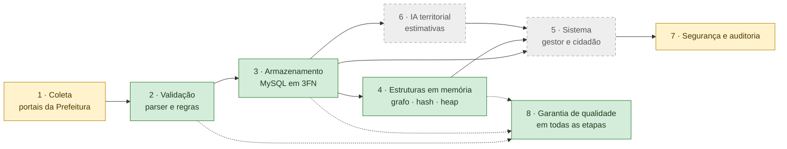

| Etapa | Situação | Onde está |
|---|---|---|
| 1 Coleta | Parcial: CSV já baixado; coleta automática na Sprint 3 | `etl/amostra.py`, E3 |
| 2 Validação | Implementada | `etl/parser.py` |
| 3 Armazenamento | Implementado | `sql/schema.sql`, `etl/carregar_receita.py` |
| 4 Estruturas | Implementadas | `src/estruturas/` |
| 5 Sistema (gestor e cidadão) | Especificado | UML §2, §6, §11, §15–18 |
| 6 IA territorial | Especificada | UML §8–10 |
| 7 Segurança e auditoria | Parcial: tabelas, restrições e protocolos | UML §2.1, `PROTOCOLOS_SEGURANCA_AUDITORIA.md` |
| 8 Qualidade | Implementada | `scripts/quality_gate.py`, UML §23 |

---

## Etapa 1 — Coleta dos dados

Os dados vêm dos portais de transparência da Prefeitura. Hoje o arquivo `receita_acessoinformacao.csv` (176.993 linhas) já foi baixado; nesta sprint usamos uma **amostra de 10 linhas reais** (IPTU e ISSQN de janeiro de 2025). A coleta automática, com HTTPS verificado e intervalo entre requisições, fica para a Sprint 3.

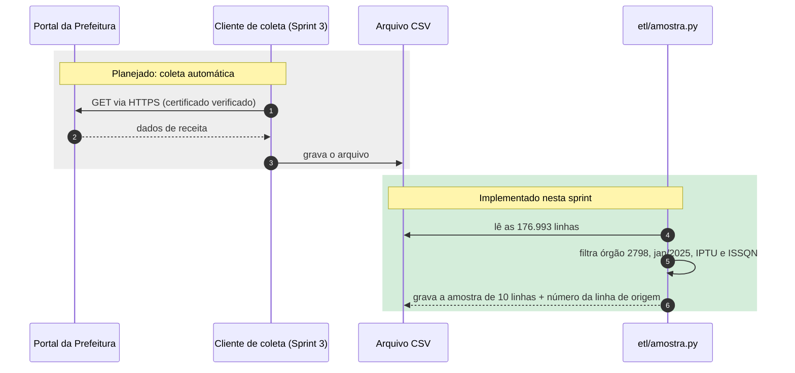

UML: §14 (interfaces externas) · E3 e `PROTOCOLOS_SEGURANCA_AUDITORIA.md` (protocolo P1).

**Fundamentação:** [L4] Kurose §8.6, p. 524–528 (TLS e truncamento); [T1]–[T3] (versões atuais de TLS); [R10] LGPD (coletar só o necessário); [D3] (arquivos e SHA-256).

---

## Etapa 2 — Validação: nenhum dado entra sem passar pelas regras

Cada linha do CSV é conferida antes de ir para o banco. Um erro de contrato (valor com fração de centavo, mês inválido) **interrompe a publicação**: o arquivo fica só na área de conferência (staging), e o erro é registrado.

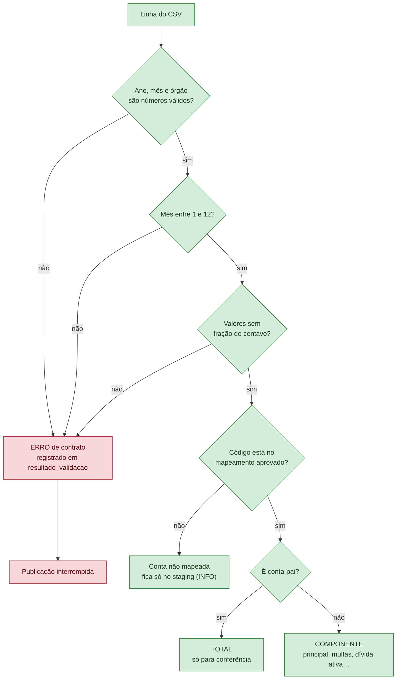

**Por que separar TOTAL e COMPONENTE:** o portal publica a conta-pai (total do IPTU) e também suas quatro partes. Somar tudo contaria o IPTU duas vezes. O sistema soma só os componentes e usa o total para conferir.

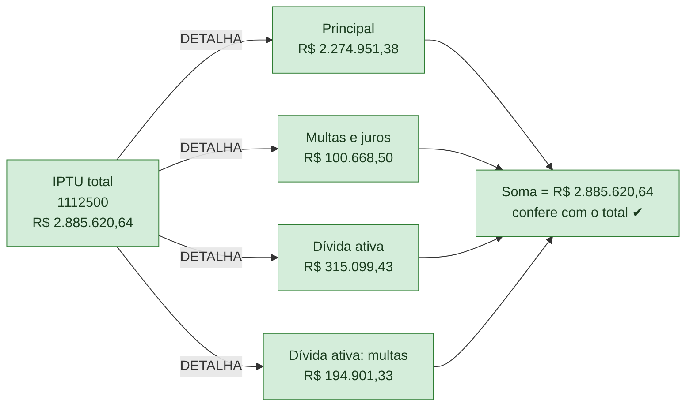

UML: §20.2 · Testes: `test_parser.py`, `carga_receita.feature`.

**Fundamentação:** [R3] CTN e [R4] MCASP §3.5 (etapas da receita); [D3] (contas-pai × componentes, 273 conciliações sem diferença); [D2] (regras de ETL).

---

## Etapa 3 — Armazenamento no banco

A carga é **idempotente**: o arquivo é identificado pelo SHA-256, e carregar o mesmo arquivo de novo não duplica nada. Tudo acontece numa única transação.

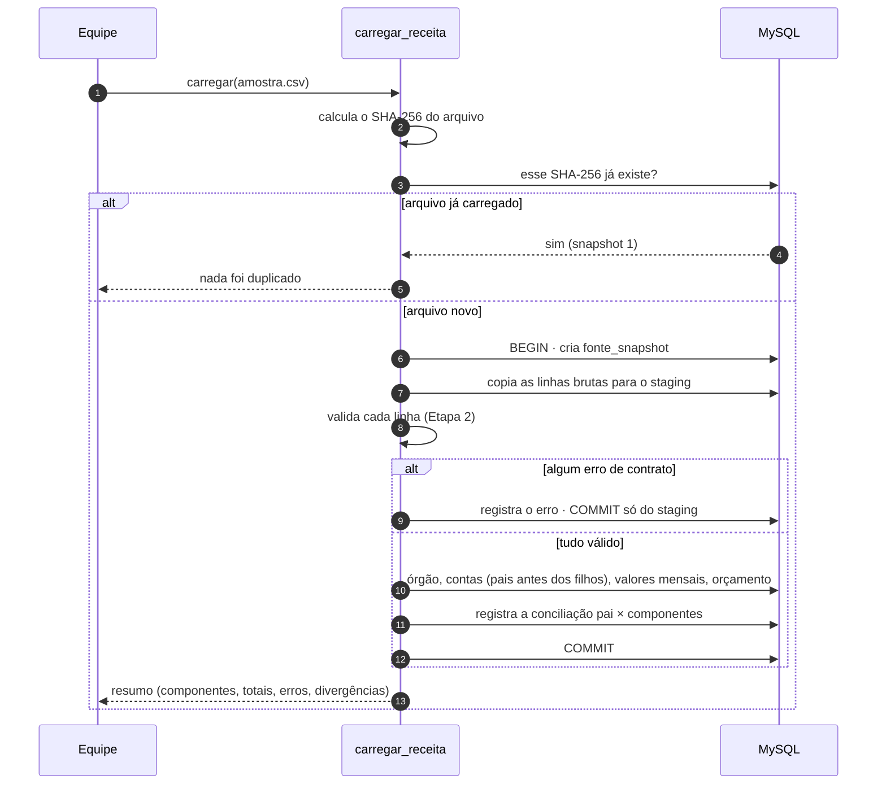

O banco tem dois módulos: **receita observada**, com dados reais, e **domínio operacional** (créditos, pagamentos, negociação), hoje com dados sintéticos, porque os dados públicos não contêm devedores.

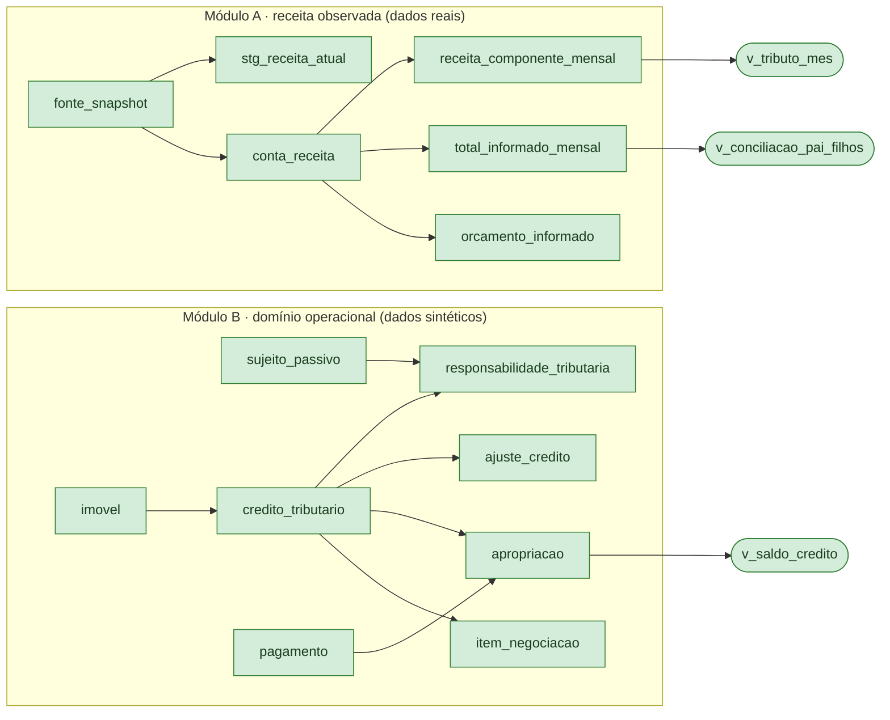

Valores derivados, como saldo e arrecadação por tributo, **nunca são gravados**: as *views* (em forma de pílula no diagrama) os calculam sempre a partir dos movimentos.

UML: §5, §16.4, §20.1 · `docs/modelagem_er.md` · Testes: `test_banco.py`, `carga_receita.feature`.

**Fundamentação:** [E4] Valente cap. 4 (modelos); [L1] Rosen p. 805 (árvore B, estrutura dos índices do banco); [F1] manual do MySQL (CHECK, FK); [D3] (snapshot imutável por SHA-256).

---

## Etapa 4 — Estruturas de dados em memória

O banco guarda o estado confiável. Três estruturas aceleram as operações do dia a dia:

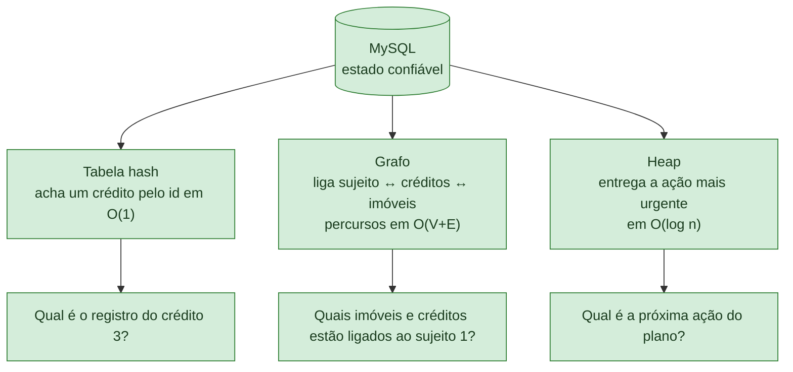

A fila de prioridade funciona como uma sala de espera ordenada. Quando a prioridade de uma ação muda, ela recebe uma nova senha, e a senha antiga é descartada quando é chamada:

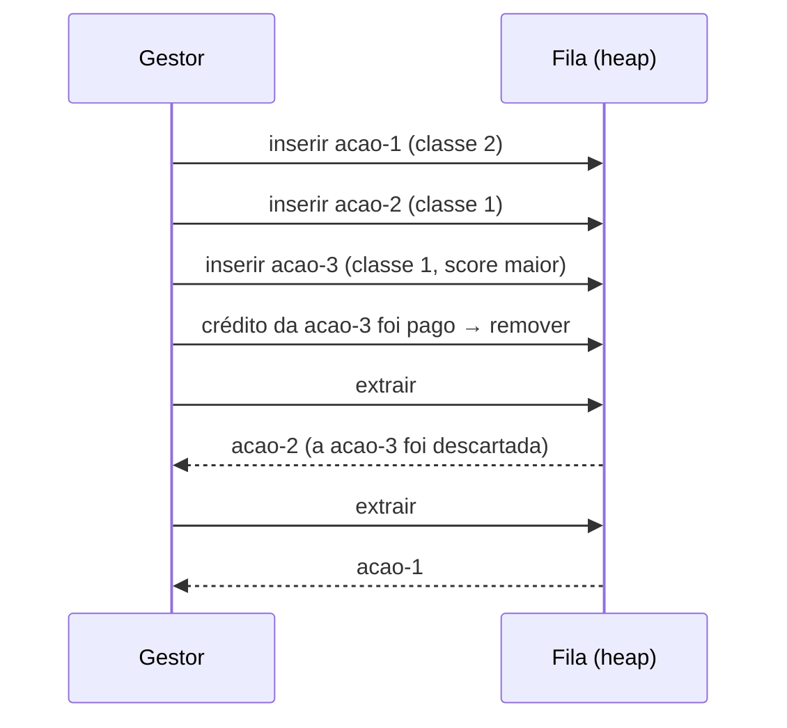

UML: §20.4 · `docs/arquitetura_dados.md` · Testes: `test_heap.py`, `test_indice_hash.py`, `test_grafo.py`, `estruturas.feature`.

**Fundamentação:** [L1] Rosen §10.3, §10.4, §11.1, §11.4 (p. 668, 682, 686, 754, 789, 791); [L2] Lintzmayer & Mota cap. 12, 14 e 24 (p. 154–167, 173–174, 305–332); [L3] Gersting §5.6, Exemplos 49–51; [R11] Morin.

---

## Etapa 5 — O sistema para o gestor e para o cidadão

Sobre a base de dados, o sistema oferece dois caminhos. O **servidor** planeja e acompanha a arrecadação. O **cidadão** consulta dados agregados e, se autenticado, acompanha os próprios processos.

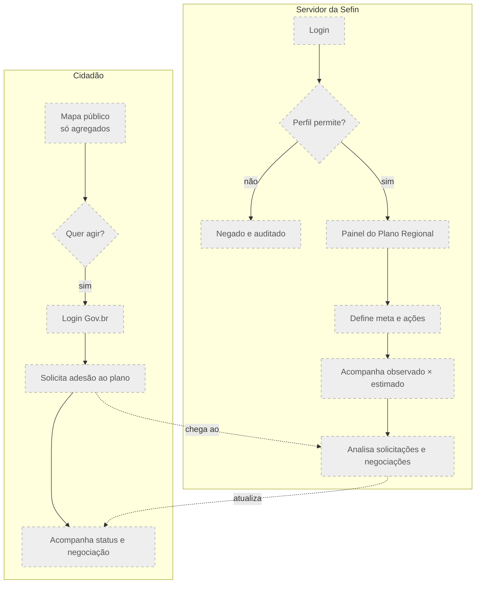

Cada processo segue uma máquina de estados. Toda mudança de estado é auditada (UML §18):

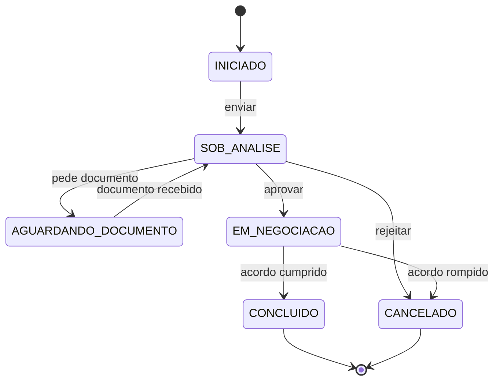

Situação: as tabelas, restrições e estados existem no banco. As telas e os serviços são das próximas sprints. A regra "uma negociação ativa por crédito" já é garantida e testada no banco (`negociacao_saldo.feature`).

UML: §2, §6, §11, §15, §17, §18.

**Fundamentação:** [E4]–[E7] Valente (modelos, princípios, padrões, arquitetura); [L4] Kurose §2.2 e §8.4.5 (sessão HTTP e nonce); [R16] Gov.br; [R12] ISO 29148 (requisitos verificáveis).

---

## Etapa 6 — A IA territorial

A IA **não classifica pessoas**. Ela estima a arrecadação por **região × período × tributo** e aponta desvios. O sistema mostra a estimativa separada do valor observado.

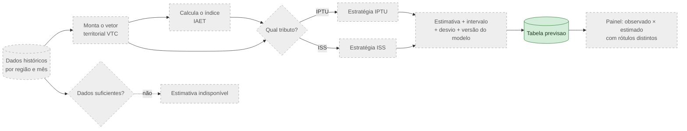

Situação: só a tabela `previsao` existe (com a restrição de que a estimativa fique dentro do intervalo). O modelo depende de dados territoriais que ainda não foram obtidos (PA-12).

UML: §8, §9, §10, §17.3.

**Fundamentação:** [R1]–[R2] (tax gap); [R6]–[R7] (cobrança e analytics); [R8] (índice composto IAET); [R9] (validação temporal); [R13] (divulgação de agregados); [R17]–[R20] (evidências e Model Card); [E6] Strategy.

---

## Etapa 7 — Segurança e auditoria

Toda conexão é cifrada, e toda ação relevante deixa um registro. A auditoria usa, sobre os próprios registros, os mesmos mecanismos que protegem mensagens na rede (Kurose, cap. 8).

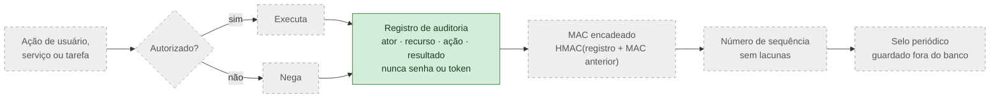

Situação: a tabela de auditoria e a regra do ator coerente existem e são testadas (`auditoria.feature`). A cadeia de MAC, a sequência e o selo estão especificados no protocolo, mas não implementados.

UML: §2.1, §13 · `PROTOCOLOS_SEGURANCA_AUDITORIA.md`.

**Fundamentação:** [L4] Kurose §8.3.2 p. 510 (MAC/HMAC), §8.6 p. 526–528 (sequência e truncamento), §9.3.4 p. 572 (controle de acesso por visões); [T4] RFC 2104; [R10] LGPD.

---

## Etapa 8 — Garantia de qualidade em cada integração

Nenhuma mudança entra no código principal sem passar pelos 10 quality gates.

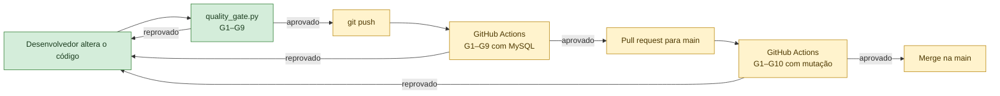

Os gates rodam localmente e foram aprovados (resultado em `docs/qualidade.md`). O workflow do GitHub Actions está pronto, mas ainda não foi executado, porque o repositório não está no GitHub (amarelo no diagrama).

UML: §23.

**Fundamentação:** [E8]–[E10] Valente (testes, refactoring, DevOps); [R12] ISO 29148 (verificação); [F2]–[F9] ferramentas.

---

## Referências literárias e acadêmicas

As referências estão agrupadas por tipo e marcadas com as **etapas do fluxo** que fundamentam (ver [COMO_O_SISTEMA_FUNCIONA.md](COMO_O_SISTEMA_FUNCIONA.md)):

| Etapa | 1 | 2 | 3 | 4 | 5 | 6 | 7 | 8 |
|---|---|---|---|---|---|---|---|---|
| Nome | Coleta | Validação | Armazenamento | Estruturas de dados | Sistema (gestor e cidadão) | IA territorial | Segurança e auditoria | Qualidade |

Páginas pela numeração impressa das obras. Os IDs `[R…]` e `[E…]` são os mesmos da Nota Técnica que fundamentou a revisão do UML.

### Matriz referência × etapa

| Ref. | Obra (resumo) | 1 | 2 | 3 | 4 | 5 | 6 | 7 | 8 |
|---|---|---|---|---|---|---|---|---|---|
| [L1] | Rosen — Matemática discreta | | | ● | ● | | | | |
| [L2] | Lintzmayer & Mota — Algoritmos e estruturas de dados | | | | ● | | | | |
| [L3] | Gersting — Fundamentos matemáticos | | | | ● | | | | |
| [L4] | Kurose & Ross — Redes de computadores | ● | | | | ● | | ● | |
| [R11] | Morin — Open Data Structures | | | | ● | | | | |
| [E4]–[E7] | Valente — modelos, princípios, padrões, arquitetura | | | ● | | ● | ● | | |
| [E8]–[E10] | Valente — testes, refactoring, DevOps | | | | | | | | ● |
| [R12] | ISO/IEC/IEEE 29148 — requisitos | | | | | ● | | | ● |
| [R1]–[R2] | OCDE e FMI — tax gap | | | | | ● | ● | | |
| [R3] | Código Tributário Nacional | | ● | ● | ● | ● | | | |
| [R4] | MCASP — etapas da receita | | ● | ● | | ● | | | |
| [R5] | Constituição Federal | | | ● | | ● | | | |
| [R6]–[R9] | OCDE, FMI, OECD/JRC, James et al. — cobrança, analytics, indicadores, aprendizado | | | | | | ● | | |
| [R17]–[R20] | Santos; Carvalho Jr.; Cabello et al.; Mitchell et al. | | | | | | ● | | |
| [R10] | LGPD | ● | | ● | | ● | | ● | |
| [R13] | Sweeney — k-anonimato | | | | | ● | ● | ● | |
| [R16] | Roteiro Gov.br | | | | | ● | | ● | |
| [T1]–[T7] | RFCs de TLS, HMAC, hash e cookies | ● | | | | ● | | ● | |
| [D1]–[D4] | Documentos do projeto | ● | ● | ● | ● | ● | ● | ● | ● |
| [F1]–[F9] | Ferramentas e manuais | | | ● | | | | | ● |

### Livros consultados

**[L1]** ROSEN, Kenneth H. *Discrete Mathematics and Its Applications*. 7. ed. New York: McGraw-Hill, 2012.
- Etapa 4 — §10.3, p. 668: representação por **lista de adjacência** (Exemplo 1, Tabela 1).
- Etapa 4 — §10.4, p. 682 e p. 686 (Definição 5): **componentes conexos** e grafo dirigido **fracamente conexo**.
- Etapa 4 — §11.4, Algoritmo 1 (DFS), p. 789, e Algoritmo 2 (BFS), p. 791: busca em profundidade e em largura, **O(e)** passos.
- Etapa 4 — §11.1, Teorema 5 e Corolário 1, p. 754: altura ⌈logₘ l⌉ de árvore balanceada, base do **O(log n)** da heap.
- Etapa 3 — Exercícios suplementares do cap. 11, p. 805: **árvore B** de grau k, estrutura dos índices do MySQL/InnoDB.
- Etapa 4 — §4.5, p. 287–288: função de dispersão h(k) = k mod m e **colisão**.

**[L2]** LINTZMAYER, Carla Negri; MOTA, Guilherme Oliveira. *Análise de Algoritmos e de Estruturas de Dados*. (versão em PDF consultada).
- Etapa 4 — cap. 12, §12.1, p. 154–167: **heap binário** (construção, inserção, remoção, alteração).
- Etapa 4 — cap. 14, p. 173–174: **tabelas hash**, colisões inevitáveis, O(1) no caso médio.
- Etapa 4 — cap. 24, Algoritmos 24.5 e 24.11 (BFS, p. 310 e 322), 24.7 (DFS iterativa, p. 316), 24.9 e 24.12 (DFS recursiva, p. 320 e 322), 24.10 (componentes, p. 321): comparados com o código em 2.000 digrafos aleatórios, com ordem de visita idêntica.
- Etapa 4 — §24.4.2, p. 330–332: um digrafo admite ordenação topológica se, e somente se, **não tem ciclos**.

**[L3]** GERSTING, Judith L. *Fundamentos matemáticos para a ciência da computação: matemática discreta e suas aplicações*. Rio de Janeiro: LTC. (edição do PDF consultado).
- Etapa 4 — Seção 5.6 "A poderosa função mod", subseção *Dispersão*: Exemplo 49 (h(x) = x mod t), **Exemplo 50 e Figura 5.29 (encadeamento)**, reproduzido em `estruturas.feature`; texto após o Exemplo 51: **fator de carga** e recomendação de tabela de tamanho primo.

**[L4]** KUROSE, James F.; ROSS, Keith W. *Redes de computadores e a Internet: uma abordagem top-down*. 6. ed. São Paulo: Pearson, 2013.
- Etapa 5 — §2.2.1 e §2.2.4, p. 73 e 79–81: HTTP sem estado e sessão com cookies.
- Etapa 7 — §8.1, p. 496–497: propriedades de comunicação segura e modelo do intruso.
- Etapa 7 — §8.3, p. 508–514: funções de hash, **MAC/HMAC** (p. 510) e autoridades certificadoras (p. 514), base da cadeia de MAC da auditoria.
- Etapa 5 e 7 — §8.4.5, p. 518: **nonce** e autenticação "ao vivo".
- Etapas 1, 5 e 7 — §8.6, p. 524–528: **SSL/TLS**, handshake, números de sequência e ataque por truncamento.
- Etapa 7 — §8.7, p. 528–531: IPsec, ESP e VPN.
- Etapa 7 — §8.9, p. 538–545: firewall, DMZ e sistemas de detecção de invasão.
- Etapa 7 — §9.3.4, p. 570–572: SNMPv3, anti-repetição e controle de acesso por visões.

**[R11]** MORIN, Pat. *Open Data Structures: An Introduction*. Athabasca University Press, 2013. https://opendatastructures.org/ — Etapa 4: tabelas hash, heaps e grafos.

**[E4]–[E10]** VALENTE, Marco Tulio. *Engenharia de Software Moderna*. (capítulos fornecidos pela equipe).
- [E4] cap. 4 Modelos — Etapas 3 e 5: diagramas UML formais deste documento.
- [E5] cap. 5 Princípios de projeto — Etapa 3: separação entre parser, repositório e serviços.
- [E6] cap. 6 Padrões de projeto — Etapas 5 e 6: Strategy (IPTU/ISS), Adaptador, Fachada.
- [E7] cap. 7 Arquitetura — Etapa 5: monólito modular.
- [E8] cap. 8 Testes — Etapa 8: testes unitários, de integração e de sistema.
- [E9] cap. 9 Refactoring — Etapa 8: divisão de `carregar()` sem mudar o comportamento.
- [E10] cap. 10 DevOps — Etapa 8: integração contínua e quality gates.

### Normas, legislação e artigos (Nota Técnica)

- **[R1]** OECD. *Tax Administration 2024*, cap. 11: Tax gap estimation. Paris, 2024. — Etapas 5 e 6.
- **[R2]** HUTTON, Eric. *The Revenue Administration-Gap Analysis Program*. IMF TNM 2017/004. https://doi.org/10.5089/9781475583618.005 — Etapas 5 e 6.
- **[R3]** BRASIL. Lei nº 5.172/1966 (Código Tributário Nacional), arts. 114, 142, 150, 198 e 201. — Etapas 2 a 5: lançamento, crédito, dívida ativa.
- **[R4]** BRASIL. STN. *Manual de Contabilidade Aplicada ao Setor Público*, 11. ed., Parte I, §3.5. — Etapas 2, 3 e 5: etapas da receita.
- **[R5]** BRASIL. Constituição Federal de 1988, arts. 156, 156-A e 167, IV. — Etapas 3 e 5.
- **[R6]** OECD. *Working Smarter in Tax Debt Management*. 2014. https://doi.org/10.1787/9789264223257-en — Etapa 6.
- **[R7]** ASLETT, J. et al. *Tax Administration: Essential Analytics for Compliance Risk Management*. IMF TNM 2024/001. https://doi.org/10.5089/9798400260063.005 — Etapa 6.
- **[R8]** OECD; EU; EC-JRC. *Handbook on Constructing Composite Indicators*. 2008. https://doi.org/10.1787/9789264043466-en — Etapa 6: IAET.
- **[R9]** JAMES, G. et al. *An Introduction to Statistical Learning: with Applications in Python*. Springer, 2023. — Etapa 6: validação temporal, sem vazamento.
- **[R10]** BRASIL. Lei nº 13.709/2018 (LGPD). — Etapas 1, 3, 5 e 7: pseudonimização, finalidade, retenção.
- **[R12]** ISO/IEC/IEEE 29148:2018. *Requirements engineering*. — Etapas 5 e 8: requisitos verificáveis e rastreáveis.
- **[R13]** SWEENEY, Latanya. k-anonymity: a model for protecting privacy. *IJUFKS*, v. 10, n. 5, 2002. — Etapas 5, 6 e 7: divulgação de agregados.
- **[R16]** GOVERNO FEDERAL. *Roteiro de Integração do Login Único gov.br*. https://acesso.gov.br/roteiro-tecnico/ — Etapas 5 e 7.
- **[R17]** SANTOS, Rubens Q. Estimando a arrecadação da Dívida Ativa da União com Machine Learning. *Revista da CGU*, v. 14, n. 26, 2022. — Etapa 6.
- **[R18]** CARVALHO JÚNIOR, Pedro H. B. *Panorama do IPTU*. Ipea, TD 2419, 2018. — Etapa 6.
- **[R19]** CABELLO, O. G. et al. Inovação e eficiência na administração tributária local. *RAP*, v. 60, 2026. — Etapa 6.
- **[R20]** MITCHELL, Margaret et al. Model Cards for Model Reporting. FAT*, 2019. https://arxiv.org/abs/1810.03993 — Etapa 6: documentação do modelo.

### Especificações técnicas (RFCs)

- **[T1]** RFC 8446 — TLS 1.3. — Etapas 1, 5 e 7.
- **[T2]** RFC 8996 — descontinuação de TLS 1.0 e 1.1. — Etapas 1 e 7.
- **[T3]** RFC 9325 / BCP 195 — recomendações de uso seguro de TLS. — Etapas 1 e 7.
- **[T4]** RFC 2104 — HMAC. — Etapa 7: cadeia de MAC da auditoria.
- **[T5]** RFC 6151 — MD5 inadequado para segurança. — Etapa 7.
- **[T6]** RFC 6194 — considerações de segurança do SHA-1. — Etapa 7.
- **[T7]** RFC 6265 e draft-ietf-httpbis-rfc6265bis — cookies HTTP e atributo `SameSite`. — Etapa 5.

### Documentos do projeto

- **[D1]** UFT/BIINAR. *Tarefa do PI — Sprint 2: Arquitetura de Dados e Banco* (`PI_Sprint2_Entrega02out2026.pdf`). — Todas as etapas: entregáveis e rubrica.
- **[D2]** *PI2 — Nota Técnica: fundamentação científica, diagnóstico dos dados e revisão do UML* (29/09/2026). — Etapas 2, 3, 5 e 6.
- **[D3]** *Palmas — Auditoria dos CSVs fornecidos* (`Relatorio_Palmas.pdf`, 29/09/2026). — Etapas 1 a 4: snapshot SHA-256, pais × componentes, valores de 2025.
- **[D4]** *Projeto Integrador — Opção D: Inteligência Tributária de Palmas* (enunciado geral). — Contexto de todas as etapas.

### Ferramentas e manuais

- **[F1]** Oracle. *MySQL 8.4 Reference Manual* — restrições CHECK, FOREIGN KEY e índices InnoDB. — Etapa 3.
- **[F2]** pytest. — Etapa 8.
- **[F3]** pytest-bdd e Cucumber Gherkin (sintaxe `Funcionalidade/Cenário/Dado/Quando/Então`). — Etapa 8.
- **[F4]** coverage.py (cobertura de linhas e ramos). — Etapa 8.
- **[F5]** cosmic-ray (testes de mutação). — Etapa 8.
- **[F6]** radon e xenon (complexidade ciclomática, índice de manutenibilidade, SLOC). — Etapa 8.
- **[F7]** import-linter (contratos de dependência). — Etapa 8.
- **[F8]** Pyright (verificação de tipos). — Etapa 8.
- **[F9]** GitHub Actions (integração contínua). — Etapa 8.
