# Projeto Integrador 2 — Inteligência Tributária de Palmas
## Relatório consolidado de requisitos e modelo UML — v2.3

> **Finalidade:** registrar, de forma auditável no Git, o problema, as histórias de usuário, a arquitetura, o papel da Inteligência Artificial, os requisitos, os diagramas UML e as decisões do Projeto Integrador 2.
>
> **Base desta revisão:** Nota Técnica *PI2 — Fundamentação científica, diagnóstico dos dados e revisão do UML* (29/09/2026), que aplica Valente, *Engenharia de Software Moderna*, caps. 4–10 [E4–E10], e as referências [R1–R20] listadas ao fim da nota.

---

> **Como ler este documento.** Cada seção tem um diagrama que mostra o processo descrito no texto: fluxogramas, diagramas de sequência, de classes, de estados e diagramas temporais. Para uma leitura em ordem de funcionamento, do dado bruto à decisão do gestor, veja [COMO_O_SISTEMA_FUNCIONA.md](COMO_O_SISTEMA_FUNCIONA.md). As referências estão ao final, marcadas por etapa do projeto.

---

## 0. Controle de versão e convenções

### 0.1 Histórico

| Versão | Data | Mudanças |
|---|---|---|
| 1.0 | 09/2026 | Especificação conceitual inicial (histórias, módulos, IA, RF/RNF, esboços de diagramas). |
| 2.0 | 29/09/2026 | Revisão conforme a nota técnica: glossário tributário; domínio reescrito (`SujeitoPassivo`, `CreditoTributario`, `Pagamento`/`Apropriacao`, `InscricaoDividaAtiva`); atributos derivados removidos das classes persistidas; "tax gap observado" renomeado para gap de pagamento; indicadores com contrato de cálculo; prioridades RF-02, RF-03 e RNF-07 elevadas a MUST; critérios de aceitação; diagramas formalizados em Mermaid; ponte para o ER da Sprint 2. **Removidos do escopo:** camadas de arrecadação, Score de Participação, votação regional, propostas de reforma e integração com WhatsApp (RF-22 a RF-26 e IES-07). |
| 2.1 | 30/09/2026 | Garantia de qualidade: §19 passa a apontar os testes que comprovam cada requisito (e o que ainda não tem código); nova §23 com quality gates (testes unitários, integração, aceitação em Gherkin, cobertura, mutação, complexidade, manutenibilidade, tamanho, dependências e tipos) executados em cada integração; §21 atualizada. |
| 2.2 | 30/09/2026 | Diagrama explicativo em cada seção (fluxogramas, sequência, temporais, gráficos); relatório complementar `COMO_O_SISTEMA_FUNCIONA.md`; seção de referências com matriz referência × etapa do projeto. |
| 2.3 | 01/10/2026 | Correções da revisão de consonância (`REVISAO_CONSONANCIA_01-10-2026.md`): fila de prioridade não reaproveita a versão de uma ação retirada e reinserida; 3 lacunas de teste que a análise de mutação classificara como equivalentes; contrato do arquivo validado antes da publicação, com snapshot `PUBLICADO`/`REJEITADO` garantido pelo banco (§20.2); escopo de permissão como chave estrangeira; redundâncias controladas de `conta_receita` declaradas (§20.1); pseudonimização especificada como HMAC-SHA-256; repositório só com a `main` (desenvolvimento baseado no tronco, §23.2); testes de propriedade e verificador de sobreviventes (§23.4). |

### 0.2 Ordem de engenharia

```text
PROBLEMA → HISTÓRIAS DE USUÁRIO → ARQUITETURA → DOMÍNIO → IA → REQUISITOS → DIAGRAMAS → RASTREABILIDADE → IMPLEMENTAÇÃO (Git)
```

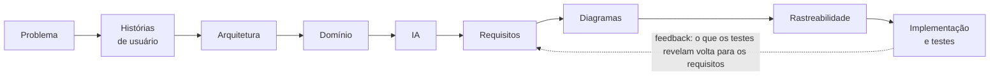

### 0.3 Convenção Sistema × IA

Os termos **Sistema** e **IA** não são sinônimos.

- **Sistema** — produto completo: autenticação, autorização, auditoria, domínio tributário, território, plano, indicadores, solicitações, negociação e comunicação. Cálculos **determinísticos** (ex.: gap de pagamento) são responsabilidade do Sistema.
- **IA** — módulo analítico interno, com contrato próprio. Produz **estimativas, intervalos e anomalias** por território × período × tributo. Não executa cobrança, sanção ou decisão jurídica.

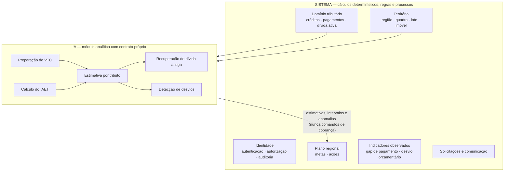


---

# PARTE I — PROBLEMA E HISTÓRIAS DE USUÁRIO

## 1. Problema central

Modernizar a administração tributária de Palmas quanto a IPTU, ISS, créditos vencidos, dívida ativa, atualização cadastral, negociação, acompanhamento regional, governança digital e transparência.

> **Pergunta central:** como um sistema de governança digital, apoiado por IA territorial, pode auxiliar Palmas a planejar, acompanhar e melhorar a arrecadação sem transformar cidadãos em categorias algorítmicas de risco?


### 1.1 Glossário obrigatório

| Termo | Significado no projeto |
|---|---|
| Fato gerador | Situação prevista em lei que origina a obrigação tributária [R3]. |
| Lançamento | Procedimento que apura matéria tributável, valor e sujeito passivo. Distinto de previsão de receita [R3]. |
| Crédito tributário | Direito de exigir a prestação, constituído segundo as regras aplicáveis. |
| Arrecadação | Recebimento dos valores pagos [R4]. |
| Recolhimento | Transferência dos valores arrecadados ao Tesouro [R4]. |
| Dívida ativa tributária | Crédito regularmente inscrito após o prazo legal de pagamento [R3–R4]. |
| Recuperação | Ingresso financeiro relativo a crédito inscrito. Não informa, sozinho, o saldo a receber. |
| Estoque × fluxo | Estoque é saldo em uma data; fluxo é movimento em um intervalo. |
| Desvio orçamentário | Arrecadação realizada − previsão comparável. **Não mede tax gap.** |
| Gap de pagamento | Créditos conhecidos, vencidos e ajustados que permanecem sem pagamento na data de corte. |
| Tax gap | Receita potencial sob a legislação de referência − arrecadação comparável. Exige metodologia declarada [R1–R2]. |
| Compliance gap / policy gap | Perda sob as regras vigentes / diferença entre sistema de referência e regras adotadas. Benefício legal não é inadimplência [R1]. |
| Pseudonimização | Substituição de identificador por código (ex.: hash com sal). **Não equivale a anonimização** [R10, R13]. |

O ciclo abaixo mostra como os termos do glossário se encadeiam. Cada indicador mede um trecho diferente do ciclo, por isso não podem ser confundidos:

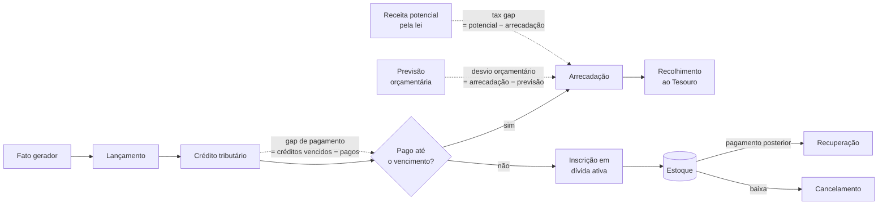

---

## 2. Histórias de usuário

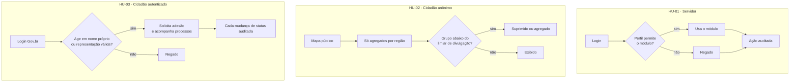

### HU-01 — Servidor municipal acessa módulos autorizados

**Como** servidor da Sefin, **quero** autenticar-me e acessar apenas os módulos do meu perfil, **para** planejar e acompanhar ações tributárias com rastreabilidade.

Critérios de aceitação:
1. Sem autenticação válida, nenhum módulo restrito é exibido.
2. Uma operação fora do perfil é negada e a negativa é auditada.
3. Login, ação permitida e ação negada geram registro de auditoria com correlação.

Módulos acessíveis conforme permissão: Plano Regional, indicadores, mapas territoriais (incluindo drill-down restrito), solicitações de adesão, créditos e negociações, comunicação, auditoria e gestão de permissões.

### HU-02 — Cidadão consulta a área pública

**Como** cidadão, **quero** ver no mapa público informações agregadas por região, **para** acompanhar metas e resultados sem expor ninguém.

Critérios de aceitação:
1. Consulta anônima não revela ID de imóvel, titular ou débito.
2. Grupos abaixo do limiar de divulgação são suprimidos ou agregados.

### HU-03 — Cidadão acompanha seus processos

**Como** cidadão autenticado, **quero** solicitar adesão a um plano, acompanhar negociações e ver o status dos meus processos, **para** regularizar minha situação.

Critérios de aceitação:
1. O cidadão A não consulta processo do cidadão B.
2. O cidadão só age em nome de um sujeito passivo (ex.: empresa) com representação autorizada.
3. Cada mudança de status é auditada.

### 2.1 Princípio de auditoria

Toda ação relevante — de usuário, serviço ou tarefa automática — produz registro com:

```text
idRegistro, idCorrelacao, dataHora, tipoAtor (USUARIO | SERVICO | TAREFA), idAtor,
recursoAcessado, acaoExecutada, nivelPermissao, resultado (PERMITIDO | NEGADO | ERRO),
enderecoIP (quando aplicável)
```

**Nunca** registrar senha, token ou documento completo. O Git registra a evolução do código e dos documentos; **não substitui** os eventos de auditoria do sistema.

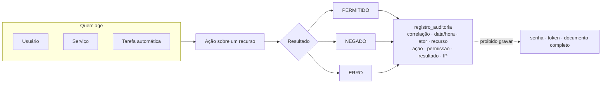

### 2.2 Front-office e back-office

A referência do Poupatempo (balcão único, multicanal, redução de fricção) orienta o **front-office**: mapa/portal → autenticação → solicitação → comunicação → negociação → acompanhamento. O **back-office** segue: autenticação → autorização → auditoria → plano → análise territorial → gestão de solicitações → negociação → acompanhamento.

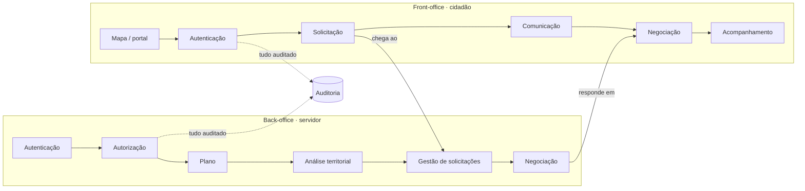

---

# PARTE II — ARQUITETURA E DOMÍNIO

## 3. Arquitetura: monólito modular

Proposta para o MVP: **monólito modular** com limites explícitos. A IA é um módulo com contrato próprio; separação lógica não exige microsserviço [E7].

| Módulo | Responsabilidade e contrato |
|---|---|
| Interface | Painel, mapa e formulários. Exibe observação, previsão e indisponibilidade com rótulos distintos; **não calcula saldo na tela**. |
| Aplicação | Coordena autorização, consulta, plano e negociação. Cada operação valida identidade, recurso, transação e resultado auditável. |
| Domínio tributário | Créditos, pagamentos, inscrições, elegibilidade e regras do plano. Cálculos testáveis sem interface nem API. |
| Analítico territorial (IA) | Prepara VTC/IAET, executa estratégia por tributo, devolve estimativa, intervalo, versão e cobertura. **Sem comandos de cobrança.** |
| Infraestrutura | Adaptadores de CSV/API, banco e integrações. Preserva dados brutos, linhagem e versões; erro não produz carga parcial silenciosa. |

**Padrões de projeto adotados** (somente onde resolvem um problema concreto) [E6]:
- **Strategy** — estratégias analíticas de IPTU e ISS sob uma interface comum.
- **Adaptador** — converte os layouts das fontes (CSV, API, Gov.br) em contratos internos.
- **Fachada** — operação única de consulta consolidada do plano.

O diagrama mostra quem chama quem. As setas só descem: a interface nunca acessa o banco diretamente, e a IA não recebe comandos de cobrança.

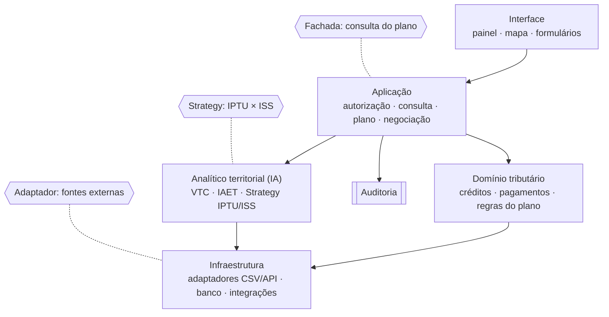

---

## 4. Território

Unidade principal de leitura: as **nove regiões de planejamento** de Palmas — *premissa a validar* (nomes, limites, vigência e fonte municipal).

```text
Palmas → Região → Quadra → Lote → Imóvel      (hierarquia)
Via ↔ Lote                                      (associação espacial, não nível hierárquico)
```

Toda unidade territorial é **versionada**: geometria + início e fim de vigência. Para o ISS, o endereço do prestador não determina sozinho o território de incidência; o critério de atribuição territorial deve ser documentado.

O drill-down até o imóvel é **capacidade administrativa restrita**, não permissão do mapa público.

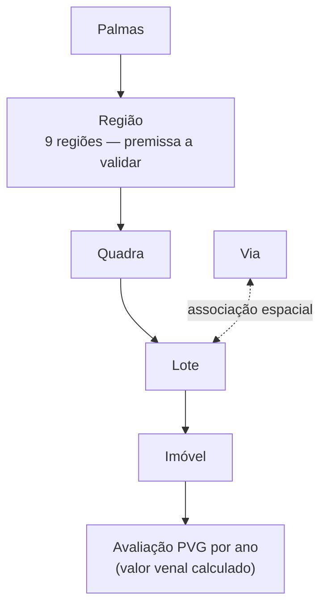

Toda unidade territorial tem vigência. O diagrama temporal abaixo é **ilustrativo** (dados sintéticos): quando uma região muda de limite, a versão antiga é encerrada e uma nova começa. Uma consulta de 2024 usa a geometria de 2024, mesmo depois da mudança.

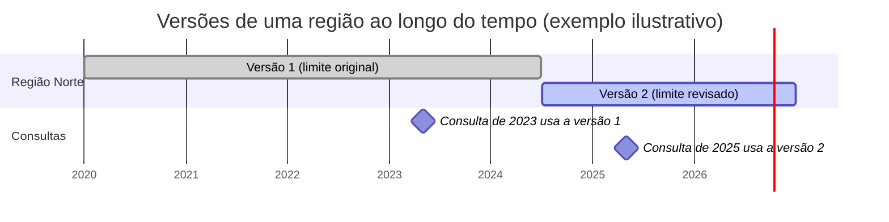

---

## 5. Domínio tributário

### 5.1 Sujeito passivo e responsabilidade

- `Usuario` é **conta de acesso**; `SujeitoPassivo` é **contribuinte ou responsável**. Um débito pode pertencer a pessoa jurídica sem conta no portal; um cidadão pode representar uma empresa, se autorizado.
- `ResponsabilidadeTributaria` liga `SujeitoPassivo` e `CreditoTributario` com papel (contribuinte, responsável, corresponsável), vigência e fundamento, evitando limitar cada dívida a um único cidadão.
- O documento (CPF/CNPJ) é armazenado **pseudonimizado**.

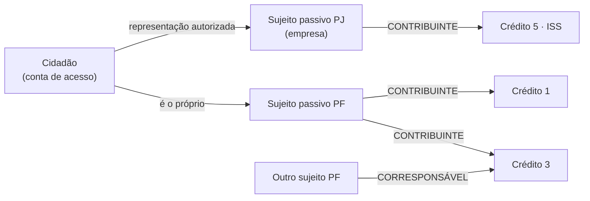

### 5.2 Base de cálculo por tributo

**IPTU** — `Imovel` com avaliações pela Planta de Valores Genéricos (PVG). As categorias iniciais (`RESIDENCIAL_HORIZONTAL`, `RESIDENCIAL_VERTICAL`, `COMERCIAL_HORIZONTAL`, `COMERCIAL_VERTICAL`, `GALPAO`) são **tipologias construtivas**, não a PVG inteira. O valor venal total é **calculado** (terreno + edificação), não armazenado.

**ISS** — `CadastroEconomico` (atividade, estabelecimento) e documentos fiscais (NFS-e). Nem toda operação começa por um carnê municipal: há declaração, apuração e retenção conforme a regra aplicável.

O tributo registra **código, exercício e versão de regra**, para suportar a transição ISS → IBS sem reclassificar receitas históricas [R5].

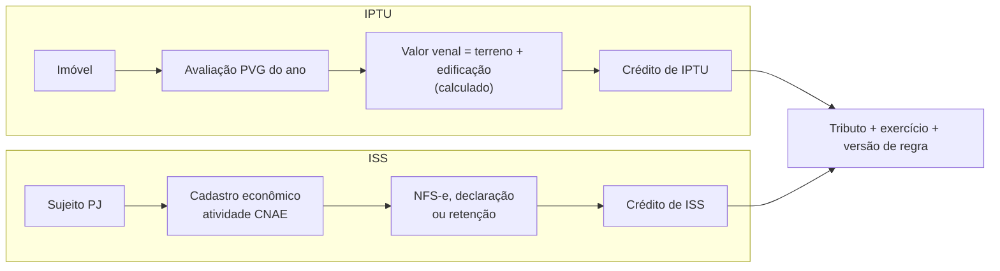

### 5.3 Crédito, dívida ativa, pagamento e negociação

| Classe | Conteúdo |
|---|---|
| `CreditoTributario` | Tributo, exercício, data de constituição, vencimento, valor principal, situação de exigibilidade. Associado a imóvel (IPTU) ou cadastro econômico (ISS). |
| `AjusteCredito` | Cancelamentos, acréscimos (multa, juros) e estornos, com data e fundamento. |
| `InscricaoDividaAtiva` | Número, data de inscrição, situação. Relação com créditos **N:M até validação** — não impor 1:1. |
| `Pagamento` / `Apropriacao` | Um pagamento se reparte em apropriações; cada apropriação aponta um crédito e separa principal e encargos. Permite pagamentos parciais e repartidos. |
| `Negociacao` / `ItemNegociacao` | Um acordo pode abranger várias dívidas. **No máximo uma negociação ativa por crédito**: o banco garante uma única reserva por crédito, inclusive entre transações concorrentes; o serviço mantém a reserva coerente com o status da negociação. |

Um pagamento pode quitar vários créditos, e um crédito pode receber vários pagamentos. A **apropriação** registra quanto de cada pagamento foi para cada crédito. Exemplo da semente sintética:

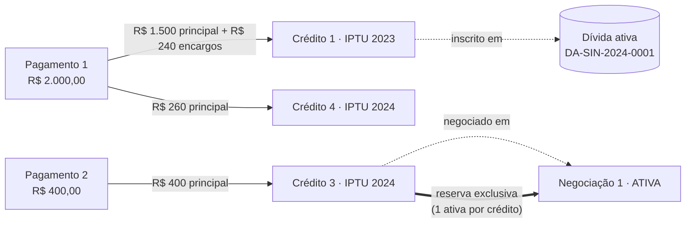

### 5.4 Invariantes

1. A soma das apropriações de um pagamento não excede seu valor líquido; estornos são rastreáveis.
2. **Saldo é derivado** de movimentos conciliados (principal + ajustes − apropriações); nunca é campo atualizado de forma independente.
3. Um crédito tem no máximo uma negociação ativa (RF-18).
4. Valores monetários usam `Decimal`/`NUMERIC` com regra de arredondamento explícita.
5. Inscrição em dívida ativa não é nova arrecadação; parcelamento não equivale a pagamento.
6. Estoque final = estoque inicial + inscrições + acréscimos − recebimentos − cancelamentos − outras baixas.

O saldo nunca é digitado: ele sai dos movimentos. Para o crédito 1 da semente sintética:

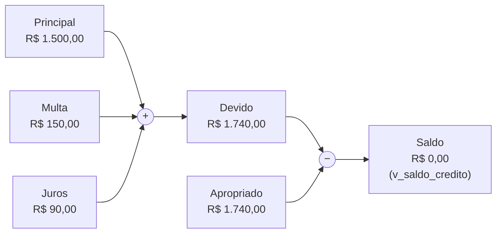

---

## 6. Plano Regional de Arrecadação

Módulo de gestão do **Sistema**. O gestor seleciona região, tributo e período; define meta; cadastra e acompanha ações; visualiza indicadores observados e resultados da IA, **com rótulos distintos**.

- Atributo persistido: `valorMeta`. Valores arrecadado, gap e percentual da meta são **operações** (derivados), não colunas.
- `calcularGapPagamento()` substitui o antigo `valorTaxGapObservado`: usa créditos vinculados e apropriações. **Sem lançamentos, retorna "indisponível"**; nunca usa `valor_orcado` como substituto.
- Status do plano e das ações seguem máquina de estados auditável (§12.4).

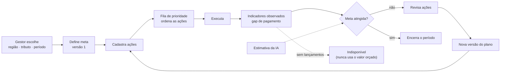

---

## 7. Indicadores com contrato de cálculo

Cada indicador tem nome, fórmula, unidade, fonte, período de competência, data de corte, tratamento de ajustes e versão do cálculo. Valor observado e valor previsto ficam em **entidades separadas** (`ValorIndicador` × `Previsao`).

| Indicador | Contrato |
|---|---|
| Desvio orçamentário | Arrecadação do período − previsão comparável. **Disponível nos CSVs**; identificar se a previsão é inicial ou atualizada. |
| Gap de pagamento da coorte | Créditos vencidos da coorte, líquidos de ajustes − pagamentos apropriados à mesma coorte até a data de corte. Separar principal e encargos. |
| Taxa de não pagamento | Gap de pagamento ÷ créditos vencidos ajustados. Denominador zero → "não aplicável". |
| Taxa de recuperação de coorte | Recebimento apropriado ao estoque inicial elegível ÷ estoque inicial elegível, mesma base monetária. Sem novas inscrições no numerador. |
| Tax gap estimado | Potencial sob a legislação de referência − arrecadação compatível. Exige estimar bases não declaradas [R1–R2]. |
| Erro de previsão | Observado − previsto. Mede erro do modelo, não dívida exigível nem sonegação. |

*Exemplo:* coorte com R$ 150 mi de créditos vencidos válidos e R$ 120 mi de pagamentos apropriados → gap de R$ 30 mi (20%). Com R$ 5 mi de cancelamentos reconhecidos, o denominador passa a R$ 145 mi e o gap a R$ 25 mi.

O exemplo da seção em forma de fluxo: o mesmo gap muda quando cancelamentos são reconhecidos, por isso o contrato do indicador precisa dizer como trata ajustes.

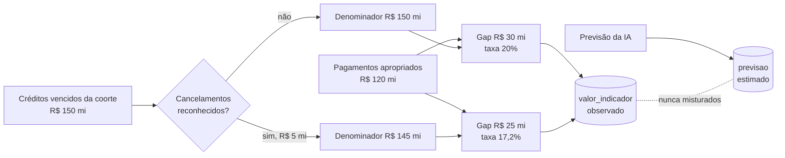

---

# PARTE III — A INTELIGÊNCIA ARTIFICIAL

## 8. Limite da IA

> A IA analisa fenômenos tributários e territoriais; **não classifica cidadãos** como bons ou maus contribuintes.

- Unidade de análise: **região × período × tributo**; quadra × período × tributo somente com dados e população suficientes.
- Atributos agregados da região não são transferidos a indivíduos.
- Granularidade: começar no município e avançar a regiões/quadras apenas com dados, utilidade estatística e controle de divulgação. Limiar mínimo de registros não garante anonimato sozinho [R10, R13].
- Previsão estatística, potencial estimado e valor observado ficam em campos distintos: a previsão aprende o que costuma entrar e pode reproduzir a inadimplência histórica como se fosse normalidade.

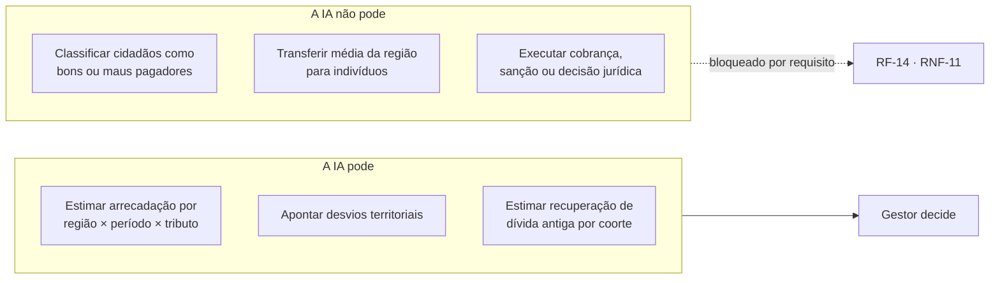

## 9. Entradas: IAET e VTC

**IAET — Índice de Atividade Econômica Territorial.** Índice **exploratório**, não PIB regional oficial:

```text
IAET(r,t) = Σ wj · zj(r,t),   wj ≥ 0,   Σ wj = 1
```

Antes de escolher pesos, definir conceito, unidade, normalização, faltantes, direção e sensibilidade [R8]. Separar dimensão imobiliária de atividade de serviços. Valor de NFS-e mede faturamento documentado, não valor adicionado. População pode ser denominador, não sinal automático de atividade.

**VTC — Vetor Territorial de Características.** Representação `X(r,t)` para a IA, com **dicionário** de cada variável (origem, disponibilidade temporal, território, unidade, finalidade). Começar com histórico de receita, mês e tributo; cadastro, NFS-e e empregos dependem de novas fontes. Só entram valores anteriores à data de previsão (sem vazamento temporal) [R9]. Não incluir o IAET junto às variáveis que o compõem sem avaliar redundância. VTC não exige banco vetorial.

IAET e VTC são **transformações determinísticas**: pertencem ao módulo analítico, mas não exigem aprendizado de máquina. Mesmos dados e versão → mesmos resultados.

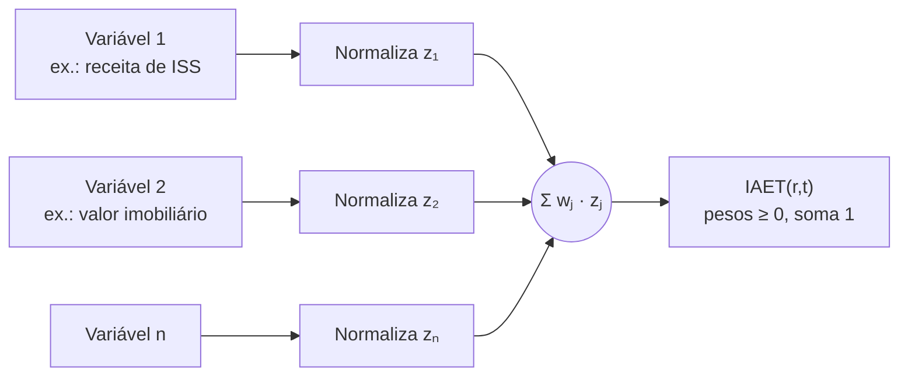

Sem vazamento temporal: para prever um mês, o VTC só usa dados de **antes** da data de previsão. O diagrama temporal mostra a regra:

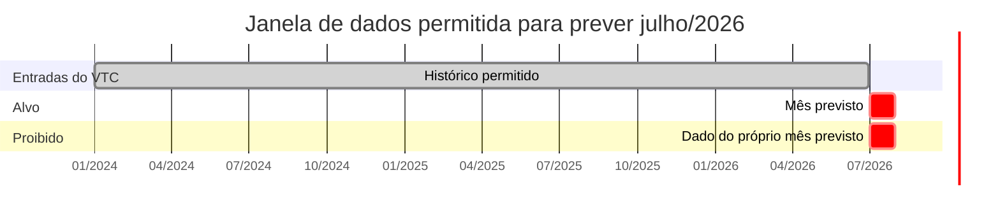

## 10. Motor analítico e estratégias por tributo

```text
Dados históricos → território → VTC/IAET → estratégia por tributo (IPTU | ISS)
→ estimativa + intervalo + desvio → potencial regional de recuperação → Sistema apresenta ao gestor
```

Funções da IA:
1. Estimar arrecadação esperada por território, período e tributo, com intervalo.
2. Identificar desvios entre base econômica/imobiliária e arrecadação.
3. Analisar a evolução do estoque de dívida antiga por coorte (tributo, região, idade, situação).
4. Estimar recuperação esperada = estoque elegível × fração esperada no horizonte H, validada por janela temporal e comparada a uma taxa histórica simples [R6–R7, R9].

Toda inferência registra versão do modelo, data, período, horizonte, variáveis e cobertura. Sem dados regionais suficientes, **não publica estimativa por região**. O ganho de arrecadação é avaliado após a intervenção, não prometido pela acurácia do modelo.

| Estratégia | Entradas candidatas |
|---|---|
| `EstrategiaIPTU` | PVG, tipologia, área construída, valor venal agregado, lançamento, recebimento, dívida histórica, território. |
| `EstrategiaISS` | NFS-e, atividade econômica, estabelecimentos, volume de serviços, ISS lançado e recolhido, estoque histórico. |

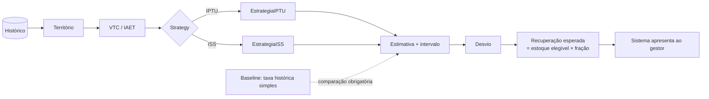

---

# PARTE IV — INTERAÇÃO COM O CIDADÃO

## 11. Solicitação de adesão e comunicação

**Solicitação de adesão.** O cidadão não é associado ao plano diretamente: `SolicitacaoAdesao` liga `Cidadao`, o `SujeitoPassivo` que ele representa e o `PlanoArrecadacao`, com status auditável (enviar, analisar, aprovar, rejeitar).

**Comunicação.** Canal oficial genérico, acessado por **adaptador**; no MVP, adaptador simulado e identificado como tal. Princípios: contato fornecido pelo titular, finalidade definida, mensagem vinculada ao processo, auditabilidade e nenhum dado fiscal em mensagem aberta.

```mermaid
sequenceDiagram
    autonumber
    actor C as Cidadão
    participant S as Sistema
    participant V as Servidor
    participant K as Canal (adaptador simulado)
    C->>S: solicita adesão ao plano (em nome do sujeito representado)
    S->>S: confere representação e registra auditoria
    S->>V: solicitação SOB_ANALISE
    alt falta documento
        V->>S: pede documento
        S->>K: mensagem vinculada ao processo (sem dado fiscal aberto)
        K-->>C: aviso
        C->>S: envia documento
    end
    V->>S: aprova ou rejeita
    S-->>C: status atualizado e auditado
```

---

# PARTE V — REQUISITOS

> Prioridade MoSCoW refere-se ao MVP. Os IDs da v1.0 foram preservados; RF-22 a RF-26 foram removidos.

## 12. Requisitos funcionais

| ID | Escopo | Requisito | MoSCoW | Critério de aceitação |
|---|---|---|---|---|
| RF-01 | Sistema | Autenticar usuários antes de liberar funções restritas. | **MUST** | Acesso sem sessão válida a recurso restrito retorna negado. |
| RF-02 | Sistema | Autorizar por perfil (papel × operação × território × recurso), negando por padrão. | **MUST** | Usuário sem permissão é negado; a negativa é auditada. |
| RF-03 | Sistema | Registrar em auditoria login, ações permitidas e negadas, de usuários, serviços e tarefas. | **MUST** | Registro contém ator, instante, recurso, resultado e correlação; sem senha, token ou documento completo. |
| RF-04 | Sistema | Exibir mapa público apenas com agregados autorizados. | COULD | Consulta anônima não revela imóvel, titular ou débito; grupos pequenos suprimidos. |
| RF-05 | Sistema | Criar, editar, versionar e acompanhar Plano Regional de Arrecadação. | **MUST** | Plano salvo gera nova versão; histórico consultável. |
| RF-06 | Sistema | Calcular o **gap de pagamento** por território, período e tributo a partir de créditos e apropriações. | **MUST** | Coorte com 1.000 de créditos vencidos e 300 pagos retorna 700; sem lançamentos retorna "indisponível", nunca `valor_orcado`. |
| RF-07 | Sistema | Separar consultas e planos por tributo (no mínimo IPTU e ISS). | SHOULD | Consulta de IPTU não inclui valores de ISS e vice-versa. |
| RF-08 | Sistema | Exibir mapas de calor e drill-down territorial a perfis autorizados. | SHOULD | Perfil sem permissão não acessa nível de imóvel. |
| RF-09 | Sistema | Navegar Palmas → Região → Quadra → Lote → Imóvel (restrito). | SHOULD | Cada nível respeita a vigência territorial da data consultada. |
| RF-10 | IA | Construir o VTC por território e período a partir do dicionário de variáveis. | SHOULD | Mesmos dados e versão geram o mesmo vetor; faltantes e cobertura registrados. |
| RF-11 | IA | Calcular o IAET conforme método documentado. | SHOULD | Pesos, normalização e versão registrados; resultado reproduzível. |
| RF-12 | IA | Estimar arrecadação esperada por território, período e tributo. | COULD | Teste em períodos posteriores ao treino; comparação com baseline; horizonte e intervalo exibidos. |
| RF-13 | IA | Detectar desvios entre arrecadação observada e estimada. | COULD | Desvio exibido como estimativa, com versão do modelo. |
| RF-14 | IA | Estimar potencial regional de recuperação de dívida antiga, sem score individual. | SHOULD | Estimativa tem coorte, estoque elegível, horizonte e métrica fora da amostra. |
| RF-15 | Sistema | Permitir ao cidadão solicitar adesão a um plano. | SHOULD | Solicitação só em nome de sujeito passivo próprio ou representado. |
| RF-16 | Sistema | Permitir ao servidor analisar e atualizar solicitações. | SHOULD | Cada decisão registra responsável e é auditada. |
| RF-17 | Sistema | Manter histórico de créditos, pagamentos, apropriações e negociações. | SHOULD | Saldo reconstruído a partir dos movimentos confere com o saldo exibido. |
| RF-18 | Sistema | Manter no máximo uma negociação ativa por crédito, preservando o histórico. | SHOULD | Duas solicitações concorrentes não criam dois acordos ativos; a rejeitada é auditada. |
| RF-19 | Sistema | Integrar canal oficial de comunicação por adaptador. | COULD | Adaptador simulado identificado; nenhuma mensagem contém dado fiscal aberto. |
| RF-20 | Sistema | Registrar mensagens e documentos associados ao processo. | COULD | Documento vinculado a processo e a autor; acesso auditado. |
| RF-21 | Sistema | Controlar a progressão de status do processo e registrar cada transição. | SHOULD | Transição inválida é rejeitada; transição válida gera auditoria. |
| RF-27 | Sistema | Comparar meta, arrecadação, gap de pagamento e percentual de execução do plano. | SHOULD | Valores derivados de movimentos; indicador indisponível é exibido como tal. |
| RF-28 | Sistema | Exibir resultados da IA sem confundir estimativa com valor observado. | SHOULD | Estimativas têm rótulo, intervalo e versão distintos dos valores observados. |

Distribuição das prioridades dos 23 requisitos funcionais do MVP:

```mermaid
pie showData
    title Requisitos funcionais por prioridade (MoSCoW)
    "MUST" : 5
    "SHOULD" : 13
    "COULD" : 5
```

## 13. Requisitos não funcionais

| ID | Tipo | Requisito | MoSCoW |
|---|---|---|---|
| RNF-01 | Segurança | Credenciais nunca em texto puro; tráfego autenticado sobre HTTPS/TLS; segredos fora do código e do Git. | **MUST** |
| RNF-02 | Segurança | Controle de acesso nega operações incompatíveis com o perfil (negar por padrão). | **MUST** |
| RNF-03 | Auditabilidade | Ações relevantes rastreáveis, inclusive de serviços e tarefas automáticas. | **MUST** |
| RNF-04 | Desempenho | Consulta agregada do painel em até 3 s no P95, informando volume, concorrência, hardware, cache e latência externa. | SHOULD |
| RNF-05 | Desempenho | Autenticação em até 2 s no P95, nas mesmas condições declaradas. | SHOULD |
| RNF-06 | Confiabilidade | Falha em integração externa não corrompe dados persistidos; carga é transacional e idempotente. | SHOULD |
| RNF-07 | Privacidade | Mapas e consultas públicas não expõem dados pessoais identificáveis. | **MUST** |
| RNF-08 | IA | Toda inferência registra versão do modelo, data, período, horizonte e variáveis de entrada. | SHOULD |
| RNF-09 | Dados | Indicadores registram fonte, período, data de corte, nível geográfico e versão do cálculo. | SHOULD |
| RNF-10 | Integridade | Negociação e alteração de status preservam consistência transacional. | SHOULD |
| RNF-11 | Arquitetura | Módulo de IA logicamente separado dos módulos que tratam processos pessoais. | SHOULD |
| RNF-12 | Explicabilidade | Valores observados e estimativas são visualmente distintos. | SHOULD |
| RNF-13 | Privacidade | Identificadores pessoais são pseudonimizados antes do armazenamento analítico; pseudonimização não é tratada como anonimização. | **MUST** |
| RNF-14 | Governança | Dados pessoais, credenciais e bases restritas nunca são versionados no Git. | **MUST** |

```mermaid
mindmap
  root((RNF))
    Segurança
      RNF-01 credenciais e TLS
      RNF-02 negar por padrão
    Privacidade
      RNF-07 mapa sem dados pessoais
      RNF-13 pseudonimização
      RNF-14 nada pessoal no Git
    Auditabilidade
      RNF-03 ações rastreáveis
    Desempenho
      RNF-04 painel até 3 s P95
      RNF-05 login até 2 s P95
    Confiabilidade e integridade
      RNF-06 carga transacional
      RNF-10 consistência transacional
    Dados e IA
      RNF-08 versão da inferência
      RNF-09 fonte e período
      RNF-11 IA separada
      RNF-12 observado × estimado
```

## 14. Interfaces externas

**Com o usuário:** IEU-01 Painel territorial · IEU-02 Mapa público · IEU-03 Mapa de calor · IEU-04 Drill-down territorial · IEU-05 Painel do Plano Regional · IEU-06 Painel de auditoria · IEU-07 Painel de solicitações · IEU-08 Área de negociação · IEU-09 Área autenticada do cidadão.

**Com outros sistemas:**

| ID | Sistema | Situação |
|---|---|---|
| IES-01 | Sistema tributário municipal | Depende de pedido de dados à Sefin |
| IES-02 | Cadastro imobiliário / PVG | Depende de pedido de dados à Sefin |
| IES-03 | NFS-e | Depende de pedido de dados à Sefin |
| IES-04 | Base territorial municipal | A confirmar (regiões, geometria, vigência) |
| IES-05 | IBGE / fontes autorizadas | Disponível publicamente |
| IES-06 | Gov.br | Adaptador simulado até homologação [R16] |
| IES-08 | Portal de transparência (NUCLEOGOV) / API antiga | Fonte dos CSVs de receita usados no piloto |

Diagrama de contexto: o sistema no centro, as pessoas à esquerda, os sistemas externos à direita.

```mermaid
flowchart LR
    SERV([Servidor]) --> SIS
    CID([Cidadão]) --> SIS
    SIS[["Sistema de<br/>Inteligência Tributária"]]
    SIS --> IES01[IES-01 Sistema tributário]
    SIS --> IES02[IES-02 Cadastro imobiliário / PVG]
    SIS --> IES03[IES-03 NFS-e]
    SIS --> IES04[IES-04 Base territorial]
    SIS --> IES05[IES-05 IBGE]
    SIS --> IES06[IES-06 Gov.br]
    SIS --> IES08[IES-08 Portal de transparência]

    classDef feito fill:#d4edda,stroke:#2e7d32,color:#1b3d1f
    classDef pendente fill:#eeeeee,stroke:#9e9e9e,stroke-dasharray:5 5,color:#555
    class IES08 feito
    class IES01,IES02,IES03,IES04,IES05,IES06 pendente
```

Verde: fonte já usada (CSVs de receita). Cinza: depende de pedido à Sefin, de confirmação ou de homologação.

---

# PARTE VI — DIAGRAMAS UML

> Diagramas em Mermaid (renderizados pelo GitHub). Mermaid não possui diagrama de casos de uso nativo; ele é representado por fluxograma seguindo a notação UML (atores fora da fronteira do sistema, casos de uso em elipses, `«include»` nas relações de inclusão).

## 15. Diagrama de casos de uso

```mermaid
flowchart LR
    SERV["«ator»<br/>Servidor de Palmas"]
    CID["«ator»<br/>Cidadão"]
    GOV["«ator»<br/>Gov.br"]
    CAN["«ator»<br/>Canal de comunicação"]

    subgraph SIS["Sistema de Inteligência Tributária"]
        UC01([Autenticar-se])
        UC02([Registrar auditoria])
        UC03([Consultar painel])
        UC04([Gerenciar plano regional])
        UC05([Consultar indicadores])
        UC06([Consultar resultados da IA])
        UC07([Gerenciar solicitações])
        UC08([Gerenciar negociações])
        UC09([Consultar auditoria])
        UC10([Gerenciar comunicação])
        UC11([Visualizar mapa público])
        UC12([Solicitar adesão])
        UC13([Acompanhar negociação])
        UC14([Consultar status])
    end

    SERV --- UC01
    SERV --- UC03
    SERV --- UC04
    SERV --- UC05
    SERV --- UC06
    SERV --- UC07
    SERV --- UC08
    SERV --- UC09
    SERV --- UC10
    CID --- UC11
    CID --- UC01
    CID --- UC12
    CID --- UC13
    CID --- UC14
    UC01 --- GOV
    UC10 --- CAN

    UC03 -. «include» .-> UC01
    UC04 -. «include» .-> UC01
    UC04 -. «include» .-> UC02
    UC07 -. «include» .-> UC02
    UC08 -. «include» .-> UC02
    UC12 -. «include» .-> UC01
    UC12 -. «include» .-> UC02
    UC13 -. «include» .-> UC01
    UC04 -. «include» .-> UC05
```

## 16. Diagramas de classes

### 16.1 Identidade, autorização e auditoria

```mermaid
classDiagram
    direction LR
    class Usuario {
        <<abstract>>
        +UUID idUsuario
        +String login
        +String hashCredencial
        +Boolean ativo
    }
    class ServidorPalmas {
        +String matricula
    }
    class Cidadao {
        +String idGovBr
    }
    class PerfilPermissao {
        +UUID idPerfil
        +String nome
    }
    class Permissao {
        +UUID idPermissao
        +String operacao
        +String recurso
        +Regiao regiaoRestrita [0..1]
    }
    class Representacao {
        +String papel
        +Date vigenciaInicio
        +Date vigenciaFim
        +String fundamento
    }
    class SujeitoPassivo {
        +UUID idSujeito
        +TipoPessoa tipoPessoa
        +String documentoPseudonimizado
    }
    class RegistroAuditoria {
        +UUID idRegistro
        +UUID idCorrelacao
        +DateTime dataHora
        +TipoAtor tipoAtor
        +String idAtor
        +String recursoAcessado
        +String acaoExecutada
        +ResultadoAcao resultado
        +String enderecoIP
    }
    class ServicoAutorizacao {
        <<service>>
        +autorizar(usuario, operacao, recurso) Boolean
    }
    class ServicoAuditoria {
        <<service>>
        +registrar(evento) void
    }

    Usuario <|-- ServidorPalmas
    Usuario <|-- Cidadao
    ServidorPalmas "0..*" --> "1" PerfilPermissao : possui
    PerfilPermissao "1" --> "1..*" Permissao : concede
    Cidadao "1" --> "0..*" Representacao : exerce
    Representacao "0..*" --> "1" SujeitoPassivo : em nome de
    RegistroAuditoria "0..*" --> "0..1" Usuario : ator humano
    ServicoAutorizacao ..> PerfilPermissao : consulta
    ServicoAutorizacao ..> ServicoAuditoria : registra decisão
```

### 16.2 Território e domínio tributário

```mermaid
classDiagram
    direction TB
    class TerritorioVersionado {
        <<abstract>>
        +UUID idTerritorio
        +Geometria geometria
        +Date vigenciaInicio
        +Date vigenciaFim
    }
    class Regiao {
        +String nome
    }
    class Quadra {
        +String codigo
    }
    class Lote {
        +String codigo
    }
    class Via {
        +UUID idVia
        +String nome
    }
    class Imovel {
        +UUID idImovel
        +String inscricaoImobiliaria
        +calcularValorVenalTotal(ano) Decimal
    }
    class AvaliacaoPVG {
        +Integer anoAvaliacao
        +CategoriaPVG categoria
        +Decimal areaConstruidaM2
        +Decimal valorVenalTerreno
        +Decimal valorVenalEdificacao
    }
    class CadastroEconomico {
        +UUID idCadastro
        +String atividadeCNAE
        +Date inicioAtividade
    }
    class SujeitoPassivo {
        +UUID idSujeito
        +TipoPessoa tipoPessoa
        +String documentoPseudonimizado
    }
    class ResponsabilidadeTributaria {
        +PapelResponsavel papel
        +Date vigenciaInicio
        +Date vigenciaFim
        +String fundamento
    }
    class Tributo {
        +String codigo
        +String nome
        +String versaoRegra
    }
    class CreditoTributario {
        +UUID idCredito
        +Integer exercicio
        +Date dataConstituicao
        +Date dataVencimento
        +Decimal valorPrincipal
        +SituacaoExigibilidade situacao
        +calcularSaldo(dataCorte) Decimal
    }
    class AjusteCredito {
        +UUID idAjuste
        +TipoAjuste tipo
        +Decimal valor
        +Date data
        +String fundamento
    }
    class InscricaoDividaAtiva {
        +UUID idInscricao
        +String numero
        +Date dataInscricao
        +SituacaoInscricao situacao
    }
    class Pagamento {
        +UUID idPagamento
        +Date dataPagamento
        +Decimal valorLiquido
    }
    class Apropriacao {
        +UUID idApropriacao
        +Decimal valorPrincipal
        +Decimal valorEncargos
    }
    class Negociacao {
        +UUID idNegociacao
        +Date dataInicio
        +StatusNegociacao status
        +Integer versao
    }
    class ItemNegociacao {
        +UUID idItem
    }

    TerritorioVersionado <|-- Regiao
    TerritorioVersionado <|-- Quadra
    TerritorioVersionado <|-- Lote
    Regiao "1" *-- "0..*" Quadra : contém
    Quadra "1" *-- "0..*" Lote : contém
    Lote "1" *-- "0..*" Imovel : contém
    Via "1..*" -- "0..*" Lote : dá acesso a
    Imovel "1" *-- "0..*" AvaliacaoPVG : avaliado por

    SujeitoPassivo "1" --> "0..*" CadastroEconomico : exerce
    SujeitoPassivo "1" --> "0..*" ResponsabilidadeTributaria : assume
    CreditoTributario "1" --> "1..*" ResponsabilidadeTributaria : atribuído por
    Tributo "1" --> "0..*" CreditoTributario : origina
    Imovel "0..1" --> "0..*" CreditoTributario : base IPTU
    CadastroEconomico "0..1" --> "0..*" CreditoTributario : base ISS
    CreditoTributario "1" *-- "0..*" AjusteCredito : ajustado por
    InscricaoDividaAtiva "0..*" -- "1..*" CreditoTributario : inscreve
    Pagamento "1" *-- "0..*" Apropriacao : reparte em
    CreditoTributario "1" --> "0..*" Apropriacao : recebe
    Negociacao "1" *-- "1..*" ItemNegociacao : abrange
    CreditoTributario "1" --> "0..*" ItemNegociacao : negociado em
```

Restrições (OCL informal):
- `{Σ Apropriacao.valorPrincipal + valorEncargos de um Pagamento ≤ Pagamento.valorLiquido}`
- `{no máximo um ItemNegociacao por CreditoTributario com Negociacao.status = ATIVA}`
- `{InscricaoDividaAtiva ↔ CreditoTributario é N:M até validação com a Sefin}`

### 16.3 Plano, indicadores e módulo analítico

```mermaid
classDiagram
    direction LR
    class PlanoArrecadacao {
        +UUID idPlano
        +Date inicioPeriodo
        +Date fimPeriodo
        +Decimal valorMeta
        +Integer versao
        +StatusPlano status
        +calcularArrecadado() Decimal
        +calcularGapPagamento() ResultadoIndicador
        +calcularPercentualMeta() Decimal
        +registrarAcao(acao) void
    }
    class AcaoPlano {
        +UUID idAcao
        +String descricao
        +Date dataPrevista
        +StatusAcao status
    }
    class SolicitacaoAdesao {
        +UUID idSolicitacao
        +DateTime dataSolicitacao
        +StatusSolicitacao status
        +DateTime dataAnalise
        +enviar() void
        +analisar() void
        +aprovar() void
        +rejeitar() void
    }
    class Indicador {
        +UUID idIndicador
        +String nome
        +String formula
        +String unidade
        +String versaoCalculo
    }
    class ValorIndicador {
        +String periodo
        +Date dataCorte
        +Decimal valor
        +String fonte
        +Decimal cobertura
        +Disponibilidade disponibilidade
    }
    class Previsao {
        +UUID idPrevisao
        +String periodo
        +Integer horizonte
        +Decimal valorEstimado
        +Decimal limiteInferior
        +Decimal limiteSuperior
        +String versaoModelo
        +DateTime dataExecucao
        +String variaveisEntrada
    }
    class ServicoIndicadores {
        <<service>>
        +calcular(indicador, territorio, periodo, tributo) ValorIndicador
    }
    class MotorAnalitico {
        <<service>>
        +analisar(territorio, periodo, tributo) ResultadoAnalitico
    }
    class PreparadorVTC {
        <<service>>
        +construirVetor(territorio, periodo) VTC
    }
    class CalculadorIAET {
        <<service>>
        +calcular(territorio, periodo, versao) Decimal
    }
    class EstrategiaAnalitica {
        <<interface>>
        +executar(vtc) ResultadoAnalitico
    }
    class EstrategiaIPTU
    class EstrategiaISS

    Regiao "1" --> "0..*" PlanoArrecadacao : possui
    Tributo "1" --> "0..*" PlanoArrecadacao : objeto de
    PlanoArrecadacao "1" *-- "0..*" AcaoPlano : contém
    PlanoArrecadacao "1" --> "0..*" SolicitacaoAdesao : recebe
    Cidadao "1" --> "0..*" SolicitacaoAdesao : realiza
    SolicitacaoAdesao "0..*" --> "1" SujeitoPassivo : em nome de
    Indicador "1" --> "0..*" ValorIndicador : medido em
    ValorIndicador "0..*" --> "1" TerritorioVersionado : refere-se a
    Previsao "0..*" --> "1" TerritorioVersionado : refere-se a
    ServicoIndicadores ..> ValorIndicador : produz
    MotorAnalitico ..> PreparadorVTC : usa
    MotorAnalitico ..> CalculadorIAET : usa
    MotorAnalitico ..> EstrategiaAnalitica : delega
    MotorAnalitico ..> Previsao : produz
    EstrategiaAnalitica <|.. EstrategiaIPTU
    EstrategiaAnalitica <|.. EstrategiaISS
```

### 16.4 Dados observados de receita (fonte dos CSVs do piloto)

```mermaid
classDiagram
    direction LR
    class Orgao {
        +Integer codigo
        +String nome
    }
    class ContaReceita {
        +String codigoOriginal
        +String codigoFormatado
        +String descricao
        +Integer nivel
    }
    class ReceitaObservacao {
        +String fonte
        +Integer ano
        +Integer mes
        +Decimal valorArrecadadoMes
        +String versaoExtracao
    }
    class PrevisaoOrcamentaria {
        +Integer ano
        +Decimal valorOrcado
        +TipoPrevisao tipo
    }
    class Tributo {
        +String codigo
        +String nome
    }

    ContaReceita "0..1" --> "0..*" ContaReceita : conta-pai de
    ContaReceita "0..*" --> "0..1" Tributo : classifica
    Orgao "1" --> "0..*" ReceitaObservacao : registra
    ContaReceita "1" --> "0..*" ReceitaObservacao : observada em
    Orgao "1" --> "0..*" PrevisaoOrcamentaria : prevê
    ContaReceita "1" --> "0..*" PrevisaoOrcamentaria : prevista em
```

Chave candidata de `ReceitaObservacao`: fonte + órgão + unidade + ano + mês + código original. Orçamento em granularidade **anual** (`PrevisaoOrcamentaria`), receita em granularidade **mensal**.

## 17. Diagramas de sequência

### 17.1 Servidor: acesso a módulo com autorização e auditoria

```mermaid
sequenceDiagram
    actor S as Servidor
    participant UI as Interface
    participant AUT as ServicoAutenticacao
    participant AZ as ServicoAutorizacao
    participant AUD as ServicoAuditoria
    participant PL as ServicoPlano

    S->>UI: informar credenciais
    UI->>AUT: autenticar(login, credencial)
    alt credencial inválida
        AUT-->>UI: falha
        UI->>AUD: registrar(LOGIN, NEGADO, idCorrelacao)
        UI-->>S: acesso negado
    else credencial válida
        AUT-->>UI: sessão + perfil
        UI->>AUD: registrar(LOGIN, PERMITIDO, idCorrelacao)
        S->>UI: abrir plano da região R
        UI->>AZ: autorizar(usuario, CONSULTAR_PLANO, R)
        alt sem permissão
            AZ-->>UI: negado
            UI->>AUD: registrar(CONSULTAR_PLANO, NEGADO, idCorrelacao)
            UI-->>S: operação não permitida
        else permitido
            AZ-->>UI: permitido
            UI->>PL: consultarPlano(R)
            PL-->>UI: plano + indicadores
            UI->>AUD: registrar(CONSULTAR_PLANO, PERMITIDO, idCorrelacao)
            UI-->>S: exibir plano
        end
    end
```

### 17.2 Cidadão: negociação com exclusividade de acordo ativo

```mermaid
sequenceDiagram
    actor C as Cidadão
    participant UI as Área autenticada
    participant AZ as ServicoAutorizacao
    participant NG as ServicoNegociacao
    participant DB as Banco (transação)
    participant AUD as ServicoAuditoria

    C->>UI: solicitar negociação do crédito K
    UI->>AZ: autorizar(cidadao, NEGOCIAR, K)
    AZ-->>UI: permitido (representação válida)
    UI->>NG: abrirNegociacao(K)
    NG->>DB: BEGIN, bloquear crédito K
    NG->>DB: existe negociação ATIVA para K?
    alt já existe acordo ativo
        DB-->>NG: sim
        NG->>DB: ROLLBACK
        NG->>AUD: registrar(NEGOCIAR, NEGADO, motivo=ATIVA_EXISTENTE)
        NG-->>UI: rejeitada
        UI-->>C: já há negociação ativa para este crédito
    else nenhum acordo ativo
        DB-->>NG: não
        NG->>DB: inserir Negociacao + ItemNegociacao, COMMIT
        NG->>AUD: registrar(NEGOCIAR, PERMITIDO)
        NG-->>UI: negociação INICIADO
        UI-->>C: exibir status
    end
```

### 17.3 Motor analítico: estimativa territorial

```mermaid
sequenceDiagram
    actor G as Gestor
    participant SIS as Sistema (Fachada do plano)
    participant REP as Repositório de dados
    participant IA as MotorAnalitico
    participant VTC as PreparadorVTC
    participant EST as EstrategiaIPTU / EstrategiaISS

    G->>SIS: solicitar análise(regiao, periodo, tributo)
    SIS->>REP: obterDados(regiao, periodo, tributo)
    REP-->>SIS: dadosObservados + cobertura
    SIS->>IA: analisar(dadosObservados)
    IA->>VTC: construirVetor(regiao, periodo)
    VTC-->>IA: vetor + faltantes
    alt cobertura insuficiente
        IA-->>SIS: indisponível (motivo, cobertura)
        SIS-->>G: exibir "estimativa indisponível"
    else cobertura suficiente
        IA->>EST: executar(vetor)
        EST-->>IA: estimativa + intervalo + desvio
        IA-->>SIS: Previsao(versaoModelo, horizonte, variáveis)
        SIS-->>G: exibir estimativa rotulada, separada do observado
    end
```

## 18. Diagrama de estados do processo

```mermaid
stateDiagram-v2
    [*] --> INICIADO
    INICIADO --> SOB_ANALISE : enviar
    SOB_ANALISE --> AGUARDANDO_DOCUMENTO : solicitar documento
    AGUARDANDO_DOCUMENTO --> SOB_ANALISE : documento recebido
    SOB_ANALISE --> EM_NEGOCIACAO : aprovar
    SOB_ANALISE --> CANCELADO : rejeitar
    AGUARDANDO_DOCUMENTO --> CANCELADO : prazo expirado
    EM_NEGOCIACAO --> CONCLUIDO : acordo cumprido
    EM_NEGOCIACAO --> CANCELADO : acordo rompido
    CONCLUIDO --> [*]
    CANCELADO --> [*]
    note right of SOB_ANALISE
        Toda transição gera RegistroAuditoria.
        Transições fora deste diagrama são rejeitadas (RF-21).
    end note
```

---

# PARTE VII — RASTREABILIDADE E IMPLEMENTAÇÃO

## 19. Rastreabilidade

A coluna **Evidência de teste** aponta os testes que comprovam o requisito no código atual. Onde não há código, a linha diz o que falta: requisito especificado não é requisito comprovado. Tipos de teste: **U** unitário · **I** integração com MySQL · **A** aceitação em Gherkin (`tests/aceitacao/*.feature`) · **V** consulta de validação (`sql/validacao.sql`) · **M** teste de mutação (§23).

O caminho de um requisito até a prova de que funciona:

```mermaid
flowchart LR
    REQ["Requisito<br/>ex.: RF-18"] --> CA["Critério de aceitação<br/>2 negociações ativas → rejeita"]
    CA --> G["Cenário Gherkin<br/>negociacao_saldo.feature @rf18"]
    G --> ST["Definição dos passos<br/>test_negociacao_auditoria.py"]
    ST --> COD["Código / banco<br/>credito_em_negociacao (PK)"]
    COD --> GATE["Quality gates<br/>G1–G10"]
    GATE --> EV["Evidência na §19"]
```

Situação atual das 17 linhas da tabela 19.1:

```mermaid
pie showData
    title Requisitos do sistema com evidência de teste
    "Comprovados" : 3
    "Parciais" : 4
    "Sem código ainda" : 10
```

### 19.1 Requisitos do sistema

| Requisito | Caso de uso | Classe / serviço | Sequência | Critério de aceitação | Evidência de teste (Sprint 2) |
|---|---|---|---|---|---|
| RF-01 | Autenticar-se | Usuario, ServicoAutenticacao | 17.1 | Sessão inválida → negado | ❌ Sem código de autenticação (só a tabela `usuario`) |
| RF-02 / RNF-02 | todos restritos | PerfilPermissao, Permissao, ServicoAutorizacao | 17.1, 17.2 | Perfil sem permissão → negado e auditado | ❌ Sem serviço de autorização. Só as tabelas, com restrições testadas: **I** `test_permissao_por_regiao_tem_integridade_referencial` (escopo por região existente; sem duplicata no município) |
| RF-03 / RNF-03 | Registrar auditoria | RegistroAuditoria, ServicoAuditoria | 17.1, 17.2 | Registro sem senha/token, com correlação | ⚠️ Parcial — **A** `auditoria.feature` (2 cenários); **I** `test_banco::test_auditoria_exige_ator_coerente`. Não testado: ausência de senha/token e cadeia de integridade (ver PROTOCOLOS A2–A5) |
| RF-04 / RNF-07 | Visualizar mapa público | ValorIndicador (agregado) | — | Consulta anônima sem identificadores | ❌ Sem interface |
| RF-05 | Gerenciar plano | PlanoArrecadacao, AcaoPlano | 17.1 | Nova versão ao salvar | ❌ Só estrutura (`uq_plano_versao`) |
| RF-06 / RF-27 | Consultar indicadores | ServicoIndicadores, CreditoTributario, Apropriacao | — | 1.000 − 300 = 700; sem lançamentos → indisponível | ❌ Sem serviço; a restrição `ck_vi_disp` é testada: **I** `test_restricoes_do_modelo_rejeitam_dados_invalidos[ck_vi_disp]` |
| RF-10 / RF-11 | Consultar resultados da IA | PreparadorVTC, CalculadorIAET | 17.3 | Mesma entrada e versão → mesmo resultado | ❌ Sprint de IA |
| RF-12 / RF-13 / RF-28 | Consultar resultados da IA | MotorAnalitico, EstrategiaAnalitica, Previsao | 17.3 | Teste temporal fora da amostra; rótulo distinto | ❌ Sprint de IA; a restrição `ck_prev_intervalo` é testada: **I** `test_restricoes_do_modelo_rejeitam_dados_invalidos[ck_prev_intervalo]` |
| RF-14 | Consultar resultados da IA | MotorAnalitico, InscricaoDividaAtiva | 17.3 | Coorte, estoque elegível e horizonte informados | ❌ Sprint de IA |
| RF-15 / RF-16 | Solicitar adesão / Gerenciar solicitações | SolicitacaoAdesao, Representacao | — | Sem representação → negado | ❌ Só estrutura |
| RF-17 | Acompanhar negociação | CreditoTributario, AjusteCredito, Apropriacao | — | Saldo reconstruído = saldo exibido | ✅ **A** `negociacao_saldo.feature` (saldo derivado; apropriação ≤ pagamento); **I** `test_banco::test_saldo_derivado_dos_movimentos`; **V** V09, V10 |
| RF-18 / RNF-10 | Gerenciar negociações | Negociacao, ItemNegociacao | 17.2 | Concorrência não cria dois acordos ativos | ⚠️ **A** `negociacao_saldo.feature` (segunda negociação ativa → erro 1062); **I** `test_banco::test_uma_negociacao_ativa_por_credito`; **V** V12, V13. Testado em sequência; duas transações **simultâneas** ainda não |
| RF-21 | Consultar status | máquina de estados | 18 | Transição inválida rejeitada | ❌ Sem serviço (ENUM de estados existe) |
| RNF-01 / RNF-14 | — | configuração | — | Segredos fora do código e do Git | ⚠️ **U** `test_etl_utilitarios::TestConfig` (leitura do `.env`); `.gitignore` conferido manualmente, sem teste automatizado |
| RNF-06 | Carga de dados | `etl.carregar_receita`, `etl.parser.validar_arquivo` | — | Carga transacional e idempotente; arquivo com erro de contrato não é publicado e a recarga não esconde a reprovação | ✅ **A** `carga_receita.feature` (reimportação; fração de centavo; recarga de arquivo reprovado; coluna ausente); **I** `test_recarga_e_idempotente`, `test_recarga_devolve_o_mesmo_resumo_da_primeira_vez`, `test_arquivo_reprovado_nao_e_mascarado_na_recarga`, `test_nova_versao_das_regras_reprocessa_o_arquivo_reprovado`, `test_banco_impede_publicar_o_mesmo_arquivo_duas_vezes`, `test_coluna_ausente_reprova_o_arquivo_sem_erro_cru`, `test_componentes_sem_a_conta_pai_reprovam_o_arquivo_sem_erro_cru`, `test_linha_com_campos_a_menos_reprova_o_arquivo_sem_erro_cru`; **U** `test_parser::TestContratoDoArquivo`, `TestValidarArquivo`; **V** V18 |
| RNF-09 | Carga de dados | `fonte_snapshot`, `stg_receita_atual` | — | Toda medida aponta fonte e linha física de origem | ✅ **A** `carga_receita.feature` ("cada valor aponta para a linha de origem"); **U** `test_amostra::test_linha_origem_aponta_para_o_arquivo_original`, `test_parser::TestLeituraDaFonte` (campo com quebra de linha, linha em branco) |
| RNF-13 | — | SujeitoPassivo | — | Documento pseudonimizado | ⚠️ **V** V14 (formato hexadecimal de 64 caracteres). Especificada como HMAC-SHA-256 com chave fora do banco (`PSEUDONIMO_CHAVE`); sem código, porque o piloto não tem dados pessoais |

### 19.2 Entregáveis técnicos da Sprint 2

| Item (§20) | Código | Evidência de teste |
|---|---|---|
| Regras de ETL §20.2: códigos por vigência, pai alternativo não somado, 2022 muda códigos, ano fora das vigências não classificado | `etl/parser.py` | **U** `test_parser::TestClassificacao`, `TestDecimal`, `TestInterpretar`, `TestContratoDoArquivo`; **M** parser |
| Contrato do arquivo antes da publicação: 14 colunas, linhas alinhadas, componente com conta-pai; snapshot `PUBLICADO` ou `REJEITADO` | `etl/parser.py` (`validar_arquivo`), `etl/carregar_receita.py`, `fonte_snapshot` | **U** `TestValidarArquivo`, `TestComponentesSemPai`, `TestLeituraDaFonte`; **I** testes de contrato de `test_banco.py`; **A** `carga_receita.feature`; **V** V18; **M** parser |
| Somar tudo duplicaria a receita; soma só componentes | `v_tributo_mes` | **U** `test_amostra::test_somar_todas_as_linhas_duplicaria_a_receita`; **A** `carga_receita.feature`; **I** `test_view_tributo_mes_soma_so_componentes` |
| Conta-pai = soma dos 4 componentes; componentes sem o total do mês são divergência | `etl.parser.conciliar`, `v_conciliacao_pai_filhos` | **U** `test_amostra::test_pais_conferem_com_soma_dos_componentes`, `test_parser::test_conciliar_detecta_componente_faltando`, `TestConciliarCompetencias`; **I** `test_conciliacao_sem_divergencia`, `test_divergencia_de_conciliacao_e_registrada`, `test_componentes_sem_o_total_do_mes_sao_divergencia_registrada`; **A** `carga_receita.feature`; **V** V02, V03 |
| Orçamento anual não multiplicado | `orcamento_informado` | **I** `test_orcamento_nao_e_multiplicado`; **A** `carga_receita.feature`; **V** V06 |
| Valores de 2025/jan conferem com a fonte | `v_tributo_mes` | **U** `test_amostra::test_totais_de_jan_2025`; **A** `carga_receita.feature`; **V** V04 |
| 3FN: fato rejeita conta TOTAL; mês fora de 1–12 rejeitado; demais restrições do modelo | `schema.sql` (FK composta, CHECK, UNIQUE) | **I** `test_fato_rejeita_conta_total` (erro 1452), `test_mes_invalido_rejeitado` (erro 3819), `test_restricoes_do_modelo_rejeitam_dados_invalidos` (7 restrições); **V** V17 (redundância controlada de `conta_receita`) |
| Grafo (lista de adjacência, BFS, DFS, ciclo, componentes) | `src/estruturas/grafo.py` | **U** `test_grafo.py`, incluindo a ordem da DFS do Algoritmo 24.12 de Lintzmayer & Mota e o teste de propriedade contra implementações de referência; **A** `estruturas.feature`; **M** grafo |
| Tabela hash (encadeamento, redimensionamento, índice secundário) | `src/estruturas/indice_hash.py` | **U** `test_indice_hash.py`; **A** `estruturas.feature` (Gersting, Exemplo 50); **M** índice hash |
| Heap binária e fila de prioridade versionada | `src/estruturas/heap_prioridade.py` | **U** `test_heap.py`, com a regressão da ação reinserida e testes de propriedade contra o `heapq` e um modelo de referência; **A** `estruturas.feature`; **M** heap |
| 18 consultas de validação executam | `sql/validacao.sql`, `etl/relatorio_validacao.py` | **I** `test_consultas_de_validacao_executam`, `test_relatorio_de_validacao_executa_todos_os_blocos`; **U** `TestRelatorioValidacao` |

## 20. Ponte para a Sprint 2 (ER, ETL e estruturas)

### 20.1 Do modelo de classes ao ER (3FN)

| Tabela | Origem no modelo | Dados no piloto |
|---|---|---|
| `orgao`, `conta_receita`, `receita_observacao`, `previsao_orcamentaria`, `tributo` | §16.4 | **Reais** (CSVs de receita) |
| `regiao`, `quadra`, `lote`, `via`, `lote_via`, `imovel`, `avaliacao_pvg` | §16.2 | Sintéticos identificados |
| `sujeito_passivo`, `cadastro_economico`, `responsabilidade_tributaria` | §16.2 | Sintéticos identificados |
| `credito_tributario`, `ajuste_credito`, `inscricao_divida_ativa`, `inscricao_credito` (N:M) | §16.2 | Sintéticos identificados |
| `pagamento`, `apropriacao`, `negociacao`, `item_negociacao` | §16.2 | Sintéticos identificados |
| `usuario`, `perfil_permissao`, `permissao`, `representacao`, `registro_auditoria` | §16.1 | Sintéticos identificados |
| `plano_arrecadacao`, `acao_plano`, `solicitacao_adesao`, `indicador`, `valor_indicador`, `previsao` | §16.3 | Estrutura; valores observados de receita quando aplicável |

Regras de 3FN herdadas do modelo: nenhum atributo derivado é coluna (saldo, valor venal total, arrecadado, percentual da meta); avaliação PVG depende de (imóvel, ano) e fica em tabela própria; associações N:M viram tabelas de junção; toda linha sintética tem `origem_dado = 'SINTETICO'`. Exceção declarada: `conta_receita` mantém duas redundâncias controladas (o papel, alvo da FK composta, e a classificação repetida por órgão), descritas em `docs/modelagem_er.md` §3.4, com a restrição `ck_conta_papel` e a consulta V17 que impedem a anomalia.

**Não usar** `contratos`, `despesas`, `licitacoes` ou `servidores` como fonte de devedores: CPF/CNPJ de fornecedor não indica dívida fiscal.

```mermaid
flowchart LR
    subgraph CL["Classes (§16)"]
        K1[ContaReceita · ReceitaObservacao]
        K2[CreditoTributario · Pagamento · Apropriacao]
        K3[Usuario · PerfilPermissao · RegistroAuditoria]
        K4[PlanoArrecadacao · Indicador · Previsao]
    end
    subgraph TB["Tabelas (sql/schema.sql)"]
        T1[conta_receita · receita_componente_mensal<br/>total_informado_mensal · orcamento_informado]
        T2[credito_tributario · pagamento · apropriacao<br/>ajuste_credito · inscricao_credito]
        T3[usuario · perfil_permissao · permissao<br/>perfil_concede · registro_auditoria]
        T4[plano_arrecadacao · acao_plano<br/>valor_indicador · previsao]
    end
    K1 --> T1
    K2 --> T2
    K3 --> T3
    K4 --> T4

    classDef real fill:#d4edda,stroke:#2e7d32,color:#1b3d1f
    classDef sint fill:#e7f0fb,stroke:#3a6ea5,color:#16324f
    class T1 real
    class T2,T3,T4 sint
```

Verde: dados reais. Azul: dados sintéticos identificados (`origem_dado = 'SINTETICO'`). O diagrama ER completo está em `docs/modelagem_er.md`.

### 20.2 Regras obrigatórias de ETL (receita)

1. Filtrar `codigo_original`: IPTU = `1112500`, ISSQN = `1114511`, ITBI = `1112530`, com `orgao = 2798` (Tesouro Municipal). Dívida ativa: acrescentar 3 (principal) ou 4 (multas e juros), ex.: `11125003`, `11125004`.
2. **Não somar** contas-pai com filhas (ex.: `111250`, `111253`) — duplica receita.
3. `valor_arrecado_periodo` = `valor_arrecado_mes` nas 176.993 linhas: não somar ambos.
4. `valor_orcado` se repete nos 12 meses: guardar uma ocorrência anual.
5. 2026 é parcial; mês ausente não vira zero.
6. Não unir `receita_palmas.csv` (2010–2018) e `receita_acessoinformacao.csv` (2018–2026) somando períodos comuns sem reconciliar códigos e conceitos.
7. Carga idempotente: o mesmo arquivo (SHA-256) é publicado no máximo uma vez; um arquivo reprovado só é reprocessado por uma nova versão das regras (`VERSAO_PARSER`, registrada no snapshot). O banco garante as duas coisas.
8. Contrato do arquivo antes de publicar (Relatório de Auditoria, p. 9): as 14 colunas da fonte, o mesmo número de campos em cada linha e a conta-pai de todo componente. Um erro reprova o arquivo inteiro (`REJEITADO`), que fica só com staging e evidências.
9. Ano fora das vigências aprovadas (2019–2021 e 2022–2026) não é classificado: a conta fica só no staging.

```mermaid
flowchart TD
    CSV[Arquivo CSV] --> SHA{"SHA-256 já publicado, ou<br/>reprovado por estas regras?"}
    SHA -- sim --> FIM1["Nada é gravado; devolve o<br/>resumo registrado (regra 7)"]
    SHA -- não --> VAL{"Contrato do arquivo<br/>(regra 8): colunas, campos,<br/>centavos, mês, conta-pai"}
    VAL -- não --> ERR["REJEITADO: staging<br/>e evidências, nada publicado"]
    VAL -- sim --> MAP{"Código no mapeamento<br/>1112500 · 1114511 · 1112530<br/>órgão 2798"}
    MAP -- "não (inclui pais alternativos<br/>111250 e 111253 — regra 2)" --> NM[Fica só no staging]
    MAP -- sim --> PAP{Conta-pai?}
    PAP -- sim --> TOT[total_informado_mensal<br/>só conferência]
    PAP -- não --> COMP[receita_componente_mensal<br/>medida aditiva]
    TOT & COMP --> ORC["Orçamento: 1 vez por vigência<br/>(regra 4)"]
    TOT & COMP --> CONC[Conciliação pai × componentes]
```

### 20.3 Valores de referência para validação (exercício 2025, órgão 2798)

| Tributo | Orçado | Arrecadado | Realizado − orçado |
|---|---|---|---|
| IPTU | 112.219.000,00 | 111.255.405,91 | −963.594,09 |
| ISSQN | 278.560.000,00 | 314.191.824,09 | +35.631.824,09 |
| ITBI | 45.115.000,00 | 43.647.325,08 | −1.467.674,92 |

| Recuperação da dívida ativa | Principal | Multas e juros | Total |
|---|---|---|---|
| IPTU | 12.678.827,83 | 4.864.828,90 | 17.543.656,73 |
| ISSQN | 2.558.812,69 | 2.252.841,16 | 4.811.653,85 |
| ITBI | 744.370,42 | 323.447,33 | 1.067.817,75 |

```mermaid
xychart-beta
    title "2025 · orçado × arrecadado (R$ milhões)"
    x-axis ["IPTU", "ISSQN", "ITBI"]
    y-axis "R$ milhões" 0 --> 350
    bar [111.3, 314.2, 43.6]
    line [112.2, 278.6, 45.1]
```

Barras: arrecadado. Linha: orçado. O ISSQN superou o orçamento em R$ 35,6 milhões, o que **não** elimina dívidas antigas: desvio orçamentário não é tax gap (§1.1).

### 20.4 Estruturas de dados (Parte 1)

Documento completo de cada estrutura, com código, execução e testes: [`docs/parte1/`](parte1/README.md).

| Estrutura | Uso | Complexidade e ressalva |
|---|---|---|
| Grafo (lista de adjacência) | Sujeitos, imóveis, créditos e processos; mesmo sujeito em várias inscrições | Espaço O(V+E); percurso O(V+E). Grafo de relações não é mapa de rotas. |
| Tabela hash | ID de crédito/inscrição → registro; índice secundário sujeito → vários IDs | Busca/inserção esperada O(1); pior caso O(n). CPF/CNPJ sozinho não identifica cada dívida. |
| Heap | Fila de ações ou lotes elegíveis por prioridade definida e versionada | Topo O(1); inserir/remover O(log n); construir O(n). Heap ordena prioridades, não estima probabilidades. |

Demonstração com dados sintéticos explicitamente identificados; métricas sobre dados sintéticos não comprovam desempenho real.

```mermaid
flowchart LR
    subgraph G["Grafo · O(V+E)"]
        S1((Sujeito 1)) --> C1((Crédito 1)) --> I1((Imóvel 1))
        S1 --> C3((Crédito 3)) --> I2((Imóvel 2))
        S2((Sujeito 2)) --> C3
    end
    subgraph H["Tabela hash · O(1) esperado"]
        K["chave (snapshot, órgão, ano, mês, código)"] --> B["bucket = hash mod m"] --> R[registro]
    end
    subgraph P["Heap · O(log n)"]
        TOP["topo: ação mais urgente"] --> F1[filho 2i+1]
        TOP --> F2[filho 2i+2]
    end
```

## 21. Estrutura do repositório

```text
PI2_Sprint2-Grupo-1-UFT/    # github.com/guilhermercmoraes-tech/PI2_Sprint2-Grupo-1-UFT (pasta local: pi2-inteligencia-tributaria)
├── README.md, SPRINT2.md
├── pyproject.toml          # cobertura, contratos de dependência (import-linter), Pyright
├── pytest.ini              # marcadores por requisito (rf17, rf18, rnf06…)
├── requirements.txt, requirements-dev.txt
├── .env.example            # sem segredos reais (.env fica fora do Git)
├── .github/workflows/qualidade.yml   # G1–G9 em cada push; G1–G10 toda semana e sob demanda
├── docs/
│   ├── REQUISITOS_UML.md   # este documento
│   ├── COMO_O_SISTEMA_FUNCIONA.md  # fluxo de trabalho com diagramas
│   ├── modelagem_er.md, er_modulo_a_receita.png, er_modulo_b_operacional.png
│   ├── arquitetura_dados.md, E3_integracao_segura.md, PROTOCOLOS_SEGURANCA_AUDITORIA.md
│   ├── validacao.md        # gerado: consultas SQL de validação
│   ├── qualidade.md        # gerado: resultado dos quality gates
│   └── mutacao.md          # gerado: testes de mutação e mutantes sobreviventes
├── sql/                    # schema, dados de referência, semente sintética, validação
├── etl/                    # amostra, parser, carga, relatório de validação
├── src/estruturas/         # grafo, tabela hash, heap
├── tests/
│   ├── test_*.py           # unitários e de integração (test_banco.py)
│   └── aceitacao/          # Gherkin: *.feature + definições de passos
├── scripts/                # quality_gate.py, mutacao.py, sobreviventes.py, filtro_anotacoes.py, demo_parte1.py, mysql_portatil.ps1
└── data/amostra/           # única base versionada: 10 linhas reais
```

Cada mudança no Git referencia RF/RNF, decisão de arquitetura e teste. O repositório usa só a `main`, com desenvolvimento baseado no tronco: todo commit vai para o branch principal e passa pelos gates [E10, cap. 10, §10.3]. Nenhuma integração é aceita com quality gate reprovado (§23).

```mermaid
flowchart LR
    DOCS[docs/<br/>requisitos e UML] --> SQL[sql/<br/>esquema] 
    DOCS --> SRC[src/ e etl/<br/>código]
    SQL --> SRC
    SRC --> TESTS[tests/<br/>unitários · integração · Gherkin]
    TESTS --> SCR[scripts/<br/>quality_gate · mutação]
    SCR --> CI[.github/workflows/<br/>integração contínua]
    SCR --> REL[docs/qualidade.md<br/>docs/mutacao.md]
```

---

## 22. Pontos abertos

Numeração da v1.0 preservada. Critério de encerramento: responsável, decisão registrada, evidência, data e versão.

| ID | Ponto | Encaminhamento proposto |
|---|---|---|
| PA-01 | Fórmula do IAET | Índice exploratório Σ wj·zj; definir conceito, normalização, faltantes e sensibilidade antes dos pesos [R8]. |
| PA-02 | Variáveis finais do VTC | Dicionário por variável; começar pelo histórico de receita; sem vazamento temporal [R9]. |
| PA-03 | Recuperação de dívida antiga | Coortes por tributo, região, idade e situação; validação temporal contra taxa histórica simples [R6–R7]. |
| PA-04 | Granularidade mínima | Município primeiro; região/quadra só com dados e controle de divulgação [R10, R13]. |
| PA-08 | Integração Gov.br | Separar autenticação de autorização local; adaptador simulado até homologação [R16]. |
| PA-10 | Permissões reais | Matriz papel × operação × território × recurso validada pela Prefeitura; negar por padrão. |
| PA-11 | Retenção documental | Inventário com finalidade, base legal, responsável, prazo e descarte; LGPD não fixa prazo único [R10]. |
| PA-12 | Dados da Sefin | Pedido institucional: créditos e pagamentos pseudonimizados, dívida ativa, território e, na falta de microdados, histórico agregado região × mês × tributo × coorte. |
| **PA-14** | **Escopo: score individual × territorial** | **Pendência decisiva.** O enunciado pede predição individual de inadimplência e recuperabilidade; este documento limita a IA ao território (RF-14). Registrar a decisão com o professor. Se o score individual for mantido, documentar experimento separado, condicionado a dados autorizados e rótulos históricos. |

Quem precisa decidir cada ponto aberto:

```mermaid
flowchart LR
    PROF([Professor]) --> PA14[PA-14 score individual × territorial]
    SEFIN([Sefin]) --> PA12[PA-12 dados de créditos e dívida ativa]
    SEFIN --> PA10[PA-10 permissões reais]
    PREF([Prefeitura / Procuradoria]) --> PA11[PA-11 retenção documental]
    PREF --> PA08[PA-08 integração Gov.br]
    EQ([Equipe]) --> PA01[PA-01 fórmula do IAET]
    EQ --> PA02[PA-02 variáveis do VTC]
    EQ --> PA03[PA-03 recuperação por coorte]
    EQ --> PA04[PA-04 granularidade mínima]
    PA12 -. bloqueia .-> PA02
    PA12 -. bloqueia .-> PA03
    PA14 -. define o escopo de .-> PA03
```

---

# PARTE VIII — GARANTIA DE QUALIDADE

## 23. Quality gates

Um requisito só é considerado **implementado** quando o código passa por todos os gates abaixo. Os gates rodam em cada etapa de desenvolvimento e em cada integração, pelo mesmo script (`scripts/quality_gate.py`), e bloqueiam a integração se qualquer um falhar. Os limites ficam no início do script; alterá-los exige justificativa registrada.

### 23.1 Gates e limites

| Gate | O que garante | Ferramenta | Limite |
|---|---|---|---|
| G1 Testes unitários | Cada função faz o que promete, isolada do banco | pytest | 100% passando, nenhum ignorado |
| G2 Testes de integração | Esquema, restrições e carga funcionam no MySQL real | pytest + MySQL 8.4 | 100% passando, nenhum ignorado |
| G3 Testes de aceitação | Critérios de aceitação dos requisitos, em linguagem de negócio | pytest-bdd (Gherkin em português) | 100% dos cenários passando |
| G4 Cobertura | Todo código e todo desvio condicional são exercitados | coverage.py (linhas + ramos) | total ≥ 90%; cada módulo ≥ 80% |
| G5 Complexidade ciclomática | Nenhuma função difícil de testar e entender | radon | ≤ 10 por função |
| G6 Manutenibilidade | Módulos legíveis e modificáveis | radon (índice MI) | ≥ 20 por módulo |
| G7 Tamanho | Módulos e funções pequenos e coesos | radon + AST | módulo ≤ 250 SLOC; função ≤ 50 linhas |
| G8 Dependências | Arquitetura em camadas preservada (§3) | import-linter | todos os contratos mantidos |
| G9 Tipos | Contratos de tipo coerentes | Pyright | 0 erros no código de produção |
| G10 Mutação | Os testes detectam falhas lógicas, não só executam o código | cosmic-ray | ≥ 80% dos mutantes mortos em cada módulo |

**Contratos de dependência (G8)**, em `pyproject.toml`:
1. `src.estruturas` não importa `etl` nem `pymysql`: as estruturas de dados são independentes da infraestrutura.
2. `etl.parser` não importa banco nem configuração: a validação é pura e testável sem MySQL.
3. Grafo, hash e heap são independentes entre si.
4. Camadas do ETL: `relatorio_validacao | carregar_receita | amostra` → `sql_runner` → `config | parser`.

```mermaid
flowchart LR
    subgraph COMP["Comportamento"]
        G1[G1 unitários] --> G2[G2 integração] --> G3[G3 Gherkin] --> G4[G4 cobertura]
    end
    subgraph EST["Estrutura"]
        G5[G5 complexidade] --> G6[G6 manutenibilidade] --> G7[G7 tamanho] --> G8[G8 dependências] --> G9[G9 tipos]
    end
    subgraph EFI["Eficácia dos testes"]
        G10[G10 mutação]
    end
    COMP --> EST --> EFI --> OK{Todos aprovados?}
    OK -- sim --> APROV[Integração permitida]
    OK -- não --> BLOQ[Integração bloqueada]
```

### 23.2 Quando cada gate roda

| Etapa | Gates | Onde |
|---|---|---|
| Desenvolvimento (antes de cada commit) | G1–G9 | `python scripts/quality_gate.py` |
| Integração na `main` (cada push) | G1–G9 | GitHub Actions (`.github/workflows/qualidade.yml`), com MySQL 8.4 em contêiner |
| Toda segunda-feira e sob demanda (aba Actions → Run workflow) | G1–G10 | GitHub Actions, com `--mutacao`, que é lenta demais para cada push |

O repositório usa só a `main`. É o **desenvolvimento baseado no tronco** que o ESM descreve junto da integração contínua: "todo desenvolvimento ocorre no branch principal" (Valente, cap. 10, §10.3). A revisão por pares, que num fluxo com branches viria do pull request, é feita sobre os commits da `main` e registrada no diário de bordo.

```mermaid
sequenceDiagram
    autonumber
    actor D as Desenvolvedor
    participant L as quality_gate.py (local)
    participant G as GitHub
    participant CI as GitHub Actions + MySQL
    D->>L: antes do commit
    L-->>D: G1–G9 aprovados
    D->>G: git push (main)
    G->>CI: dispara workflow
    CI-->>G: G1–G9
    alt algum reprovado
        G-->>D: commit marcado com falha · relatórios anexados · corrigir antes do próximo
    end
    Note over G,CI: toda segunda-feira ou sob demanda
    G->>CI: workflow com --mutacao
    CI-->>G: G1–G10
```

### 23.3 Tipos de teste

| Tipo | Pasta | Papel |
|---|---|---|
| Unitário | `tests/test_*.py` (exceto `test_banco.py`) | Estruturas de dados, parser, utilitários de ETL; sem banco |
| Integração | `tests/test_banco.py` | Recria o banco `pi2_tributario_teste`; exige o **código de erro MySQL exato** de cada restrição violada (1452 FK, 3819 CHECK, 1062 PK) |
| Aceitação (Gherkin) | `tests/aceitacao/*.feature` | Cenários `Dado/Quando/Então` escritos a partir dos critérios de aceitação; cada funcionalidade é marcada com o requisito que comprova (`@rf17`, `@rf18`, `@rnf06`…) |
| Mutação | `scripts/mutacao.py` | Injeta falhas lógicas no código e verifica se algum teste as detecta |

Funcionalidades em Gherkin:

| Arquivo | Requisitos | Cenários |
|---|---|---|
| `carga_receita.feature` | RNF-06, RNF-09, Parte 2 | carga publica componentes e totais separados; reimportação não duplica; arrecadação soma só componentes; fração de centavo interrompe a publicação e o arquivo fica `REJEITADO`; recarga de arquivo reprovado repete o diagnóstico; arquivo sem uma coluna da fonte é reprovado; orçamento não multiplicado |
| `negociacao_saldo.feature` | RF-17, RF-18, RNF-10 | saldo derivado dos movimentos; segunda negociação ativa rejeitada; apropriação ≤ pagamento |
| `auditoria.feature` | RF-03, RNF-03 | ação de usuário sem usuário rejeitada; tarefa automática aceita com identificador do sistema |
| `estruturas.feature` | Parte 1 | fila de prioridade com pagamento; colisão por encadeamento (Gersting, Ex. 50); componentes pela conta-pai |

### 23.4 Testes de mutação

Um mutante é uma cópia do código com uma falha lógica injetada, por exemplo `<` trocado por `<=` ou `continue` por `break`. Se algum teste falha, o mutante está **morto**. Se todos passam, ele **sobreviveu**: ou existe um comportamento que nenhum teste verifica (lacuna), ou o mutante não muda o comportamento (equivalente) [A1].

Regras de execução:
- Cada módulo roda em cópia isolada fora da pasta de trabalho, dividido em fatias paralelas.
- Mutantes dentro de anotações de tipo são ignorados: com `from __future__ import annotations` elas não são executadas, e nenhum teste poderia detectá-los (mutantes equivalentes, `scripts/filtro_anotacoes.py`).
- Se nenhum mutante for válido (comando de teste quebrado), o gate **falha**, em vez de relatar sucesso vazio.
- Os sobreviventes passam por `python scripts/sobreviventes.py`: cada um é aplicado a uma cópia do código, e o comportamento é comparado com o do original numa carga diferencial escrita à parte dos testes [A4]. Comportamento diferente é lacuna de teste, e não equivalência.

Resultados (as duas primeiras colunas são de 30/09; a terceira, de 01/10/2026, depois das correções da revisão de consonância):

| Módulo | 30/09, 1ª rodada | 30/09, após novos testes | 01/10 | Mortos / válidos | Ignorados (anotações) |
|---|---|---|---|---|---|
| `src/estruturas/heap_prioridade.py` | 85,1% | 88,1% | **89,5%** | 257 / 287 | 0 |
| `src/estruturas/indice_hash.py` | 84,9% | 96,2% | **96,2%** | 230 / 239 | 0 |
| `src/estruturas/grafo.py` | 82,7% | 84,0% | **85,2%** | 69 / 81 | 22 |
| `etl/parser.py` | 81,9% | 95,3% | **96,3%** | 260 / 270 | 66 |
| **Total** | 84,0% | 91,7% | **93,0%** | 816 / 877 | 88 |

O total de mutantes cresceu porque o parser ganhou a validação do arquivo inteiro.

**Lacunas reais encontradas pela mutação em 30/09 e corrigidas com testes:**

| Módulo | Falha que os testes não detectavam | Teste adicionado |
|---|---|---|
| grafo | `continue` → `break`: detecção de ciclo parava de examinar os componentes seguintes | `test_ciclo_em_componente_posterior_e_detectado` |
| grafo | `CINZA == PRETO`: falso ciclo em grafo com diamante | `test_diamante_nao_e_ciclo` |
| grafo | Filtro de rótulo em `sucessores()` nunca exercitado | `test_sucessores_filtra_pelo_rotulo` |
| grafo | Aresta com origem inexistente não conferida | `test_aresta_para_vertice_inexistente` (ampliado) |
| heap | Desempate usava o id do item, não a ordem de chegada | `test_empate_total_respeita_ordem_de_chegada` (ids fora de ordem alfabética) |
| heap | Entrada obsoleta de prioridade **rebaixada** podia ser devolvida | `test_prioridade_rebaixada_descarta_a_entrada_antiga` |
| heap | Extrair após remover o topo | `test_extrair_depois_de_remover_o_topo` |
| heap | `valida()` só testada com heaps válidas | `test_valida_detecta_heap_invalida` |
| hash | Teste lia o limite 0,75 da própria classe mutada | `test_redimensiona_e_mantem_fator_de_carga` (limite literal) e `test_capacidade_cresce_para_o_proximo_primo_quando_fator_passa_de_075` |
| hash | Regra de crescimento (menor primo ≥ 2m + 1) só conferida em capacidades onde variantes davam o mesmo primo | `test_crescimento_segue_a_regra_menor_primo_maior_ou_igual_a_2m_mais_1` (capacidades 1 a 40) |
| hash | `remover` num bucket com colisão podia retirar a chave errada | `test_remover_em_bucket_com_colisao_retira_a_chave_certa` |
| hash | Chave ausente em bucket ocupado; busca por objeto igual mas distinto; iteração | `test_chave_ausente_em_bucket_ocupado`, `test_chave_igual_mas_outro_objeto_e_encontrada`, `test_iteracao_percorre_todas_as_chaves` |
| parser | Mês 0 e 12, anos 2019–2020, arredondamento para cima, código longo, campos textuais, soma errada com 4 componentes, componente duplicado | `TestLimites`, `TestCamposTextuais`, `TestConciliar` |

**O que a revisão de 01/10/2026 mostrou sobre a análise de 30/09.** Em 30/09, os 66 sobreviventes foram classificados como equivalentes. Aplicando cada um e comparando o comportamento, três não eram:

| Mutante | Por que não era equivalente | Teste que agora o mata |
|---|---|---|
| `pai = (i - 1) // 2` → `(i - 1) // 1` | Depois de uma extração o vetor deixa de estar ordenado; inserir comparando com o vizinho, e não com o pai, gera uma heap inválida (`[1, 5, 2]` + 3 → `[1, 5, 2, 3]`) | `test_insercao_depois_de_extracao_sobe_ate_o_pai`; `test_heap_equivale_ao_heapq_com_insercoes_e_extracoes_intercaladas` |
| `len // 2 - 1` → `len - 2 - 1` | Com 2 itens a construção não roda, e `[5, 1]` fica inválida | `test_construcao_em_lote_para_todas_as_permutacoes` |
| `r == rotulo` → `r is rotulo` (grafo) | Um rótulo lido de fora, do banco por exemplo, é outro objeto com o mesmo texto | `test_filtro_de_rotulo_compara_por_igualdade_e_nao_por_identidade` |

A mutação também não detecta **defeitos de omissão**. A fila de prioridade reaproveitava a versão de uma ação retirada e reinserida, e nenhum mutante podia revelar isso, porque o defeito era a falta de um contador único. Ele foi encontrado por um teste diferencial contra um modelo de referência (`test_fila_equivale_ao_modelo_de_referencia`) [A3, A4] e corrigido com o número de sequência de cada entrada, a mesma ideia das notas do `heapq` [F10].

**Lacunas no código novo de 01/10.** O verificador e a análise de cada sobrevivente acharam oito, todas fechadas com testes:
- primeiro ano da vigência 2022–2026: `test_limites_das_vigencias`;
- linha física de registros consecutivos: `test_registros_consecutivos_em_linhas_pares_e_impares`;
- linha com vários campos a menos: `test_linha_com_varios_valores_a_menos`;
- cabeçalho com quebra de linha: `test_cabecalho_com_quebra_de_linha_entre_aspas`;
- imutabilidade de `Ocorrencia`, e regra e papel vindos de fora comparados por identidade: `TestValoresVindosDeFora`.

O verificador também teve um falso positivo, causado por bytecode em cache; a causa e a correção estão em `docs/parte2/5_manutencao_e_qualidade.md`, §2.

**Sobreviventes restantes (61).** `python scripts/sobreviventes.py` não encontra diferença de comportamento em nenhum. Cada um está numa das categorias abaixo, classificado por inspeção. Isso é evidência de equivalência, não prova, porque decidir se um mutante é equivalente é indecidível em geral [A2].

| Tipo | Exemplos | Por que o comportamento não muda |
|---|---|---|
| Identidade × igualdade com o mesmo objeto | `self._vigente.get(id) == seq` → `is`; `menor == i` → `is`; `padrao is _VAZIO` → `==`; cores do ciclo e contagens comparadas com `is` | O objeto é o mesmo por construção (o mesmo inteiro está no dicionário e na entrada da heap; o sentinela é um único `object()`), ou é um inteiro pequeno que o CPython reaproveita (cores 0 a 2, comprimentos de código, 4 componentes) |
| Operações que dão o mesmo número | `2*i + 1` → `2*i \| 1` ou `^ 1`; `2m + 1` → `2m \| 1` no crescimento da hash | `2*i` e `2m` são sempre pares |
| Teste de primalidade com mesmo resultado | `k % 2 == 0` → `<= 0`; `divisor += 2` → `+= 1`; `max(2, n)` → `max(1, n)`; `d*d <= k` → `d + d <= k` | Resto nunca é negativo; testar divisores a mais só custa tempo; 1 não é primo e o laço segue até 2 |
| Valores que só precisam ser distintos e crescentes | sequência começando em 1 ou −1, ou somando 2; cores `BRANCO = −1` ou `PRETO = 3` | Só importa que sejam diferentes entre si e cresçam |
| Construção da heap começando de índice maior (16 mutantes) | `len // 2 - 1` → `len // 2`, `len >> 1`, `len \| 1` | Os índices extras são folhas: só trabalho a mais |
| Empates tratados com `<=` | `a[i] < a[pai]` → `<=`, e o mesmo em `_descer` | Trocar elementos iguais mantém a heap válida e a mesma ordem de extração |
| Comparação num domínio que não tem o caso diferente | `i > 0` → `i != 0` (índice nunca é negativo); `menor == i` → `<=` (menor nunca é menor que i); `papel == "TOTAL"` → `>=` ou `<=` (só existem TOTAL e COMPONENTE, e um componente a mais no conjunto de pais não muda a busca de órfãos); `len(codigo) == len(pai) + 1` → `<=` (um código mais curto que começa com o pai é o próprio pai, tratado antes); `cor[raiz] != BRANCO` → `> BRANCO` e `cor[w] == BRANCO` → `<= BRANCO` (as cores não são negativas) | O valor que distinguiria as duas versões nunca ocorre |
| Valor padrão que dá o mesmo resultado | `contagem.get(chave, 0)` → `1` ou `−1` | Qualquer padrão diferente de 4 acusa a divergência de um total sem componentes |
| Faixas sobrepostas | vigência 2022–2026 começando em 2021 | 2021 é encontrado antes, na vigência 2019–2021 |
| Mesma resposta, mais trabalho | `cor[w] == BRANCO` → `> BRANCO`; `cor[raiz] != BRANCO` → `< BRANCO` | A detecção de ciclo continua correta, mas revisita vértices concluídos; num grafo acíclico com muitos caminhos o custo pode crescer exponencialmente |

Os casos de "mesma resposta, mais trabalho" só seriam detectados por testes de desempenho (contagem de passos), recomendados para a próxima sprint.

```mermaid
flowchart LR
    COD["Código original<br/>if a[i] < a[pai]"] --> MUT["Mutante<br/>if a[i] <= a[pai]"]
    MUT --> RUN[Roda os testes do módulo]
    RUN --> R{Algum teste falhou?}
    R -- sim --> K["Morto ✔<br/>os testes detectam essa falha"]
    R -- não --> S["Sobreviveu"]
    S --> V{"sobreviventes.py:<br/>comportamento muda<br/>na carga diferencial?"}
    V -- sim --> NT[Lacuna: escrever teste novo]
    V -- não --> AN{Inspeção: muda o<br/>comportamento observável?}
    AN -- sim --> NT
    AN -- não --> EQ[Equivalente: documentar]
```

### 23.5 Resultado atual

Execução de 01/10/2026 12:33 (`python scripts/quality_gate.py --mutacao`), relatório completo em `docs/qualidade.md`:

| Gate | Obtido | Situação |
|---|---|---|
| G1 Testes unitários | 217/217 | ✅ |
| G2 Testes de integração (MySQL) | 32/32 | ✅ |
| G3 Testes de aceitação (Gherkin) | 15/15 | ✅ |
| G4 Cobertura de linhas e ramos | 98,1% | ✅ |
| G5 Complexidade ciclomática | máx. 8 (componentes_sem_pai), média 2,8 | ✅ |
| G6 Índice de manutenibilidade | mín. 43,1 (parser.py) | ✅ |
| G7 Tamanho | maior módulo 202 SLOC; maior função 31 linhas | ✅ |
| G8 Dependências | 4/4 contratos | ✅ |
| G9 Tipos (Pyright) | 0 erro(s) | ✅ |
| G10 Mutação | 93,0% (816/877 mortos, nesta rodada) | ✅ |

**No GitHub Actions** (Ubuntu, Python 3.12, MySQL 8.4 em contêiner), a primeira execução, no push de 01/10/2026, também aprovou G1–G9 ([execução 36899758668](https://github.com/guilhermercmoraes-tech/PI2_Sprint2-Grupo-1-UFT/actions/runs/36899758668)). A mutação (G10) roda por agenda e sob demanda.

**Resultado: aprovado.** Correções no código que vieram diretamente dos gates: a refatoração de `carregar()` (complexidade 18 → 6), a separação de `relatorio_validacao.gerar()` para permitir o teste sem sobrescrever o relatório real e, em 01/10, a divisão de `interpretar()` (complexidade 13 → 4).

### 23.6 Verificação dos próprios gates

Um gate que nunca reprova não garante nada. Provas de que os gates e as ferramentas reprovam quando devem:
1. **Defeito proposital no código:** removida a regra que rejeita fração de centavo em `etl/parser.py`. O gate reprovou G1 (1 unitário), G2 (1 de integração) e G3 (1 cenário Gherkin), cada um apontando o teste que falhou.
2. **Import proibido:** criado um módulo em `src/estruturas` importando `pymysql`. O G8 apontou o contrato "Estruturas de dados não dependem de ETL nem de banco" como quebrado.
3. **Reprovação real (01/10/2026):** o G5 reprovou a primeira versão da validação do arquivo inteiro (`interpretar` com complexidade 13), e a função foi dividida antes do commit.
4. **Verificador de sobreviventes:** acusou os 3 mutantes não equivalentes de 30/09 e as lacunas do código novo; depois dos testes novos, não acusa nenhum. Os testes da correção da fila foram executados contra o código antigo, e falham nele.

### 23.7 Definição de pronto de cada requisito

1. Critério de aceitação escrito em Gherkin (`tests/aceitacao/`), marcado com o ID do requisito.
2. Testes unitários ou de integração para as regras internas.
3. Linha da §19 atualizada com a evidência de teste.
4. Quality gates G1–G9 aprovados localmente e no push; G10 aprovado na execução semanal ou sob demanda.
5. Mutantes sobreviventes analisados: `python scripts/sobreviventes.py` não acusa diferença de comportamento, e cada um ganha teste ou é registrado como equivalente em §23.4.

```mermaid
flowchart LR
    A[Critério em Gherkin<br/>com o ID do requisito] --> B[Testes das regras internas] --> C[§19 atualizada] --> D[G1–G9 local e no push] --> E[G10 semanal ou sob demanda] --> F[Sobreviventes verificados] --> PR([Pronto])
```

---

# PARTE IX — REFERÊNCIAS

## 24. Referências literárias e acadêmicas

As referências estão agrupadas por tipo e marcadas com as **etapas do fluxo** que fundamentam (ver [COMO_O_SISTEMA_FUNCIONA.md](COMO_O_SISTEMA_FUNCIONA.md)):

| Etapa | 1 | 2 | 3 | 4 | 5 | 6 | 7 | 8 |
|---|---|---|---|---|---|---|---|---|
| Nome | Coleta | Validação | Armazenamento | Estruturas de dados | Sistema (gestor e cidadão) | IA territorial | Segurança e auditoria | Qualidade |

Páginas pela numeração impressa das obras. Os IDs `[R…]` e `[E…]` são os mesmos da Nota Técnica que fundamentou a revisão do UML.

### Matriz referência × etapa

| Ref. | Obra (resumo) | 1 | 2 | 3 | 4 | 5 | 6 | 7 | 8 |
|---|---|---|---|---|---|---|---|---|---|
| [L1] | Rosen — Matemática discreta | | | ● | ● | | | | |
| [L2] | Lintzmayer & Mota — Algoritmos e estruturas de dados | | | | ● | | | | |
| [L3] | Gersting — Fundamentos matemáticos | | | | ● | | | | |
| [L4] | Kurose & Ross — Redes de computadores | ● | | | | ● | | ● | |
| [R11] | Morin — Open Data Structures | | | | ● | | | | |
| [E4]–[E7] | Valente — modelos, princípios, padrões, arquitetura | | | ● | | ● | ● | | |
| [E8]–[E10] | Valente — testes, refactoring, DevOps | | | | | | | | ● |
| [R12] | ISO/IEC/IEEE 29148 — requisitos | | | | | ● | | | ● |
| [R1]–[R2] | OCDE e FMI — tax gap | | | | | ● | ● | | |
| [R3] | Código Tributário Nacional | | ● | ● | ● | ● | | | |
| [R4] | MCASP — etapas da receita | | ● | ● | | ● | | | |
| [R5] | Constituição Federal | | | ● | | ● | | | |
| [R6]–[R9] | OCDE, FMI, OECD/JRC, James et al. — cobrança, analytics, indicadores, aprendizado | | | | | | ● | | |
| [R17]–[R20] | Santos; Carvalho Jr.; Cabello et al.; Mitchell et al. | | | | | | ● | | |
| [R10] | LGPD | ● | | ● | | ● | | ● | |
| [R13] | Sweeney — k-anonimato | | | | | ● | ● | ● | |
| [R16] | Roteiro Gov.br | | | | | ● | | ● | |
| [T1]–[T7] | RFCs de TLS, HMAC, hash e cookies | ● | | | | ● | | ● | |
| [D1]–[D4] | Documentos do projeto | ● | ● | ● | ● | ● | ● | ● | ● |
| [F1]–[F10] | Ferramentas e manuais | | | ● | ● | | | | ● |
| [A1]–[A4] | DeMillo et al.; Budd e Angluin; Claessen e Hughes; McKeeman — mutação, propriedades, testes diferenciais | | | | | | | | ● |
| [A5] | Kahn — ordenação topológica | | | | ● | | | | |
| [A6] | Codd — 2FN e 3FN | | | ● | | | | | |

### Livros consultados

**[L1]** ROSEN, Kenneth H. *Discrete Mathematics and Its Applications*. 7. ed. New York: McGraw-Hill, 2012.
- Etapa 4 — §10.3, p. 668: representação por **lista de adjacência** (Exemplo 1, Tabela 1).
- Etapa 4 — §10.4, p. 682 e p. 686 (Definição 5): **componentes conexos** e grafo dirigido **fracamente conexo**.
- Etapa 4 — §11.4, Algoritmo 1 (DFS), p. 789, e Algoritmo 2 (BFS), p. 791: busca em profundidade e em largura, **O(e)** passos.
- Etapa 4 — §11.1, Teorema 5 e Corolário 1, p. 754: limite de altura de árvores m-árias (h ≥ ⌈logₘ l⌉; igualdade só para árvores cheias e balanceadas). **Não** fundamenta a altura da heap, que vem de [L2], cap. 12, p. 154: a "árvore m-ária completa" de Rosen (p. 756) tem todas as folhas no mesmo nível, o que a heap não exige.
- Etapa 3 — Exercícios suplementares do cap. 11, p. 805: **árvore B** de grau k, estrutura dos índices do MySQL/InnoDB.
- Etapa 4 — §4.5, p. 287–288: função de dispersão h(k) = k mod m e **colisão**.

**[L2]** LINTZMAYER, Carla Negri; MOTA, Guilherme Oliveira. *Análise de Algoritmos e de Estruturas de Dados*. (versão em PDF consultada).
- Etapa 4 — cap. 12, §12.1, p. 154–167: **heap binário** (construção, inserção, remoção, alteração).
- Etapa 4 — cap. 14, p. 173–174: **tabelas hash**, colisões inevitáveis, O(1) no caso médio.
- Etapa 4 — cap. 12, p. 154: a altura do heap binário é ⌊lg n⌋, base do **O(log n)** de inserir e extrair.
- Etapa 4 — cap. 24, Algoritmos 24.5 e 24.11 (BFS, p. 310 e 322), 24.7 (DFS iterativa, p. 316), 24.9 e 24.12 (DFS recursiva, p. 320 e 322), 24.10 (componentes, p. 321). A DFS do código, iterativa, visita na mesma ordem da DFS recursiva 24.12, e a BFS na mesma ordem da 24.5: conferido em 1.000 digrafos aleatórios pelo teste versionado `test_grafo.py::TestPropriedades`.
- Etapa 4 — §24.4.2, p. 330–332: um digrafo admite ordenação topológica se, e somente se, **não tem ciclos**.

**[L3]** GERSTING, Judith L. *Fundamentos matemáticos para a ciência da computação: matemática discreta e suas aplicações*. Rio de Janeiro: LTC. (edição do PDF consultado).
- Etapa 4 — Seção 5.6 "A poderosa função mod", subseção *Dispersão*: Exemplo 49 (h(x) = x mod t), **Exemplo 50 e Figura 5.29 (encadeamento)**, reproduzido em `estruturas.feature`; texto após o Exemplo 51: **fator de carga** e recomendação de tabela de tamanho primo.

**[L4]** KUROSE, James F.; ROSS, Keith W. *Redes de computadores e a Internet: uma abordagem top-down*. 6. ed. São Paulo: Pearson, 2013.
- Etapa 5 — §2.2.1 e §2.2.4, p. 73 e 79–81: HTTP sem estado e sessão com cookies.
- Etapa 7 — §8.1, p. 496–497: propriedades de comunicação segura e modelo do intruso.
- Etapa 7 — §8.3, p. 508–514: funções de hash, **MAC/HMAC** (p. 510) e autoridades certificadoras (p. 514), base da cadeia de MAC da auditoria.
- Etapa 5 e 7 — §8.4.5, p. 518: **nonce** e autenticação "ao vivo".
- Etapas 1, 5 e 7 — §8.6, p. 524–528: **SSL/TLS**, handshake, números de sequência e ataque por truncamento.
- Etapa 7 — §8.7, p. 528–531: IPsec, ESP e VPN.
- Etapa 7 — §8.9, p. 538–545: firewall, DMZ e sistemas de detecção de invasão.
- Etapa 7 — §9.3.4, p. 570–572: SNMPv3, anti-repetição e controle de acesso por visões.

**[R11]** MORIN, Pat. *Open Data Structures: An Introduction*. Athabasca University Press, 2013. https://opendatastructures.org/ — Etapa 4: tabelas hash, heaps e grafos.

**[E4]–[E10]** VALENTE, Marco Tulio. *Engenharia de Software Moderna*. (capítulos fornecidos pela equipe).
- [E4] cap. 4 Modelos — Etapas 3 e 5: diagramas UML formais deste documento.
- [E5] cap. 5 Princípios de projeto — Etapa 3: separação entre parser, repositório e serviços.
- [E6] cap. 6 Padrões de projeto — Etapas 5 e 6: Strategy (IPTU/ISS), Adaptador, Fachada.
- [E7] cap. 7 Arquitetura — Etapa 5: monólito modular.
- [E8] cap. 8 Testes — Etapa 8: testes unitários, de integração e de sistema.
- [E9] cap. 9 Refactoring — Etapa 8: divisão de `carregar()` sem mudar o comportamento.
- [E10] cap. 10 DevOps — Etapa 8: integração contínua e quality gates; §10.3 (p. 15 do PDF): desenvolvimento baseado no trunk, base da decisão de usar só a `main`.

### Normas, legislação e artigos (Nota Técnica)

- **[R1]** OECD. *Tax Administration 2024*, cap. 11: Tax gap estimation. Paris, 2024. — Etapas 5 e 6.
- **[R2]** HUTTON, Eric. *The Revenue Administration-Gap Analysis Program*. IMF TNM 2017/004. https://doi.org/10.5089/9781475583618.005 — Etapas 5 e 6.
- **[R3]** BRASIL. Lei nº 5.172/1966 (Código Tributário Nacional), arts. 114, 142, 150, 198 e 201. — Etapas 2 a 5: lançamento, crédito, dívida ativa.
- **[R4]** BRASIL. STN. *Manual de Contabilidade Aplicada ao Setor Público*, 11. ed., Parte I, §3.5. — Etapas 2, 3 e 5: etapas da receita.
- **[R5]** BRASIL. Constituição Federal de 1988, arts. 156, 156-A e 167, IV. — Etapas 3 e 5.
- **[R6]** OECD. *Working Smarter in Tax Debt Management*. 2014. https://doi.org/10.1787/9789264223257-en — Etapa 6.
- **[R7]** ASLETT, J. et al. *Tax Administration: Essential Analytics for Compliance Risk Management*. IMF TNM 2024/001. https://doi.org/10.5089/9798400260063.005 — Etapa 6.
- **[R8]** OECD; EU; EC-JRC. *Handbook on Constructing Composite Indicators*. 2008. https://doi.org/10.1787/9789264043466-en — Etapa 6: IAET.
- **[R9]** JAMES, G. et al. *An Introduction to Statistical Learning: with Applications in Python*. Springer, 2023. — Etapa 6: validação temporal, sem vazamento.
- **[R10]** BRASIL. Lei nº 13.709/2018 (LGPD). — Etapas 1, 3, 5 e 7: pseudonimização, finalidade, retenção.
- **[R12]** ISO/IEC/IEEE 29148:2018. *Requirements engineering*. — Etapas 5 e 8: requisitos verificáveis e rastreáveis.
- **[R13]** SWEENEY, Latanya. k-anonymity: a model for protecting privacy. *IJUFKS*, v. 10, n. 5, 2002. — Etapas 5, 6 e 7: divulgação de agregados.
- **[R16]** GOVERNO FEDERAL. *Roteiro de Integração do Login Único gov.br*. https://acesso.gov.br/roteiro-tecnico/ — Etapas 5 e 7.
- **[R17]** SANTOS, Rubens Q. Estimando a arrecadação da Dívida Ativa da União com Machine Learning. *Revista da CGU*, v. 14, n. 26, 2022. — Etapa 6.
- **[R18]** CARVALHO JÚNIOR, Pedro H. B. *Panorama do IPTU*. Ipea, TD 2419, 2018. — Etapa 6.
- **[R19]** CABELLO, O. G. et al. Inovação e eficiência na administração tributária local. *RAP*, v. 60, 2026. — Etapa 6.
- **[R20]** MITCHELL, Margaret et al. Model Cards for Model Reporting. FAT*, 2019. https://arxiv.org/abs/1810.03993 — Etapa 6: documentação do modelo.

### Especificações técnicas (RFCs)

- **[T1]** RFC 8446 — TLS 1.3. — Etapas 1, 5 e 7.
- **[T2]** RFC 8996 — descontinuação de TLS 1.0 e 1.1. — Etapas 1 e 7.
- **[T3]** RFC 9325 / BCP 195 — recomendações de uso seguro de TLS. — Etapas 1 e 7.
- **[T4]** RFC 2104 — HMAC. — Etapa 7: cadeia de MAC da auditoria e pseudonimização especificada (HMAC-SHA-256; chave de pelo menos 32 bytes, §3).
- **[T5]** RFC 6151 — MD5 inadequado para segurança. — Etapa 7.
- **[T6]** RFC 6194 — considerações de segurança do SHA-1. — Etapa 7.
- **[T7]** RFC 6265 e draft-ietf-httpbis-rfc6265bis — cookies HTTP e atributo `SameSite`. — Etapa 5.

### Artigos sobre teste e modelagem

Referências externas, citadas pelo conhecimento geral da área e **não conferidas** nos livros do curso:

- **[A1]** DEMILLO, R. A.; LIPTON, R. J.; SAYWARD, F. G. Hints on test data selection: help for the practicing programmer. *IEEE Computer*, v. 11, n. 4, 1978. — Etapa 8: testes de mutação.
- **[A2]** BUDD, T. A.; ANGLUIN, D. Two notions of correctness and their relation to testing. *Acta Informatica*, v. 18, n. 1, 1982. — Etapa 8: decidir se um mutante é equivalente é indecidível em geral.
- **[A3]** CLAESSEN, K.; HUGHES, J. QuickCheck: a lightweight tool for random testing of Haskell programs. *ICFP*, 2000. — Etapa 8: testes de propriedade.
- **[A4]** McKEEMAN, W. M. Differential testing for software. *Digital Technical Journal*, v. 10, n. 1, 1998. — Etapa 8: testes diferenciais e `scripts/sobreviventes.py`.
- **[A5]** KAHN, A. B. Topological sorting of large networks. *Communications of the ACM*, v. 5, n. 11, 1962. — Etapa 4: referência do teste de detecção de ciclo.
- **[A6]** CODD, E. F. *Further Normalization of the Data Base Relational Model*. IBM Research Report RJ909, 1971. — Etapa 3: 2FN e 3FN.

### Documentos do projeto

- **[D1]** UFT/BIINAR. *Tarefa do PI — Sprint 2: Arquitetura de Dados e Banco* (`PI_Sprint2_Entrega02out2026.pdf`). — Todas as etapas: entregáveis e rubrica.
- **[D2]** *PI2 — Nota Técnica: fundamentação científica, diagnóstico dos dados e revisão do UML* (29/09/2026). — Etapas 2, 3, 5 e 6.
- **[D3]** *Palmas — Auditoria dos CSVs fornecidos* (`Relatorio_Palmas.pdf`, 29/09/2026). — Etapas 1 a 4: snapshot SHA-256, pais × componentes, valores de 2025.
- **[D4]** *Projeto Integrador — Opção D: Inteligência Tributária de Palmas* (enunciado geral). — Contexto de todas as etapas.

### Ferramentas e manuais

- **[F1]** Oracle. *MySQL 8.4 Reference Manual* — restrições CHECK, FOREIGN KEY e índices InnoDB. — Etapa 3.
- **[F2]** pytest. — Etapa 8.
- **[F3]** pytest-bdd e Cucumber Gherkin (sintaxe `Funcionalidade/Cenário/Dado/Quando/Então`). — Etapa 8.
- **[F4]** coverage.py (cobertura de linhas e ramos). — Etapa 8.
- **[F5]** cosmic-ray (testes de mutação). — Etapa 8.
- **[F6]** radon e xenon (complexidade ciclomática, índice de manutenibilidade, SLOC). — Etapa 8.
- **[F7]** import-linter (contratos de dependência). — Etapa 8.
- **[F8]** Pyright (verificação de tipos). — Etapa 8.
- **[F9]** GitHub Actions (integração contínua). — Etapa 8.
- **[F10]** Python Software Foundation. `heapq`, *Priority Queue Implementation Notes*. — Etapa 4: remoção preguiçosa com contador crescente, a ideia da correção da fila em 01/10/2026.

---

## Fim
