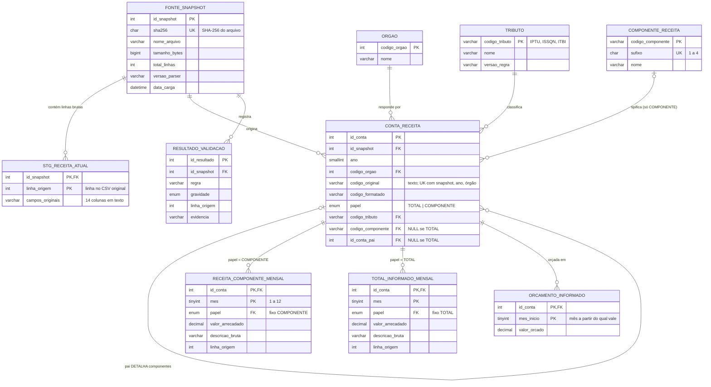
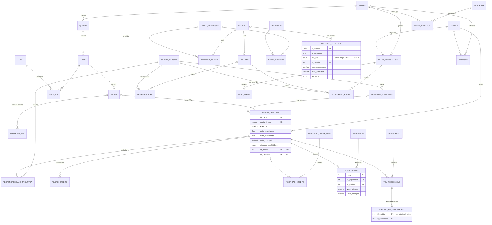

# Modelagem Entidade-Relacionamento (3FN) — Sprint 2

Banco: **MySQL 8.4** · Esquema versionado: [`sql/schema.sql`](../sql/schema.sql) · Origem do modelo: [`REQUISITOS_UML.md`](REQUISITOS_UML.md) §16 e §20.1.

O banco tem dois módulos:

| Módulo | Conteúdo | Dados no piloto |
|---|---|---|
| **A — Receita observada** | Arrecadação mensal por conta, órgão e competência, com linhagem até a linha do CSV | **Reais**: amostra de 10 linhas de `receita_acessoinformacao.csv` |
| **B — Domínio operacional** | Território, sujeitos passivos, créditos, dívida ativa, pagamentos, negociação, identidade, auditoria, plano e indicadores | **Sintéticos**, marcados `origem_dado = 'SINTETICO'` — os CSVs públicos não contêm devedores, dívidas nem imóveis |

---

## 1. Diagrama ER — Módulo A (receita observada)

## 2. Diagrama ER — Módulo B (domínio operacional)

Os atributos completos de todas as tabelas estão em [`sql/schema.sql`](../sql/schema.sql).

---

## 3. Normalização

### 3.1 1FN
Todos os atributos são atômicos. As 14 colunas do CSV ficam em texto no staging; na publicação, cada medida vira uma linha (conta × mês), e não há grupos repetidos (ex.: o histórico com `valor_jan … valor_dez` não é copiado para colunas mensais).

### 3.2 2FN
Nas tabelas com chave composta, cada atributo não chave depende da chave inteira:

| Tabela | Chave | Dependências funcionais |
|---|---|---|
| `receita_componente_mensal` | (id_conta, mes) | valor_arrecadado, descricao_bruta, linha_origem → dependem da conta **e** do mês (a descrição muda em 77 grupos conta/mês na fonte) |
| `orcamento_informado` | (id_conta, mes_inicio) | valor_orcado → depende da conta e do início da vigência (orçamento muda em 16 grupos na fonte) |
| `avaliacao_pvg` | (id_imovel, ano_avaliacao) | categoria, área, valores venais → dependem do imóvel **no ano** |
| `responsabilidade_tributaria` | (id_credito, id_sujeito, papel) | vigência, fundamento |

### 3.3 3FN
Nenhum atributo não chave depende de outro atributo não chave:

| Decisão | Motivo |
|---|---|
| `orgao_nome` sai da conta/fato e vai para `orgao` | codigo_orgao → nome (dependência transitiva) |
| Nome do tributo e do componente em tabelas próprias | codigo_tributo → nome; codigo_componente → nome, sufixo |
| **Nenhum valor derivado é coluna** | saldo (`v_saldo_credito`), valor venal total, arrecadado por tributo (`v_tributo_mes`), gap e percentual da meta são calculados. Evita anomalias de atualização. |
| Totais (pais) separados dos componentes | O total é derivável da soma dos filhos; é mantido **só para conferência** em `total_informado_mensal`, nunca somado ao fato (`v_conciliacao_pai_filhos`). |
| Associações N:M em tabelas próprias | `lote_via`, `inscricao_credito`, `item_negociacao`, `perfil_concede`, `responsabilidade_tributaria` |
| Orçamento guardado só quando muda | O CSV repete o valor anual nos 12 meses; replicá-lo seria redundância e induziria a somar 12 vezes. |

### 3.4 Redundâncias controladas (documentadas)

| Coluna | Por que existe | Por que não gera anomalia |
|---|---|---|
| `papel` em `receita_componente_mensal` / `total_informado_mensal` | Alvo de uma **FK composta** `(id_conta, papel) → conta_receita`: o banco rejeita uma conta TOTAL na tabela de fatos (e vice-versa) sem trigger | Valor fixado por `CHECK`; não pode divergir da conta |
| `credito_em_negociacao` | Garante **no máximo uma negociação ativa por crédito** (RF-18) pela PK, inclusive sob concorrência | A linha é criada/removida na mesma transação que muda `negociacao.status`; a consulta V13 detecta desvio |
| `usuario.tipo` | Discriminador da especialização `servidor_palmas` / `cidadao` | Informativo; as subtabelas são a fonte da verdade |

---

## 4. Restrições que protegem o modelo

| Regra | Mecanismo |
|---|---|
| Reimportar o mesmo arquivo não duplica receita | `UNIQUE (sha256)` em `fonte_snapshot` |
| Conta única por snapshot, ano, órgão e código | `uq_conta` |
| Conta TOTAL não entra no fato; COMPONENTE não entra na conferência | FK composta + `CHECK` de papel |
| Mês entre 1 e 12 | `CHECK` |
| Componente tem pai e componente; total não tem | `ck_conta_papel` |
| Crédito baseado em imóvel **ou** cadastro econômico | `ck_cred_base` |
| Vencimento ≥ constituição · vigência fim ≥ início | `CHECK` |
| Uma negociação ativa por crédito | PK de `credito_em_negociacao` |
| Auditoria de usuário exige id_usuario; de serviço/tarefa exige id do ator de sistema | `ck_aud_ator` |
| Observado × estimado separados; estimativa dentro do intervalo | tabelas `valor_indicador` × `previsao`; `ck_prev_intervalo` |
| Indicador DISPONIVEL ⇔ valor preenchido | `ck_vi_disp` |
| Dinheiro exato | `DECIMAL(18,2)` em todas as colunas monetárias |
| Σ apropriações ≤ pagamento | Não expressável em CHECK no MySQL: validado pela consulta V09 e pelo serviço |

Todas foram exercitadas em `tests/test_banco.py`, que confere o código de erro MySQL de cada rejeição (1452 FK, 3819 CHECK, 1062 PK).

## 5. Índices

Além das PKs, UKs e índices automáticos das FKs: `conta_receita (ano, codigo_orgao)`, `credito_tributario (codigo_tributo, exercicio)` e `(situacao_exigibilidade)`, `inscricao_divida_ativa (situacao)`, `responsabilidade_tributaria (id_sujeito)`, `acao_plano (status, classe_prioridade, data_prevista)` para a fila, `registro_auditoria (id_correlacao)` e `(data_hora)`. Medir as consultas com a base completa antes de ampliar.
