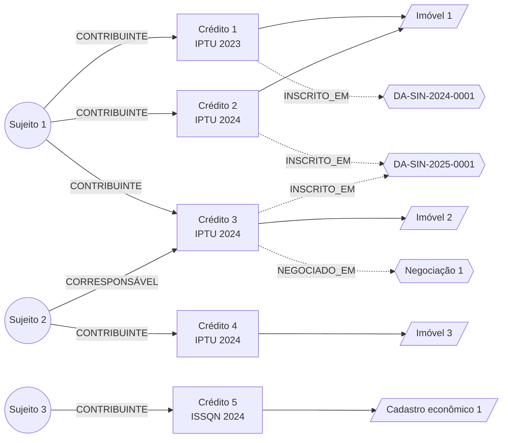

# Grafo de relações contribuinte–imóvel–processo

> **Sprint 2 — Parte 1: Documento de Arquitetura de Dados.** Estrutura de apresentação mantida do material da equipe; conteúdo substituído pelo desenvolvimento do repositório (código, testes, medições e referências conferidas). Toda saída mostrada aqui foi gerada por `python scripts/demo_parte1.py`.

## Para que será usado

Para relacionar as entidades da cobrança e responder, com um percurso, perguntas como *"que imóveis e processos estão ligados a este contribuinte?"*. É o caso do enunciado: **o mesmo CPF/CNPJ em múltiplas inscrições**.

| Enunciado | No modelo do projeto |
|---|---|
| Contribuinte | `SujeitoPassivo` (documento pseudonimizado) |
| Imóvel | `Imovel` (base do IPTU) ou `CadastroEconomico` (base do ISS) |
| Processo | `InscricaoDividaAtiva` e `Negociacao` |
| Ligação | O `CreditoTributario`, que une contribuinte, base de cálculo e processo |

O mesmo código também representa a hierarquia contábil da receita real: cada conta-pai **detalha** seus 4 componentes.

## Exemplo

Dados sintéticos que espelham `sql/seed_sintetico.sql`:



- Sujeito 1 → Créditos 1, 2 e 3 → Imóveis 1 e 2 → Processos DA-SIN-2024-0001, DA-SIN-2025-0001 e Negociação 1.
- Sujeito 2 é **corresponsável** pelo Crédito 3, por isso está no mesmo componente conexo do Sujeito 1.
- Sujeito 3 tem um crédito de ISS, sem ligação com os outros.

## Big-O

**O(V + E)** para percorrer o grafo, com V vértices e E arestas.

Justificativa: na lista de adjacência, os vizinhos de um vértice já estão disponíveis. A busca visita **cada vértice uma única vez** (conjunto de visitados) e examina **cada aresta uma única vez** ao percorrer a lista de vizinhos do vértice de origem. Rosen chega ao mesmo limite para a DFS e a BFS: O(e) passos (§11.4, p. 789 e 791); Lintzmayer & Mota, O(n + m) (p. 310 e 318).

| Operação | Complexidade |
|---|---|
| Espaço (lista de adjacência) | O(V + E) — uma matriz de adjacência gastaria O(V²) num grafo esparso como este |
| Inserir vértice ou aresta | O(1) esperado |
| Vizinhos de um vértice | O(grau) |
| BFS, DFS, componentes conexos, detecção de ciclo | O(V + E) |

À medida que entram mais contribuintes, créditos e processos, o custo cresce **linearmente** com o número de vértices e arestas.

## Código Python

Código: [`src/estruturas/grafo.py`](../../src/estruturas/grafo.py). A DFS é **iterativa** (pilha explícita), para não depender do limite de recursão do Python em cadeias longas; a ordem de visita é a mesma da DFS recursiva do livro (Lintzmayer & Mota, Algoritmo 24.12), verificada em teste.

```python
"""Grafo dirigido por lista de adjacência, com rótulos nas arestas.

Usos no projeto:
- grafo contábil (dados REAIS): conta-pai --DETALHA--> componente; permite
  recuperar os 4 componentes de um tributo sem duplicar a conta-pai;
- grafo de relações (dados SINTÉTICOS): sujeito --RESPONDE_POR--> crédito
  --BASEADO_EM--> imóvel/cadastro; componentes conexos mostram o mesmo
  sujeito ligado a várias inscrições.

Complexidade (V vértices, E arestas):
- espaço O(V + E); inserir vértice/aresta O(1) esperado;
- BFS, DFS, detecção de ciclo e componentes conexos: O(V + E).

Grafo de relações não é mapa de rotas: não há pesos de deslocamento.
"""
from __future__ import annotations

from collections import deque
from collections.abc import Hashable, Iterable


class GrafoDirigido:
    def __init__(self) -> None:
        self._sai: dict[Hashable, dict[Hashable, str]] = {}
        self._entra: dict[Hashable, set[Hashable]] = {}
        self._atributos: dict[Hashable, dict] = {}

    # --- construção ---
    def adicionar_vertice(self, v: Hashable, **atributos) -> None:
        if v not in self._sai:
            self._sai[v] = {}
            self._entra[v] = set()
            self._atributos[v] = {}
        self._atributos[v].update(atributos)

    def adicionar_aresta(self, origem: Hashable, destino: Hashable, rotulo: str = "") -> None:
        for v in (origem, destino):
            if v not in self._sai:
                raise KeyError(f"vértice inexistente: {v!r}")
        self._sai[origem][destino] = rotulo
        self._entra[destino].add(origem)

    # --- consulta ---
    def vertices(self) -> list[Hashable]:
        return list(self._sai)

    def arestas(self) -> list[tuple[Hashable, Hashable, str]]:
        return [(o, d, r) for o, viz in self._sai.items() for d, r in viz.items()]

    def sucessores(self, v: Hashable, rotulo: str | None = None) -> list[Hashable]:
        return [d for d, r in self._sai[v].items() if rotulo is None or r == rotulo]

    def predecessores(self, v: Hashable) -> list[Hashable]:
        return list(self._entra[v])

    def atributos(self, v: Hashable) -> dict:
        return dict(self._atributos[v])

    def grau_saida(self, v: Hashable) -> int:
        return len(self._sai[v])

    def grau_entrada(self, v: Hashable) -> int:
        return len(self._entra[v])

    def __len__(self) -> int:
        return len(self._sai)

    @property
    def num_arestas(self) -> int:
        return sum(len(v) for v in self._sai.values())

    # --- algoritmos ---
    def bfs(self, inicio: Hashable) -> list[Hashable]:
        """Vértices alcançáveis a partir de `inicio`, em ordem de largura."""
        visitados, ordem, fila = {inicio}, [], deque([inicio])
        while fila:
            v = fila.popleft()
            ordem.append(v)
            for w in self._sai[v]:
                if w not in visitados:
                    visitados.add(w)
                    fila.append(w)
        return ordem

    def dfs(self, inicio: Hashable) -> list[Hashable]:
        """Vértices alcançáveis a partir de `inicio`, em pré-ordem de profundidade (iterativa)."""
        visitados, ordem, pilha = set(), [], [inicio]
        while pilha:
            v = pilha.pop()
            if v in visitados:
                continue
            visitados.add(v)
            ordem.append(v)
            pilha.extend(reversed(list(self._sai[v])))
        return ordem

    def tem_ciclo(self) -> bool:
        """DFS com três cores: aresta para vértice CINZA fecha um ciclo."""
        BRANCO, CINZA, PRETO = 0, 1, 2
        cor = dict.fromkeys(self._sai, BRANCO)
        for raiz in self._sai:
            if cor[raiz] != BRANCO:
                continue
            cor[raiz] = CINZA
            pilha = [(raiz, iter(self._sai[raiz]))]
            while pilha:
                v, filhos = pilha[-1]
                w = next(filhos, None)
                if w is None:
                    cor[v] = PRETO
                    pilha.pop()
                elif cor[w] == CINZA:
                    return True
                elif cor[w] == BRANCO:
                    cor[w] = CINZA
                    pilha.append((w, iter(self._sai[w])))
        return False

    def componentes_conexos(self) -> list[set[Hashable]]:
        """Componentes fracamente conexos (ignora o sentido das arestas)."""
        vistos: set[Hashable] = set()
        componentes = []
        for raiz in self._sai:
            if raiz in vistos:
                continue
            comp, fila = {raiz}, deque([raiz])
            while fila:
                v = fila.popleft()
                for w in list(self._sai[v]) + list(self._entra[v]):
                    if w not in comp:
                        comp.add(w)
                        fila.append(w)
            vistos |= comp
            componentes.append(comp)
        return componentes


def grafo_contabil(contas: Iterable[tuple[str, str | None, dict]]) -> GrafoDirigido:
    """Monta o grafo pai → componentes a partir de (id_conta, id_pai, atributos)."""
    contas = list(contas)
    g = GrafoDirigido()
    for id_conta, _, attrs in contas:
        g.adicionar_vertice(id_conta, **attrs)
    for id_conta, id_pai, _ in contas:
        if id_pai is not None:
            g.adicionar_aresta(id_pai, id_conta, "DETALHA")
    return g
```

## Teste 01 — dados reais: hierarquia contábil da receita

**Dados:** amostra real de 10 linhas (`data/amostra/receita_amostra_10.csv`), órgão 2798, jan/2025: contas-pai de IPTU (1112500) e ISSQN (1114511) e seus 4 componentes cada.

**O que se verifica:** 10 vértices e 8 arestas; cada pai detalha exatamente 4 componentes; a BFS a partir do pai recupera os componentes sem duplicar o pai; a soma dos componentes é igual ao total; não há ciclos.

| Teste | O que comprova |
|---|---|
| `test_tamanho` | 10 vértices e 8 arestas |
| `test_cada_pai_detalha_quatro_componentes` | Grau de saída 4 em cada conta-pai |
| `test_bfs_recupera_componentes_sem_duplicar_o_pai` | Folhas da BFS = 4 componentes; soma = total |
| `test_sem_ciclos_e_dois_componentes` | Acíclico, com um componente por tributo |

## Teste 02 — dados sintéticos: contribuinte, créditos, imóveis e processos

**Dados:** os do exemplo acima (Sujeitos 1 a 3, Créditos 1 a 5, Imóveis 1 a 3, cadastro econômico, inscrições e negociação).

**O que se verifica:** o Sujeito 1 alcança 2 imóveis por meio de 3 créditos; o corresponsável une dois grupos num mesmo componente; DFS e BFS alcançam os mesmos vértices; o grafo completo com processos tem 15 vértices, 15 arestas, 2 componentes e nenhum ciclo.

| Teste | O que comprova |
|---|---|
| `test_mesmo_sujeito_em_varias_inscricoes` | Sujeito 1 → Imóveis 1 e 2 |
| `test_corresponsavel_une_componentes` | Componentes de 9 e 3 vértices |
| `test_dfs_e_bfs_alcancam_os_mesmos_vertices` | Mesmo conjunto alcançado pelas duas buscas |
| `test_grafo_de_relacoes_tem_dois_componentes_e_nenhum_ciclo` | Grafo com processos: 15 vértices, 15 arestas |
| `test_mesmo_contribuinte_em_varias_inscricoes` | Processos do Sujeito 1: 2 inscrições e 1 negociação |

**Casos de borda** (vieram da análise de mutação):

| Teste | O que comprova |
|---|---|
| `test_diamante_nao_e_ciclo` | Vértice alcançado por dois caminhos não é ciclo |
| `test_ciclo_em_componente_posterior_e_detectado` | A detecção continua nos componentes seguintes |
| `test_detecta_ciclo` | Ciclo a → b → c → a |
| `test_sucessores_filtra_pelo_rotulo` | Filtro por tipo de relação |
| `test_dfs_segue_a_ordem_da_busca_recursiva_do_livro` | Mesma ordem do Algoritmo 24.12 (Lintzmayer & Mota) |
| `test_aresta_para_vertice_inexistente` | Aresta com vértice inexistente é rejeitada |

## Resultados

Saída de `python scripts/demo_parte1.py grafo`:

```text
=== Grafo de relações (dados sintéticos): contribuinte → crédito → imóvel e processo ===
15 vértices · 15 arestas
A partir do Sujeito 1 (BFS):
  crédito: Crédito 1, Crédito 2, Crédito 3
  imóvel: Imóvel 1, Imóvel 2
  processo: DA-SIN-2024-0001, DA-SIN-2025-0001, Negociação 1
DFS a partir do Sujeito 1: Sujeito 1 → Crédito 1 → Imóvel 1 → DA-SIN-2024-0001 → Crédito 2 → DA-SIN-2025-0001 → Crédito 3 → Imóvel 2 → Negociação 1
Componentes conexos: [12, 3] vértices
  o Sujeito 2 é corresponsável pelo Crédito 3, por isso fica no mesmo componente do Sujeito 1
Tem ciclo? False

=== Grafo contábil (dados reais, jan/2025): conta-pai DETALHA componentes ===
10 vértices · 8 arestas · ciclo? False
IPTU 1112500: 4 componentes, soma R$ 2885620.64 = total R$ 2885620.64 → confere
ISSQN 1114511: 4 componentes, soma R$ 21802997.01 = total R$ 21802997.01 → confere
```

A busca percorreu todos os vértices alcançáveis sem repetir nenhum, encontrou os imóveis e processos do mesmo contribuinte e confirmou, nos dados reais, que cada conta-pai é igual à soma dos seus componentes.

**Testes:** 13 passed in 0.05s. **Mutação:** **84.0%** dos mutantes mortos (68 de 81 válidos; 22 em anotações de tipo ignorados). Os sobreviventes são equivalentes: análise em `docs/REQUISITOS_UML.md` §23.4.

**Referências:** Rosen §10.3 (p. 668, lista de adjacência), §10.4 (p. 682 e 686, componentes e conexidade fraca), §11.4 (p. 789 e 791, DFS e BFS); Lintzmayer & Mota cap. 24 (p. 305–332); Morin, *Open Data Structures*.
