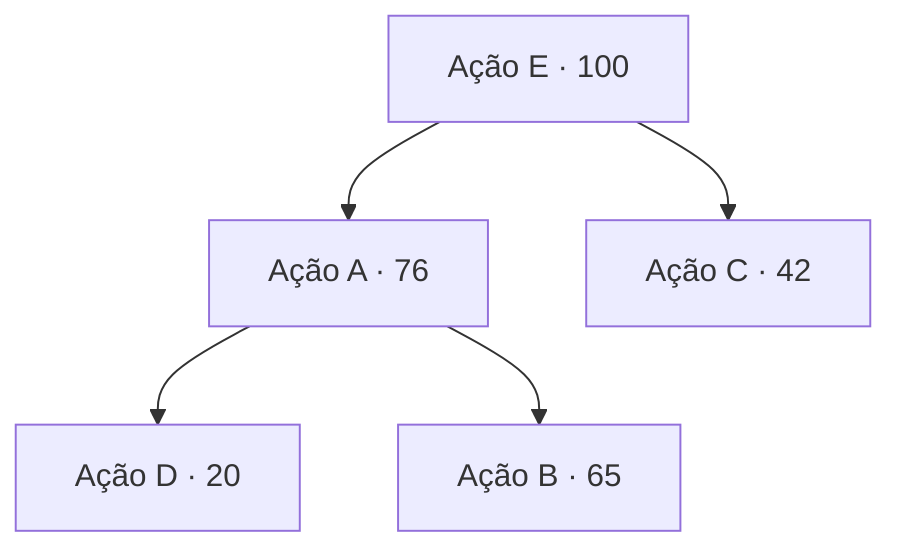

# Heap: fila de cobrança por score de recuperabilidade

> **Sprint 2 — Parte 1: Documento de Arquitetura de Dados.** Estrutura de apresentação mantida do material da equipe; conteúdo substituído pelo desenvolvimento do repositório (código, testes, medições e referências conferidas). Toda saída mostrada aqui foi gerada por `python scripts/demo_parte1.py`.

A heap organiza a fila de **ações de cobrança** usando o score de recuperabilidade como critério de prioridade: quanto maior o score, maior a prioridade. Assim o sistema acessa e retira rapidamente a ação mais prioritária, independentemente da ordem em que ela entrou. A fila ordena **ações**, não pessoas, e o score usado aqui é **sintético**: a escolha entre score individual e prioridade territorial está pendente com o professor (PA-14), e não há, nos dados disponíveis, base para estimar a probabilidade de pagamento.

A implementação é uma heap binária **mínima**. Para que o maior score saia primeiro, a chave de prioridade usa **−score**. Além disso, a fila:
- **desempata pela ordem de chegada** (número de sequência), para que ações com o mesmo score não saiam em ordem arbitrária;
- **retira ações pagas** e **reposiciona ações com score revisto**, sem reconstruir a heap: a versão antiga é descartada quando chega ao topo;
- aceita **critério composto**, como no plano de arrecadação: classe de prioridade, prazo e score.

Considere uma fila com as ações A (score 76), B (65), C (42), D (20) e E (100). Ao inserir E, que tem o maior score, ela passa para o topo e é a primeira atendida. Depois dela, as demais seguem a ordem dos scores.



*Heap depois das 5 inserções (vetor interno [E, A, C, D, B]): cada pai tem prioridade maior ou igual à dos filhos, e a de maior score está no topo. A heap não é uma lista ordenada: B (65) está abaixo de A, e C (42) está no segundo nível.*

A consulta do topo tem complexidade **O(1)**. A inserção e a retirada da ação mais prioritária têm complexidade **O(log n)**, porque o elemento sobe ou desce no máximo pela **altura** da heap, que é uma árvore binária completa de altura ⌈log₂(n + 1)⌉ − 1 (Rosen, §11.1, Teorema 5 e Corolário 1, p. 754). Construir a heap a partir de n itens custa **O(n)**. Revisar o score ou retirar uma ação paga custa O(log n) amortizado (remoção preguiçosa), e `reconstruir()` elimina as versões antigas acumuladas em O(n).

| Operação | Complexidade |
|---|---|
| Ver o topo (`espiar`) | O(1), mais o descarte amortizado de versões antigas |
| Inserir, extrair | O(log n) |
| Revisar score, retirar ação paga | O(log n) amortizado |
| Construir a partir de n itens, reconstruir | O(n) |

Código: [`src/estruturas/heap_prioridade.py`](../../src/estruturas/heap_prioridade.py).

```python
"""Heap binária mínima e fila de prioridade versionada.

HeapBinaria: implementação em vetor. Para o índice i (base 0), filhos em
2i+1 e 2i+2 e pai em (i-1)//2.
- topo: O(1) · inserir/extrair: O(log n) · construir a partir de n itens: O(n)

FilaPrioridadeVersionada: ordena ações elegíveis por uma chave lexicográfica
aprovada (ex.: classe de prioridade, prazo, score sintético), com número de
sequência para desempate determinístico. Atualizar a prioridade de uma ação
incrementa sua versão e insere uma nova entrada; entradas obsoletas são
descartadas na extração (remoção preguiçosa) — Relatório de Auditoria, p. 12.

A heap ordena prioridades; ela não estima probabilidades nem substitui o banco.
"""
from __future__ import annotations

from collections.abc import Hashable, Iterable
from typing import Any, Generic, Protocol, TypeVar


class Comparavel(Protocol):
    def __lt__(self, outro: Any, /) -> bool: ...


T = TypeVar("T", bound=Comparavel)


class HeapBinaria(Generic[T]):
    def __init__(self, itens: Iterable[T] = ()) -> None:
        self._a: list[T] = list(itens)
        # construção de baixo para cima: O(n)
        for i in range(len(self._a) // 2 - 1, -1, -1):
            self._descer(i)

    def inserir(self, item: T) -> None:
        self._a.append(item)
        self._subir(len(self._a) - 1)

    def topo(self) -> T:
        if not self._a:
            raise IndexError("heap vazia")
        return self._a[0]

    def extrair(self) -> T:
        if not self._a:
            raise IndexError("heap vazia")
        ultimo = self._a.pop()
        if not self._a:
            return ultimo
        menor, self._a[0] = self._a[0], ultimo
        self._descer(0)
        return menor

    def __len__(self) -> int:
        return len(self._a)

    def itens(self) -> list[T]:
        """Cópia do vetor interno (ordem de heap, não ordenada)."""
        return list(self._a)

    def valida(self) -> bool:
        """Verifica a propriedade de heap (pai ≤ filhos)."""
        return all(not (self._a[i] < self._a[(i - 1) // 2]) for i in range(1, len(self._a)))

    def _subir(self, i: int) -> None:
        a = self._a
        while i > 0:
            pai = (i - 1) // 2
            if a[i] < a[pai]:
                a[i], a[pai] = a[pai], a[i]
                i = pai
            else:
                break

    def _descer(self, i: int) -> None:
        a, n = self._a, len(self._a)
        while True:
            esq, dir_, menor = 2 * i + 1, 2 * i + 2, i
            if esq < n and a[esq] < a[menor]:
                menor = esq
            if dir_ < n and a[dir_] < a[menor]:
                menor = dir_
            if menor == i:
                return
            a[i], a[menor] = a[menor], a[i]
            i = menor


class FilaPrioridadeVersionada:
    """Fila de ações por prioridade com atualização e remoção em O(log n) amortizado."""

    def __init__(self) -> None:
        self._heap: HeapBinaria[tuple] = HeapBinaria()
        self._versao: dict[Hashable, int] = {}
        self._dados: dict[Hashable, Any] = {}
        self._seq = 0

    def inserir(self, id_item: Hashable, chave: tuple, dados: Any = None) -> None:
        """Insere ou atualiza a prioridade de um item (nova versão invalida a anterior)."""
        if any(c is None for c in chave):
            raise ValueError("chave de prioridade incompleta: defina regra para campos ausentes")
        versao = self._versao.get(id_item, 0) + 1
        self._versao[id_item] = versao
        self._dados[id_item] = dados
        self._seq += 1
        self._heap.inserir((chave, self._seq, id_item, versao))

    def remover(self, id_item: Hashable) -> None:
        """Retira o item da fila (ex.: pagamento ou suspensão retiram a elegibilidade)."""
        if id_item not in self._versao:
            raise KeyError(id_item)
        del self._versao[id_item]
        del self._dados[id_item]

    def extrair(self) -> tuple[Hashable, tuple, Any]:
        """Retorna (id, chave, dados) do item de maior prioridade ainda válido."""
        while self._heap:
            chave, _, id_item, versao = self._heap.extrair()
            if self._versao.get(id_item) == versao:
                del self._versao[id_item]
                return id_item, chave, self._dados.pop(id_item)
        raise IndexError("fila vazia")

    def espiar(self) -> tuple[Hashable, tuple]:
        while self._heap:
            chave, _, id_item, versao = self._heap.topo()
            if self._versao.get(id_item) == versao:
                return id_item, chave
            self._heap.extrair()  # descarta entrada obsoleta
        raise IndexError("fila vazia")

    def __len__(self) -> int:
        return len(self._versao)

    @property
    def entradas_na_heap(self) -> int:
        """Inclui entradas obsoletas ainda não descartadas."""
        return len(self._heap)

    def reconstruir(self) -> None:
        """Remove entradas obsoletas acumuladas em O(n)."""
        vivas = [e for e in self._heap.itens() if self._versao.get(e[2]) == e[3]]
        self._heap = HeapBinaria(vivas)
```

Execução (`python scripts/demo_parte1.py heap`):

```text
=== Fila de ações de cobrança por score de recuperabilidade (score sintético) ===
inseriu Ação A (score 76) → topo: Ação A
inseriu Ação B (score 65) → topo: Ação A
inseriu Ação C (score 42) → topo: Ação A
inseriu Ação D (score 20) → topo: Ação A
inseriu Ação E (score 100) → topo: Ação E
Ordem de atendimento: Ação E (100), Ação A (76), Ação B (65), Ação C (42), Ação D (20)

=== Empate de score: respeita a ordem de chegada ===
Chegada: E, B, D, A, C → atendimento: Ação E, Ação B, Ação D, Ação A, Ação C

=== Pagamento retira a ação; revisão de score reposiciona ===
Crédito da Ação E foi pago → removida. Topo: Ação A
Score da Ação D revisto de 20 para 90. Topo: Ação D
Entradas na heap: 5 (inclui a versão antiga da Ação D) · ações válidas: 4
Ordem de atendimento: Ação D (90), Ação A (76), Ação B (65), Ação C (42)

=== Critério composto do plano: classe de prioridade, prazo e score ===
1º Contato sobre créditos de 2024 (classe 1, prazo 05/10, score 0.90)
2º Contato sobre créditos de 2023 (classe 1, prazo 05/10, score 0.10)
3º Revisar cadastro de lotes (classe 2, prazo 15/10, score 0.40)
4º Atualizar avaliação PVG (classe 3, prazo 01/11, score 0.99)

=== Fila vazia ===
IndexError: fila vazia
```

Foram inseridas ações com diferentes scores. Ao inserir a Ação E, com score 100, ela passou para o topo e foi a primeira atendida. Empates saíram na ordem de chegada; a ação paga saiu da fila; a ação com score revisto foi reposicionada; e o critério composto do plano ordenou primeiro por classe, depois por prazo e por fim por score. Com a fila vazia, a retirada gera um erro explícito.

**Testes:**

| Teste | O que comprova |
|---|---|
| `test_extrai_em_ordem` | 500 inserções aleatórias saem ordenadas; propriedade de heap válida após cada uma |
| `test_construcao_em_lote` | Construção O(n) produz heap válida |
| `test_valida_detecta_heap_invalida` | A verificação da propriedade de heap acusa vetor inválido |
| `test_ordem_lexicografica` | Classe, prazo e score, nessa ordem |
| `test_empate_total_respeita_ordem_de_chegada` | Empates na ordem de chegada |
| `test_atualizacao_invalida_versao_anterior` | Prioridade elevada: a versão antiga não reaparece |
| `test_prioridade_rebaixada_descarta_a_entrada_antiga` | Prioridade rebaixada: a versão antiga é descartada no topo |
| `test_remocao_por_pagamento` | Ação paga sai da fila |
| `test_extrair_depois_de_remover_o_topo` | Retirar depois de remover o topo |
| `test_reconstruir_descarta_obsoletas` | Reconstrução elimina versões antigas |
| `test_chave_incompleta_rejeitada` | Prioridade com campo ausente é rejeitada |
| `test_vazia` | Heap vazia gera erro explícito |
| `test_fila_vazia` | Fila vazia gera erro explícito |

Também em Gherkin: cenário *"A ação mais urgente sai primeiro e o pagamento retira a ação da fila"* em `tests/aceitacao/estruturas.feature`.

**Resultado:** 13 passed in 0.06s. **Mutação:** **88.1%** dos mutantes mortos (266 de 302 válidos). Os sobreviventes são equivalentes: análise em `docs/REQUISITOS_UML.md` §23.4.

**Referências:** Lintzmayer & Mota, cap. 12, §12.1, p. 154–167 (heap binário: construção, inserção, remoção, alteração); Rosen, §11.1, p. 754 (altura de árvore balanceada) e p. 756 (árvore binária completa); Morin, *Open Data Structures* (heaps); Python Software Foundation, documentação do `heapq` (atualização de entradas por remoção preguiçosa), citada no relatório de auditoria dos CSVs.
