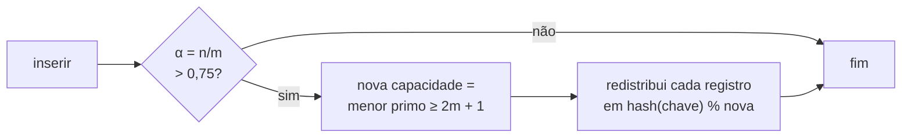
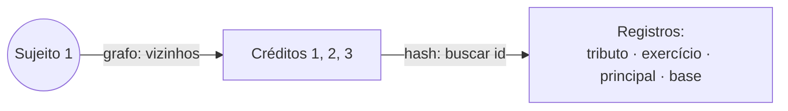

# Tabelas hash para indexação da dívida ativa

> **Sprint 2 — Parte 1: Documento de Arquitetura de Dados.** Estrutura de apresentação mantida do material da equipe; conteúdo substituído pelo desenvolvimento do repositório (código, testes, medições e referências conferidas). Toda saída mostrada aqui foi gerada por `python scripts/demo_parte1.py`.

## Executar

Python 3.12 ou superior. As estruturas usam só a biblioteca padrão; os testes usam pytest.

```bash
python scripts/demo_parte1.py hash                                   # demonstração
python -m pytest tests/test_indice_hash.py tests/test_integracao_estruturas.py   # testes
python scripts/mutacao.py indice_hash                                # testes de mutação
```

Código: [`src/estruturas/indice_hash.py`](../../src/estruturas/indice_hash.py).

## Decisão de arquitetura

- **Chave do índice da dívida ativa:** o número da inscrição (`DA-SIN-2025-0001`); valor: os créditos inscritos. Para os créditos, a chave é o id do crédito. **CPF/CNPJ não é chave**, porque um contribuinte tem várias inscrições e um crédito pode ter corresponsáveis. Para essa consulta existe o `IndiceSecundario` (contribuinte → conjunto de créditos).
- **Índice analítico da receita real:** chave composta `(órgão, ano, mês, código original)` dentro de um snapshot. É a chave da observação de receita no banco: a conta (`uq_conta`: snapshot, ano, órgão, código original) mais o mês. Entre snapshots, acrescenta-se o id do snapshot. A reimportação de um arquivo é detectada no banco, pelo SHA-256, e não pelo índice.
- **Implementação explícita:** vetor de listas (buckets), `hash(chave) % m` para escolher o bucket, **encadeamento separado** para colisões e comparação da **chave completa** dentro do bucket. O `dict` do Python não é usado como tabela principal; a função `hash()` nativa é reaproveitada.
- **Unicidade:** a fonte da verdade é o banco, que garante a unicidade das inscrições (`uq_inscricao_numero`). A tabela em memória espelha o banco, então `inserir` com uma chave existente atualiza o valor.
- A tabela é um **índice em memória**: não substitui a persistência nem a auditoria.

## Redimensionamento

- Fator de carga α = n/m (registros / buckets). Quando α passa de **0,75**, a capacidade cresce para o **menor primo ≥ 2m + 1**, e os registros são redistribuídos.
- **Capacidade prima.** Com tamanho em potência de 2, chaves inteiras múltiplas dessa potência cairiam todas no mesmo bucket. Gersting (Seção 5.6, após o Exemplo 51) recomenda tabela de tamanho primo. A capacidade padrão é 11; uma capacidade inicial informada explicitamente é respeitada, o que permite reproduzir o Exemplo 50 do Gersting com 10 posições.
- A tabela não diminui ao remover: o índice espelha o banco, onde remoções são raras, e a memória fica O(n + m) com m do maior tamanho atingido.



## Complexidade

| Operação | Esperado | Pior caso | Justificativa |
|---|---|---|---|
| Buscar, inserir, remover | O(1 + α) = O(1) | O(n) | Só o bucket da chave é percorrido; com α ≤ 0,75, o bucket médio é curto. No pior caso, todas as chaves colidem |
| Redimensionar | O(n + m) | O(n + m) | Cada registro é redistribuído uma vez; como a capacidade ao menos dobra, o custo amortizado por inserção é O(1) |
| Índice secundário: créditos de um contribuinte | O(1 + k) | O(n) | Busca O(1) pela chave e devolve os k créditos |
| Memória | O(n + m) | O(n + m) | Um bucket por posição e uma entrada por registro |

O limite esperado depende de a função de hash distribuir bem as chaves; a capacidade prima evita a concentração causada por chaves com padrão.

## Integração com o grafo

O grafo responde **quais** créditos estão ligados a um contribuinte (vizinhos no grafo, O(d(s))). A tabela hash recupera **o registro** de cada um (O(1) esperado). Para k créditos, a consulta completa custa **O(d(s) + k)** esperado.



Coberto por `tests/test_integracao_estruturas.py`.

## Referência acadêmica

- GERSTING, J. L. *Fundamentos matemáticos para a ciência da computação*. Seção 5.6, subseção *Dispersão*: Exemplo 49 (h(x) = x mod t), **Exemplo 50 e Figura 5.29 (encadeamento)**, fator de carga e tamanho primo (após o Exemplo 51).
- ROSEN, K. H. *Discrete Mathematics and Its Applications*. 7. ed. §4.5, p. 287–288: função de dispersão e colisão.
- LINTZMAYER, C. N.; MOTA, G. O. *Análise de Algoritmos e de Estruturas de Dados*. Cap. 14, p. 173–174: tabelas hash, colisões inevitáveis, O(1) no caso médio.
- MORIN, P. *Open Data Structures*. 2013: tabelas hash.

Dados do domínio operacional (sujeitos, créditos, inscrições) são **sintéticos** e espelham `sql/seed_sintetico.sql`; a receita é real (amostra de 10 linhas).

## Código

```python
"""Tabela hash com encadeamento separado e redimensionamento.

Uso no projeto (docs/arquitetura_dados.md):
- índice analítico: (snapshot, órgão, ano, mês, código_original) → linha de receita,
  para busca exata (a reimportação de um arquivo é detectada no banco, pelo SHA-256);
- índice operacional: id da inscrição/crédito → registro;
- IndiceSecundario: sujeito passivo → vários créditos (CPF/CNPJ sozinho não
  identifica uma dívida).

Capacidade em números primos (padrão 11; ao crescer, o menor primo ≥ 2m + 1): com
tamanho em potência de 2, chaves inteiras múltiplas dessa potência caem todas no mesmo
bucket. Gersting, Seção 5.6, após o Exemplo 51: a distribuição funciona melhor quando o
tamanho da tabela é primo. Uma capacidade inicial informada explicitamente é respeitada.

Complexidade (n = elementos, m = buckets, α = n/m ≤ 0,75):
- inserir, buscar, remover: O(1) esperado; O(n) no pior caso (todas as chaves no mesmo bucket);
- redimensionar: O(n), amortizado O(1) por inserção;
- espaço: O(n + m).
"""
from __future__ import annotations

from collections.abc import Hashable, Iterator
from typing import Any

_VAZIO = object()


def eh_primo(k: int) -> bool:
    if k < 2:
        return False
    if k % 2 == 0:
        return k == 2
    divisor = 3
    while divisor * divisor <= k:
        if k % divisor == 0:
            return False
        divisor += 2
    return True


def proximo_primo(n: int) -> int:
    """Menor número primo maior ou igual a n."""
    candidato = max(2, n)
    while not eh_primo(candidato):
        candidato += 1
    return candidato


class TabelaHash:
    CARGA_MAXIMA = 0.75

    def __init__(self, capacidade_inicial: int = 11) -> None:
        if capacidade_inicial < 1:
            raise ValueError("capacidade inicial deve ser positiva")
        self._buckets: list[list[tuple[Hashable, Any]]] = [[] for _ in range(capacidade_inicial)]
        self._n = 0

    # --- operações principais ---
    def inserir(self, chave: Hashable, valor: Any) -> None:
        """Insere ou substitui o valor da chave."""
        bucket = self._bucket(chave)
        for i, (k, _) in enumerate(bucket):
            if k == chave:  # colisão de hash exige comparar a chave completa
                bucket[i] = (chave, valor)
                return
        bucket.append((chave, valor))
        self._n += 1
        if self._n / len(self._buckets) > self.CARGA_MAXIMA:
            self._redimensionar(proximo_primo(2 * len(self._buckets) + 1))

    def buscar(self, chave: Hashable, padrao: Any = _VAZIO) -> Any:
        for k, v in self._bucket(chave):
            if k == chave:
                return v
        if padrao is _VAZIO:
            raise KeyError(chave)
        return padrao

    def remover(self, chave: Hashable) -> Any:
        bucket = self._bucket(chave)
        for i, (k, v) in enumerate(bucket):
            if k == chave:
                bucket.pop(i)
                self._n -= 1
                return v
        raise KeyError(chave)

    def contem(self, chave: Hashable) -> bool:
        return any(k == chave for k, _ in self._bucket(chave))

    # --- utilidades ---
    def __len__(self) -> int:
        return self._n

    def __contains__(self, chave: Hashable) -> bool:
        return self.contem(chave)

    def __iter__(self) -> Iterator[Hashable]:
        for bucket in self._buckets:
            for k, _ in bucket:
                yield k

    def itens(self) -> Iterator[tuple[Hashable, Any]]:
        for bucket in self._buckets:
            yield from bucket

    @property
    def capacidade(self) -> int:
        return len(self._buckets)

    @property
    def fator_carga(self) -> float:
        return self._n / len(self._buckets)

    def maior_bucket(self) -> int:
        """Tamanho da maior cadeia: mede a qualidade da distribuição."""
        return max(len(b) for b in self._buckets)

    def _bucket(self, chave: Hashable) -> list[tuple[Hashable, Any]]:
        return self._buckets[hash(chave) % len(self._buckets)]

    def _redimensionar(self, nova_capacidade: int) -> None:
        antigos = self._buckets
        self._buckets = [[] for _ in range(nova_capacidade)]
        for bucket in antigos:
            for k, v in bucket:
                self._buckets[hash(k) % nova_capacidade].append((k, v))


class IndiceSecundario:
    """Chave não única → conjunto de identificadores (ex.: sujeito → créditos)."""

    def __init__(self) -> None:
        self._tabela = TabelaHash()

    def adicionar(self, chave: Hashable, identificador: Hashable) -> None:
        ids = self._tabela.buscar(chave, None)
        if ids is None:
            ids = set()
            self._tabela.inserir(chave, ids)
        ids.add(identificador)

    def buscar(self, chave: Hashable) -> frozenset:
        return frozenset(self._tabela.buscar(chave, set()))

    def remover(self, chave: Hashable, identificador: Hashable) -> None:
        ids = self._tabela.buscar(chave, None)
        if not ids or identificador not in ids:
            raise KeyError((chave, identificador))
        ids.discard(identificador)
        if not ids:
            self._tabela.remover(chave)

    def __len__(self) -> int:
        return len(self._tabela)
```

## Exemplo

Saída de `python scripts/demo_parte1.py hash`:

```text
=== Índice da dívida ativa: inscrição → créditos inscritos ===
Buscar DA-SIN-2025-0001: [2, 3]
Buscar DA-INEXISTENTE: não encontrada

=== Índice de créditos: id → registro ===
Buscar crédito 3: {'tributo': 'IPTU', 'exercicio': 2024, 'principal': Decimal('4800.00'), 'base': 'Imóvel 2'}
Capacidade: 11 buckets · 5 registros · fator de carga 0.45

=== Índice secundário: contribuinte → créditos (CPF/CNPJ não identifica uma dívida) ===
Sujeito 1: créditos [1, 2, 3]
Sujeito 2: créditos [3, 4]
Sujeito 3: créditos [5]

=== Índice analítico da receita real: (órgão, ano, mês, código) → valor ===
Buscar (2798, 2025, 1, '11125003') → 315099.43 (IPTU, dívida ativa, jan/2025)

=== Redimensionamento: capacidade sempre prima ===
Capacidades ao inserir 200 chaves múltiplas de 1024: 11 → 23 → 47 → 97 → 197 → 397
Maior bucket: 1 (com capacidade em potência de 2 seriam 200 no mesmo bucket)

=== Integração com o grafo: créditos do Sujeito 1 e seus registros ===
Crédito 1: IPTU 2023, principal R$ 1500.00, base Imóvel 1
Crédito 2: IPTU 2024, principal R$ 1620.00, base Imóvel 1
Crédito 3: IPTU 2024, principal R$ 4800.00, base Imóvel 2
```

## Testes

| Teste | O que comprova |
|---|---|
| `test_inserir_buscar_substituir_remover` | Operações básicas com chave composta da receita |
| `test_chave_ausente` (2 casos) | Busca e remoção de chave inexistente geram erro ou valor padrão |
| `test_colisoes_comparam_a_chave_completa` | 20 chaves com o mesmo hash: pior caso O(n), todas recuperáveis |
| `test_chave_ausente_em_bucket_ocupado` | Gersting, Exemplo 50: 68 não existe no bucket de 158 e 48 |
| `test_chave_igual_mas_outro_objeto_e_encontrada` | A busca compara por igualdade, não por identidade |
| `test_capacidade_cresce_para_o_proximo_primo_quando_fator_passa_de_075` | 8 → 17 → 37: cresce só acima de 0,75 |
| `test_capacidade_padrao_e_prima` | Capacidade padrão 11 → 23 |
| `test_proximo_primo` (12 casos) | Cálculo do próximo primo |
| `test_eh_primo` (9 casos) | Teste de primalidade |
| `test_chaves_multiplas_de_potencia_de_2_nao_se_concentram` | Regressão do defeito corrigido: maior bucket ≤ 2 |
| `test_redimensiona_e_mantem_fator_de_carga` | 1.000 inserções mantêm α ≤ 0,75 |
| `test_equivale_a_dict_em_operacoes_aleatorias` | 5.000 operações aleatórias iguais às de um dict de referência |
| `test_indice_secundario_sujeito_para_varios_creditos` | Contribuinte → vários créditos |
| `test_mesmo_contribuinte_em_varias_inscricoes` | Integração: grafo + hash para o Sujeito 1 |
| `test_indice_secundario_concorda_com_o_grafo` | Índice secundário e grafo dão a mesma resposta |

Também em Gherkin: cenário *"Colisões são resolvidas por encadeamento (Gersting, Exemplo 50)"* em `tests/aceitacao/estruturas.feature`.

**Resultado:** 81 passed in 0.27s. **Mutação:** **96,2%** dos mutantes mortos (230 de 239 válidos). Nenhum sobrevivente muda o comportamento numa carga diferencial (`python scripts/sobreviventes.py`); por isso são classificados como equivalentes, o que é evidência, não prova. Análise em `docs/REQUISITOS_UML.md` §23.4.
