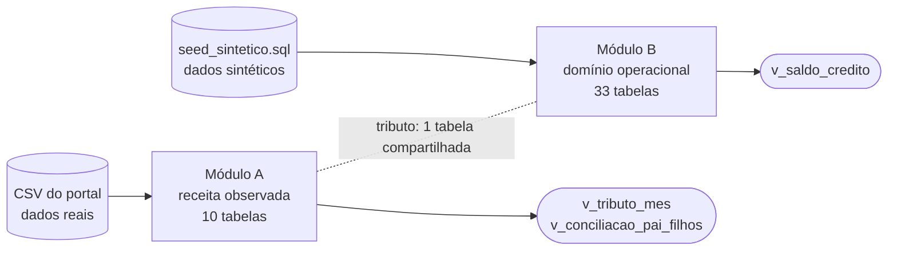
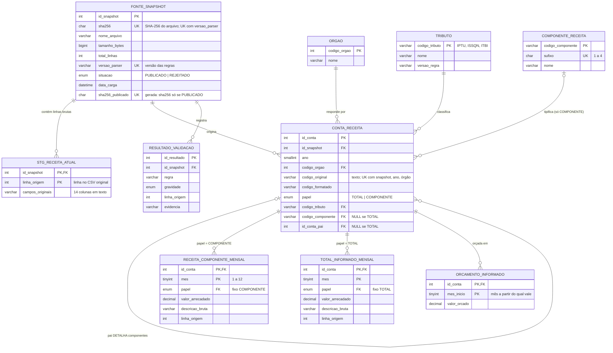
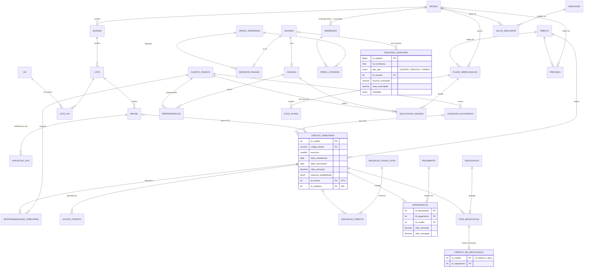
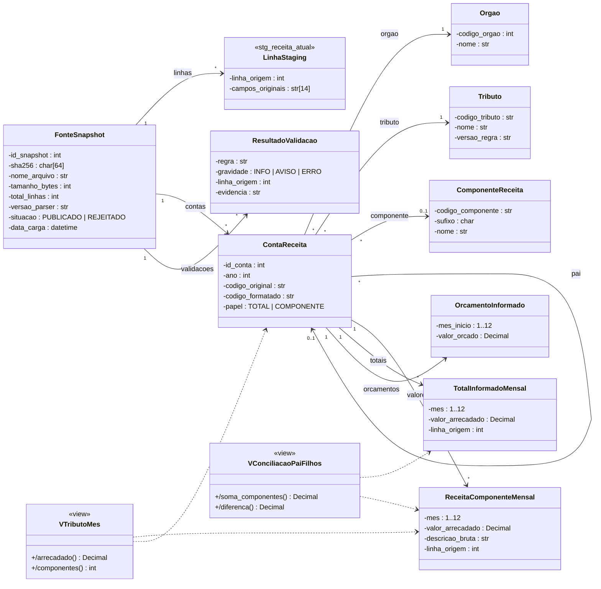
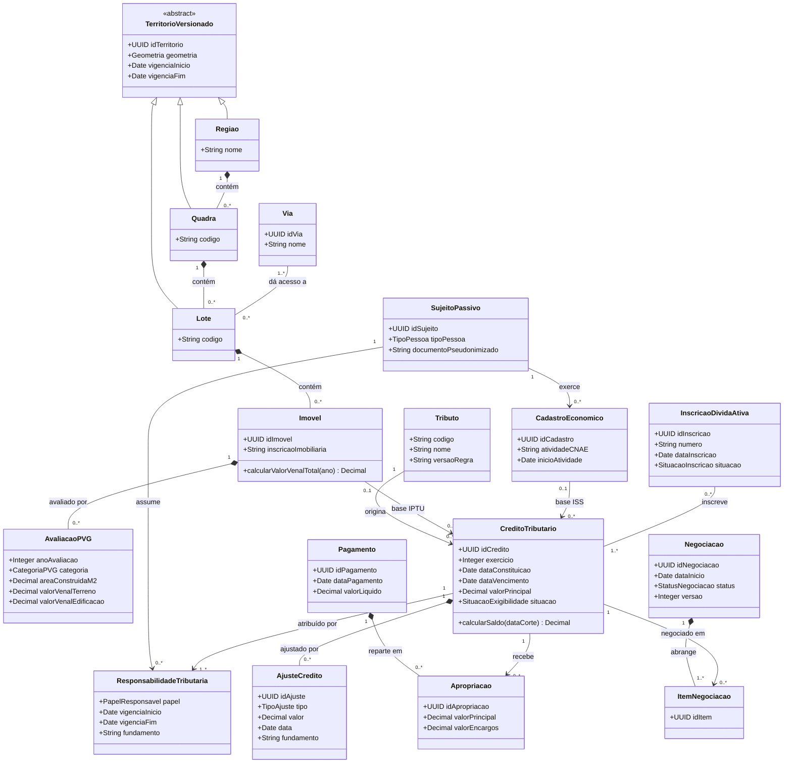
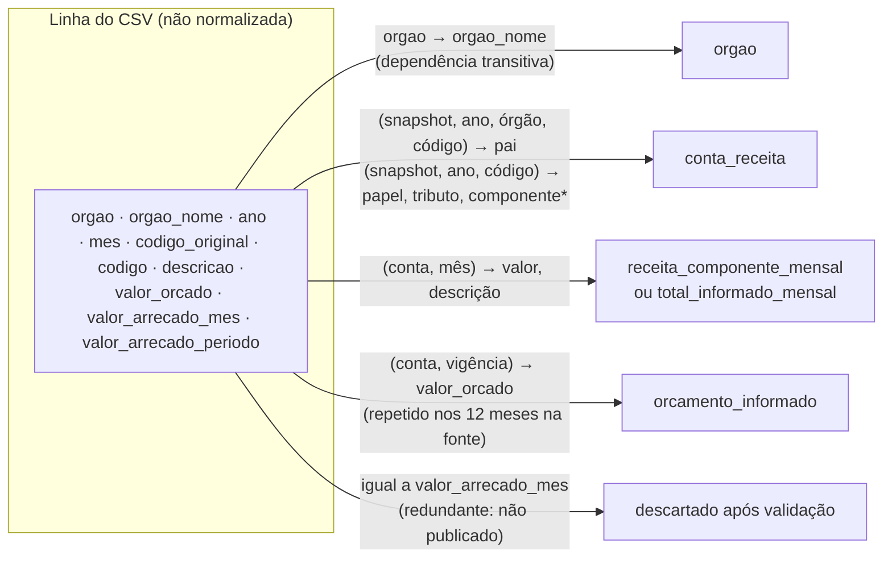
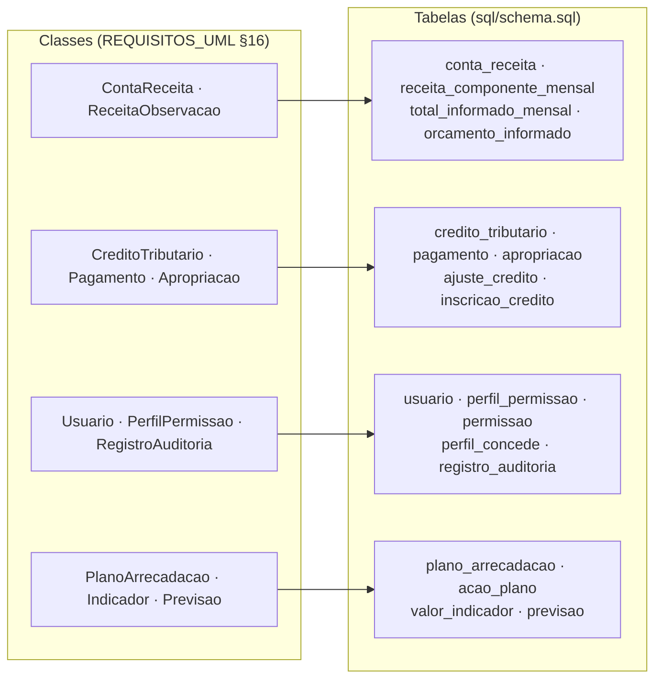

# Critério 1 — Diagrama Entidade-Relacionamento normalizado (3FN)

> **Enunciado (Parte 2):** *"Diagrama Entidade-Relacionamento normalizado (3FN)"*.
> **Evidências:** este documento, [`sql/schema.sql`](../../sql/schema.sql), imagens `er_modulo_a_receita.png` e `er_modulo_b_operacional.png`.

## 1. Visão geral: dois módulos

O banco foi dividido pela **origem dos dados**, uma decisão tomada na modelagem:

| Módulo | Conteúdo | Dados no piloto |
|---|---|---|
| **A — Receita observada** | Arrecadação mensal por conta, órgão e competência, com linhagem até a linha do CSV | **Reais**: amostra do portal de transparência |
| **B — Domínio operacional** | Território, contribuintes, créditos, dívida ativa, pagamentos, negociação, identidade, auditoria, plano e indicadores | **Sintéticos**, marcados `origem_dado = 'SINTETICO'`, porque os dados públicos não trazem devedores nem dívidas individuais |

## 2. Diagrama ER — Módulo A (receita observada)

## 3. Diagrama ER — Módulo B (domínio operacional)

## 4. Diagrama de classes do domínio

O diagrama ER mostra **tabelas e chaves**. O diagrama de classes mostra o **modelo conceitual** que as originou: atributos com tipo e visibilidade, associações com multiplicidade e dependências. Segue a notação de Valente, *Engenharia de Software Moderna* (ESM), cap. 4, §4.3 (p. 8–16):
- classe como retângulo de três compartimentos (nome, atributos, métodos);
- `−` para atributo privado e `+` para operação pública;
- associação como seta sólida com multiplicidade `1`, `0..1` ou `*` (§4.3.1);
- herança como seta de ponta triangular (§4.3.2);
- dependência como seta tracejada (§4.3.3).

Como recomenda o livro, a UML é usada **como esboço** (*sketch*, p. 5–6): o suficiente para comunicar o projeto, sem pretender ser planta técnica completa.

### 4.1 Módulo A — receita observada

As *views* aparecem como classes com estereótipo «view»: não guardam dados e **dependem** das tabelas que agregam. Por isso o arrecadado por tributo é uma operação derivada (`/arrecadado`), e não um atributo gravado.

Leitura das multiplicidades mais importantes:
- `ContaReceita "*" --> "0..1" ComponenteReceita`: uma conta-**pai** não tem componente (`0`); uma conta-**filha** tem exatamente um.
- `ContaReceita "*" --> "0..1" ContaReceita : pai`: a autoassociação que forma a hierarquia pai → 4 componentes.
- Os valores mensais ficam em duas classes diferentes, de acordo com o papel da conta. Isso impede que um total seja somado junto com seus próprios componentes.

### 4.2 Módulo B — domínio operacional

Restrições que o diagrama não expressa (ver o critério 2): soma das apropriações ≤ valor do pagamento, conferida pela consulta V09; uma única reserva de negociação ativa por crédito, garantida pelo banco; saldo sempre derivado dos movimentos, por uma *view*.

## 5. Normalização

### 5.1 Primeira Forma Normal (1FN)

Todos os atributos são atômicos. As 14 colunas do CSV chegam como texto no staging; na publicação, cada medida vira **uma linha por conta e mês**. O histórico antigo, com colunas `valor_jan … valor_dez`, é exatamente o grupo repetido que a 1FN elimina, e não é copiado assim. O escopo de uma permissão era o texto `'REGIAO:1'`, uma referência sem integridade; virou a chave estrangeira `permissao.id_regiao` (vazia = município inteiro). A única coluna composta é `previsao.variaveis_entrada` (JSON): é o registro de proveniência das entradas do modelo, gravado uma vez e nunca consultado por partes, por isso tratado como valor único.

### 5.2 Segunda Forma Normal (2FN)

Nas tabelas com chave composta, cada atributo não chave depende da **chave inteira** (a exceção controlada de `conta_receita` está na seção 5.4):

| Tabela | Chave | Dependências funcionais |
|---|---|---|
| `receita_componente_mensal` | (id_conta, mes) | valor_arrecadado, descricao_bruta, linha_origem → dependem da conta **e** do mês. A descrição muda em 77 grupos conta/mês na fonte (relatório de auditoria dos CSVs) |
| `orcamento_informado` | (id_conta, mes_inicio) | valor_orcado → depende da conta e do início da vigência. O orçamento muda em 16 grupos na fonte |
| `avaliacao_pvg` | (id_imovel, ano_avaliacao) | categoria, área, valores venais → dependem do imóvel **no ano** |
| `responsabilidade_tributaria` | (id_credito, id_sujeito, papel) | vigência e fundamento |
| `stg_receita_atual` | (id_snapshot, linha_origem) | as 14 colunas brutas daquela linha daquele arquivo |

### 5.3 Terceira Forma Normal (3FN)

Em todas as tabelas, os atributos não chave dependem só da chave (Codd, 1971), **exceto as redundâncias controladas da seção 5.4**, cada uma com a restrição ou a consulta que impede a anomalia:

\* A classificação depende de parte da chave natural de `conta_receita`: é uma das redundâncias controladas da seção 5.4.

| Decisão | Motivo |
|---|---|
| `orgao_nome` vai para `orgao` | `codigo_orgao → nome` seria dependência transitiva |
| Nome de tributo e de componente em tabelas próprias | `codigo_tributo → nome`; `codigo_componente → nome, sufixo` |
| **Nenhum valor derivado é coluna** | Saldo (`v_saldo_credito`), arrecadado por tributo (`v_tributo_mes`), valor venal total, gap e percentual da meta são calculados, o que evita anomalias de atualização |
| Totais (contas-pai) separados dos componentes | O total é derivável da soma dos filhos; fica só como conferência (`v_conciliacao_pai_filhos`) |
| Associações N:M em tabelas próprias | `lote_via`, `inscricao_credito`, `item_negociacao`, `perfil_concede`, `responsabilidade_tributaria` |
| Orçamento gravado só quando muda | A fonte repete o valor anual nos 12 meses; replicar induziria a somar 12 vezes |

### 5.4 Redundâncias controladas

Os pontos abaixo violam a forma normal de propósito. Cada um tem a sua proteção:

| Coluna ou tabela | Dependência que viola a forma normal | Por que existe | Por que não gera anomalia |
|---|---|---|---|
| `conta_receita.papel` | Transitiva: `codigo_componente → papel` (vazio = TOTAL, preenchido = COMPONENTE) | Alvo da chave estrangeira composta `(id_conta, papel)` que impede uma conta TOTAL na tabela de fatos, sem trigger | `ck_conta_papel` impede papel e componente divergentes (teste `ck_conta_papel`, erro 3819) |
| `conta_receita.codigo_tributo`, `codigo_componente`, `codigo_formatado` | Parcial: dependem de `(id_snapshot, ano, codigo_original)`, parte da chave natural `uq_conta`, que inclui o órgão | A classificação é aplicada pelo parser versionado na carga; repeti-la por órgão evita uma tabela de plano de contas que ninguém edita ainda | O snapshot é imutável (só `INSERT`, numa transação, pela mesma função), então nenhuma atualização cria divergência; a consulta **V17** confere. Normalizar exige a tabela `plano_conta`, prevista se o plano de contas passar a ser editado |
| `papel` em `receita_componente_mensal` e `total_informado_mensal` | Repete o papel da conta | Lado de origem da mesma chave estrangeira composta | O valor é fixado por `CHECK`; não pode divergir da conta |
| `credito_em_negociacao` | Repete "negociação ativa", já expressa em `negociacao.status` | A chave primária garante **uma única reserva por crédito**, inclusive entre transações concorrentes | Manter a reserva coerente com o status é tarefa do serviço de negociação, que ainda não existe (Sprint 3); a consulta V13 detecta negociação ativa sem reserva |
| `fonte_snapshot.sha256_publicado`, `permissao.escopo_regiao` | Derivadas de outras colunas da mesma linha | Permitem os `UNIQUE` "publicado uma vez" e "permissão única no município" (no MySQL, `NULL` não colide num `UNIQUE`) | Colunas geradas pelo banco (`AS … VIRTUAL`): não podem divergir |
| `usuario.tipo` | Discriminador da especialização servidor/cidadão | Consulta rápida do tipo | Informativo; as subtabelas são a fonte da verdade |

## 6. Das classes às tabelas

**Referências:** Codd, E. F. *Further Normalization of the Data Base Relational Model*. IBM Research Report RJ909, 1971 (2FN e 3FN); Valente, *Engenharia de Software Moderna*, cap. 4, §4.2 (UML como esboço, p. 5–6) e §4.3 (diagrama de classes, p. 8–16); `docs/modelagem_er.md`; `docs/REQUISITOS_UML.md` §16 e §20.1; relatório de auditoria dos CSVs (grupos com descrição e orçamento variáveis).
