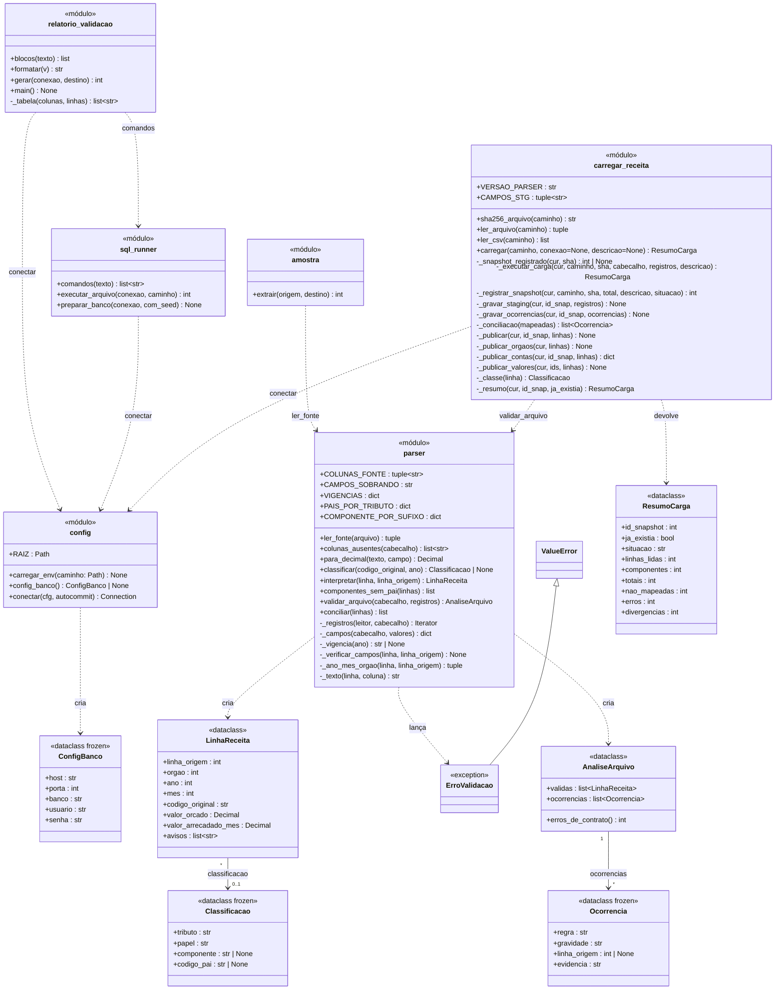
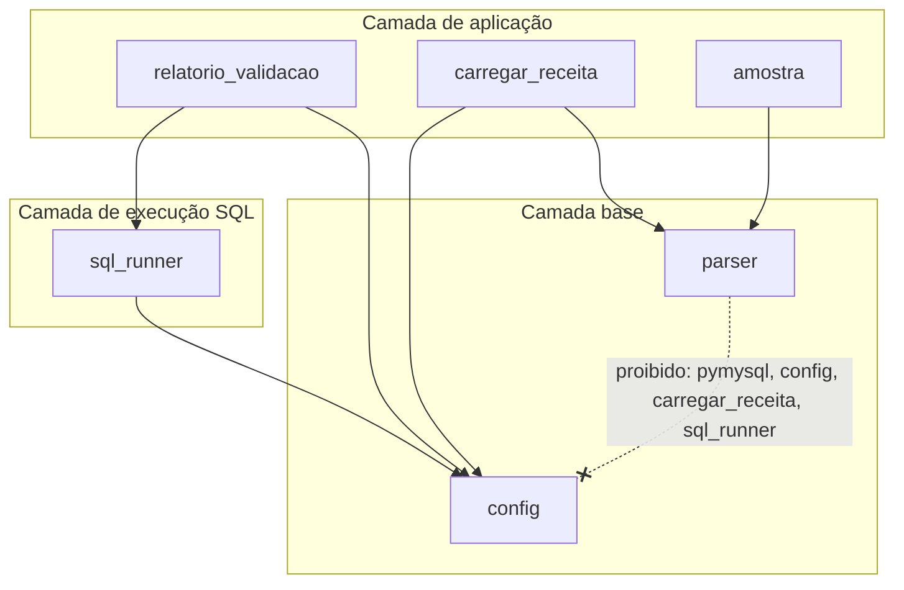

# Critério 2 — Banco implementado, com esquema versionado no repositório

> **Enunciado (Parte 2):** *"banco implementado (PostgreSQL, MySQL, SQLite ou MongoDB) com esquema versionado no repositório"*.
> **Evidências:** [`sql/schema.sql`](../../sql/schema.sql), [`sql/dados_referencia.sql`](../../sql/dados_referencia.sql), [`sql/seed_sintetico.sql`](../../sql/seed_sintetico.sql), testes de integração `tests/test_banco.py`.

## 1. O banco

| Item | Valor verificado em 01/10/2026 12:12 |
|---|---|
| SGBD | **MySQL 8.4.11** (InnoDB, `utf8mb4`) |
| Banco de desenvolvimento | `pi2_tributario`; testes em `pi2_tributario_teste`, recriado a cada execução |
| Objetos | **43 tabelas** e **3 views** |
| Esquema | `sql/schema.sql`: 95 comandos, reexecutável (remove e recria tudo) |
| Acesso | Usuário `pi2_app` com privilégios só nesses dois bancos; senha no `.env`, fora do Git; servidor ouvindo só em `127.0.0.1` |

## 2. Esquema versionado

Todo o banco é definido por arquivos de texto no repositório. Nada é criado à mão.

| Arquivo | Conteúdo | Ordem |
|---|---|---|
| `sql/schema.sql` | Tabelas, chaves, restrições, índices e views | 1 |
| `sql/dados_referencia.sql` | Domínios fixos: tributos, componentes, indicadores | 2 |
| `sql/seed_sintetico.sql` | Semente sintética do módulo operacional | 3 |
| `sql/validacao.sql` | As 18 consultas de validação (critério 4) | depois da carga |

```bash
python -m etl.sql_runner        # executa 1, 2 e 3 no banco do .env
```

Saída desta execução:

```text
schema.sql: 95 comandos
dados_referencia.sql: 3 comandos
seed_sintetico.sql: 30 comandos
```

> **Situação do versionamento:** o esquema está no Git, na `main`, com histórico de commits por frente de trabalho; o `.gitignore` exclui senhas e dados gerados. Publicado no GitHub em 01/10/2026: [github.com/guilhermercmoraes-tech/PI2_Sprint2-Grupo-1-UFT](https://github.com/guilhermercmoraes-tech/PI2_Sprint2-Grupo-1-UFT).

## 3. Restrições que protegem o modelo

As regras do modelo não dependem da disciplina de quem escreve os dados: o próprio banco as recusa.

| Regra | Mecanismo | Teste que prova (código de erro esperado) |
|---|---|---|
| Reimportar o mesmo arquivo não duplica a receita | `uq_snapshot_publicado`: no máximo um snapshot `PUBLICADO` por SHA-256 (coluna gerada) | `test_banco_impede_publicar_o_mesmo_arquivo_duas_vezes` (1062); `test_recarga_e_idempotente` |
| Arquivo reprovado só é reprocessado por regras novas | `uq_snapshot_sha_versao` (SHA-256, versão do parser) | `test_banco_impede_publicar_o_mesmo_arquivo_duas_vezes` (1062); `test_nova_versao_das_regras_reprocessa_o_arquivo_reprovado` |
| Conta única por snapshot, ano, órgão e código | `uq_conta` | `test_restricoes_do_modelo_rejeitam_dados_invalidos[uq_conta]` (1062) |
| Conta TOTAL não entra na tabela de fatos | FK composta `(id_conta, papel)` + `CHECK` | `test_fato_rejeita_conta_total` (1452) |
| TOTAL sem componente nem pai; COMPONENTE com os dois | `CHECK ck_conta_papel` | `…[ck_conta_papel]` (3819) |
| Mês entre 1 e 12 | `CHECK` | `test_mes_invalido_rejeitado` (3819) |
| Uma negociação ativa por crédito | PK de `credito_em_negociacao` | `test_uma_negociacao_ativa_por_credito` (1062) |
| Auditoria coerente com o tipo de ator | `CHECK ck_aud_ator` | `test_auditoria_exige_ator_coerente` (3819) |
| Permissão restrita a uma região existente; sem duplicata no município | `fk_perm_regiao`; `uq_permissao` com `escopo_regiao` | `test_permissao_por_regiao_tem_integridade_referencial` (1452 e 1062) |
| Crédito com base em imóvel **ou** cadastro econômico | `CHECK ck_cred_base` | `…[ck_cred_base]` (3819) |
| Vencimento ≥ constituição | `CHECK ck_cred_datas` | `…[ck_cred_datas]` (3819) |
| Fim de vigência ≥ início | `CHECK ck_resp_vig` (e equivalentes) | `…[ck_resp_vig]` (3819) |
| Estimativa dentro do intervalo | `CHECK ck_prev_intervalo` | `…[ck_prev_intervalo]` (3819) |
| Indicador `DISPONIVEL` ⇔ valor preenchido | `CHECK ck_vi_disp` | `…[ck_vi_disp]` (3819) |
| Dinheiro exato | `DECIMAL(18,2)` em toda coluna monetária | `test_saldo_derivado_dos_movimentos` |
| Σ apropriações ≤ pagamento | Não expressável em `CHECK` no MySQL | Consulta V09 (critério 4) |

`…[nome]` abrevia `test_restricoes_do_modelo_rejeitam_dados_invalidos[nome]`: um teste parametrizado por restrição, que exige o código de erro exato.

## 4. Diagrama de classes do código da camada de dados

O banco é criado e alimentado por um pacote Python, `etl/`. O diagrama abaixo foi montado **a partir do código real** (classes, atributos e funções extraídos dos arquivos) e segue a notação do ESM, cap. 4, §4.3:
- cada módulo aparece como uma classe com estereótipo «módulo»;
- `+` indica função pública e `−` função interna (prefixo `_` em Python);
- `dataclass` são classes de dados;
- a herança aparece como seta com ponta triangular (§4.3.2), e a dependência (um módulo importa ou usa o outro) como seta tracejada (§4.3.3).



`LinhaReceita` aparece com os atributos principais; o conjunto completo tem 12 campos (`etl/parser.py`).

### 4.1 Princípios de projeto aplicados

| Princípio (ESM, cap. 5) | Onde aparece |
|---|---|
| **Coesão** (§5.4, p. 12) | Cada módulo tem uma responsabilidade: `parser` lê, valida e classifica, e **decide** se o arquivo pode ser publicado; `carregar_receita` só **registra** a decisão; `sql_runner` executa scripts; `relatorio_validacao` documenta |
| **Acoplamento** (§5.5, p. 13) | O `parser` não conhece banco nem configuração. Isso não é só convenção: é um **contrato verificado automaticamente** pelo import-linter (gate G8) |
| **Ocultamento de informação** (§5.3, p. 6) | A carga expõe `carregar()` e três funções de leitura; os 12 passos internos são privados (`_executar_carga`, `_publicar_contas`…) |
| **Arquitetura em camadas** (ESM cap. 7, §7.2, p. 4) | Camadas verificadas pelo import-linter: `relatorio_validacao · carregar_receita · amostra` → `sql_runner` → `config · parser`. Uma camada só usa as de baixo |
| **Código aberto a customizações por injeção de dependência** (*Fundamentos de Manutenção de Software*, cap. 4, §4.4, p. 12–15) | `carregar(caminho, conexao=None)` e `gerar(conexao, destino)` recebem a conexão de fora. Os testes injetam a conexão do banco de teste, e a mesma função atende o uso real |



### 4.2 Métricas do código (medidas pelos quality gates)

O ESM, §5.7 (p. 33–38), apresenta métricas de tamanho, coesão, acoplamento e complexidade, e adverte que **não devem ser tratadas como metas**, e sim como indicadores. Nos gates, elas funcionam como limite de alerta:

| Métrica | Medida atual | Limite do gate |
|---|---|---|
| Complexidade ciclomática por função (§5.7.4, p. 38) | máx. 8, média 2,8 | ≤ 10 |
| Tamanho (§5.7.1) | maior módulo 202 SLOC; maior função 31 linhas | ≤ 250 SLOC; ≤ 50 linhas |
| Acoplamento entre módulos | 4/4 contratos de dependência mantidos | todos |

A complexidade de `carregar()` era **18** antes da refatoração por extração de método (ESM cap. 9, §9.2.1, p. 4); hoje nenhuma função da carga passa de 5. Em 01/10/2026, o próprio gate G5 reprovou a primeira versão da validação do arquivo inteiro (`interpretar` com complexidade 13), e a correção foi a mesma: extrair `_texto` e `_ano_mes_orgao`.

**Referências:** ESM cap. 4 §4.3 (p. 8–16); cap. 5 §5.3–5.5 (p. 6–13) e §5.7 (p. 33–38); cap. 7 §7.2 (p. 4); cap. 9 §9.2.1 (p. 4). *Fundamentos de Manutenção de Software*, cap. 4 §4.4 (p. 12–15). Manual do MySQL 8.4 (restrições `CHECK` e `FOREIGN KEY`).
