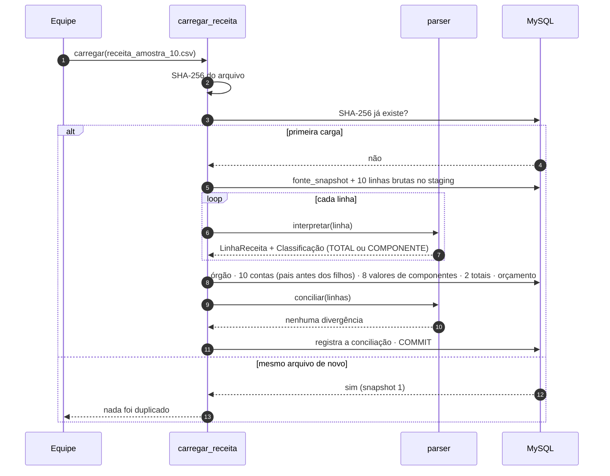
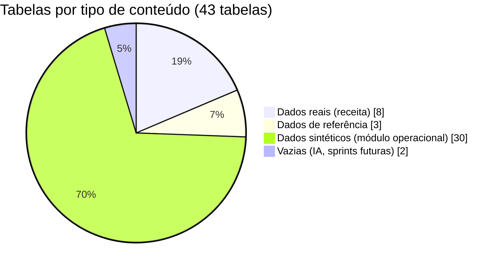

# Critério 3 — Banco populado com dados reais coletados em piloto

> **Enunciado (Parte 2):** *"populado com dados reais coletados em piloto"*.
> **Evidências:** [`data/amostra/receita_amostra_10.csv`](../../data/amostra/receita_amostra_10.csv), [`etl/carregar_receita.py`](../../etl/carregar_receita.py), saída da carga e contagem por tabela abaixo (execução de 30/09/2026 12:22).

## 1. De onde vêm os dados

| Etapa | Detalhe |
|---|---|
| Fonte | Portal de Acesso à Informação da Prefeitura de Palmas (NUCLEOGOV), extração de 07/07/2026 |
| Arquivo completo | `receita_acessoinformacao.csv`: 176.993 linhas, receitas de 2018 a jul/2026 |
| **Piloto** | **Amostra de 10 linhas reais**: órgão 2798 (Tesouro Municipal), jan/2025, contas-pai de IPTU (1112500) e ISSQN (1114511) e seus 4 componentes cada |
| Por que essa amostra | É a menor fatia que exercita todas as regras: pai e componentes, conciliação, orçamento e as duas classificações de tributo |
| Extração | `python -m etl.amostra "<CSV completo>"`: filtro determinístico que grava também o **número da linha de origem** de cada registro |
| Identificação do arquivo | SHA-256 `45f1c487f7ff767e43a02618f462c26a99e0c905deb6aba47eaf5632f937a4a3` |

## 2. Como os dados entram

A carga é **idempotente** (o mesmo arquivo não entra duas vezes, graças ao SHA-256) e **transacional** (ou entra tudo, ou nada além do staging).



Saída real das duas cargas:

```text
# 1ª carga
Snapshot 1: 10 linhas lidas · 8 componentes · 2 totais · 0 não mapeadas · 0 erros · 0 divergências de conciliação
# 2ª carga do mesmo arquivo
Snapshot 1 já carregado (mesmo SHA-256): nada foi duplicado.
```

## 3. O que ficou no banco



| Tabela | Linhas | Conteúdo |
|---|---|---|
| `conta_receita` | 10 | **real** |
| `fonte_snapshot` | 1 | **real** |
| `orcamento_informado` | 10 | **real** |
| `orgao` | 1 | **real** |
| `receita_componente_mensal` | 8 | **real** |
| `resultado_validacao` | 1 | **real** |
| `stg_receita_atual` | 10 | **real** |
| `total_informado_mensal` | 2 | **real** |
| `acao_plano` | 3 | sintética |
| `ajuste_credito` | 3 | sintética |
| `apropriacao` | 3 | sintética |
| `avaliacao_pvg` | 3 | sintética |
| `cadastro_economico` | 1 | sintética (`origem_dado = SINTETICO`) |
| `cidadao` | 1 | sintética |
| `componente_receita` | 4 | referência |
| `credito_em_negociacao` | 1 | sintética |
| `credito_tributario` | 5 | sintética (`origem_dado = SINTETICO`) |
| `imovel` | 3 | sintética (`origem_dado = SINTETICO`) |
| `indicador` | 3 | referência |
| `inscricao_credito` | 3 | sintética |
| `inscricao_divida_ativa` | 2 | sintética (`origem_dado = SINTETICO`) |
| `item_negociacao` | 1 | sintética |
| `lote` | 3 | sintética (`origem_dado = SINTETICO`) |
| `lote_via` | 4 | sintética |
| `negociacao` | 1 | sintética (`origem_dado = SINTETICO`) |
| `pagamento` | 2 | sintética (`origem_dado = SINTETICO`) |
| `perfil_concede` | 3 | sintética |
| `perfil_permissao` | 2 | sintética |
| `permissao` | 3 | sintética |
| `plano_arrecadacao` | 1 | sintética (`origem_dado = SINTETICO`) |
| `previsao` | 0 | vazia (IA, sprints futuras) |
| `quadra` | 2 | sintética (`origem_dado = SINTETICO`) |
| `regiao` | 2 | sintética (`origem_dado = SINTETICO`) |
| `registro_auditoria` | 2 | sintética |
| `representacao` | 1 | sintética |
| `responsabilidade_tributaria` | 6 | sintética |
| `servidor_palmas` | 1 | sintética |
| `solicitacao_adesao` | 1 | sintética |
| `sujeito_passivo` | 3 | sintética (`origem_dado = SINTETICO`) |
| `tributo` | 3 | referência |
| `usuario` | 2 | sintética (`origem_dado = SINTETICO`) |
| `valor_indicador` | 0 | vazia (IA, sprints futuras) |
| `via` | 2 | sintética (`origem_dado = SINTETICO`) |

**Valores reais conferidos** (critério 4, consultas V02 e V04):

| Tributo | Componentes carregados | Soma | Total informado pela conta-pai |
|---|---|---|---|
| IPTU (1112500) | Principal 2.274.951,38 · Multas e juros 100.668,50 · Dívida ativa 315.099,43 · Dívida ativa: multas e juros 194.901,33 | **2.885.620,64** | 2.885.620,64 ✔ |
| ISSQN (1114511) | Principal 21.293.247,99 · Multas e juros 425.288,01 · Dívida ativa 43.248,99 · Dívida ativa: multas e juros 41.212,02 | **21.802.997,01** | 21.802.997,01 ✔ |

## 4. Limites do piloto

- **Volume.** O piloto carrega **10 das 176.993 linhas**. O código já trata o arquivo inteiro (contas não mapeadas ficam registradas no staging), mas a carga completa não foi executada nem medida. É o primeiro passo recomendado para a Sprint 3.
- **Módulo operacional sintético.** Os dados públicos não contêm contribuintes, créditos nem dívidas individuais. Todas essas tabelas estão marcadas `origem_dado = 'SINTETICO'` (consulta V16), e o pedido desses dados à Sefin está registrado como pendência (PA-12).
- **Pseudonimização.** Não há dado pessoal real no banco. A pseudonimização com sal secreto está especificada (`PSEUDONIMO_SAL` no `.env`), mas só será exercitada quando chegarem dados pessoais.

**Referências:** relatório de auditoria dos CSVs (snapshot por SHA-256, contas-pai × componentes); `docs/E3_integracao_segura.md` (origem dos dados); Lei nº 13.709/2018 (LGPD).
