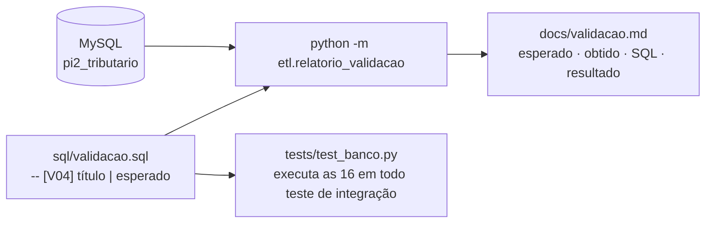
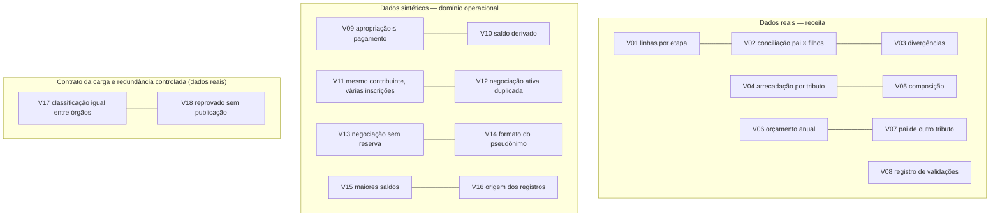

# Critério 4 — Consultas SQL de validação executadas e documentadas

> **Enunciado (Parte 2):** *"consultas SQL de validação executadas e documentadas"*.
> **Evidências:** [`sql/validacao.sql`](../../sql/validacao.sql) (as consultas), [`validacao.md`](../validacao.md) (resultado completo de cada uma, gerado em 01/10/2026 12:12), testes `test_consultas_de_validacao_executam` e `test_relatorio_de_validacao_executa_todos_os_blocos`.

## 1. Como as consultas são executadas e documentadas

Cada consulta tem um cabeçalho padronizado com identificador, título e **resultado esperado**. Um script executa todas e grava o documento de resultados, com o SQL executado e a tabela devolvida. Assim, o resultado documentado nunca é digitado à mão.



```bash
python -m etl.relatorio_validacao
```

## 2. As 18 consultas

V01 a V08, V17 e V18 validam os **dados reais** de receita e o contrato da carga; V09 a V16 validam a estrutura do módulo operacional com **dados sintéticos**.



| # | Consulta | Esperado | Obtido | Situação |
|---|---|---|---|---|
| V01 | Linhas por etapa da carga (staging x publicadas) | staging = componentes + totais + não mapeadas | 1 linha(s) | ✅ |
| V02 | Conciliação conta-pai x soma dos componentes | diferença 0,00 e 4 componentes por pai | 2 linha(s) | ✅ |
| V03 | Divergências de conciliação | 0 linhas | 0 linha(s) | ✅ |
| V04 | Arrecadação por tributo e competência (somente componentes) | IPTU 2.885.620,64 · ISSQN 21.802.997,01 | 2 linha(s) | ✅ |
| V05 | Composição por componente (receita de dívida ativa é fluxo, não estoque) | 4 componentes por tributo | 8 linha(s) | ✅ |
| V06 | Orçamento anual informado das contas-pai (guardado uma vez, não somado por mês) | IPTU 112.219.000,00 · ISSQN 278.560.000,00 | 2 linha(s) | ✅ |
| V07 | Componentes cujo pai é de outro tributo ou outro ano | 0 linhas | 0 linha(s) | ✅ |
| V08 | Registro de validações da carga | somente INFO na amostra | 1 linha(s) | ✅ |
| V09 | Invariante: apropriações não excedem o pagamento | 0 linhas | 0 linha(s) | ✅ |
| V10 | Saldo de cada crédito derivado dos movimentos (dados sintéticos) | nenhum saldo negativo | 5 linha(s) | ✅ |
| V11 | Mesmo sujeito em várias inscrições/imóveis (dados sintéticos) | sujeito 1: 3 créditos em 2 imóveis · sujeito 2: 2 créditos | 2 linha(s) | ✅ |
| V12 | Créditos com mais de uma negociação ativa | 0 linhas | 0 linha(s) | ✅ |
| V13 | Negociações ativas sem reserva de exclusividade | 0 linhas | 0 linha(s) | ✅ |
| V14 | Documentos pseudonimizados com formato inválido (HMAC-SHA-256 em hexadecimal, 64 caracteres) | 0 linhas | 0 linha(s) | ✅ |
| V15 | Top créditos por saldo em aberto (dados sintéticos) | ordenado por saldo | 4 linha(s) | ✅ |
| V16 | Origem dos registros operacionais | todos SINTETICO no piloto | 4 linha(s) | ✅ |
| V17 | Classificação de uma conta divergente entre órgãos do mesmo snapshot (redundância controlada) | 0 linhas | 0 linha(s) | ✅ |
| V18 | Arquivo reprovado com receita publicada ou publicado com erro de contrato | 0 linhas | 0 linha(s) | ✅ |

As consultas cujo resultado esperado é **0 linhas** (V03, V07, V09, V12, V13, V14, V17 e V18) são verificações de integridade: qualquer linha retornada indicaria uma violação. A V17 confere a redundância controlada de `conta_receita` (critério 1, seção 5.4): a classificação de uma conta não pode divergir entre órgãos do mesmo snapshot. A V18 confere a regra da carga: nenhum arquivo reprovado tem receita publicada, e nenhum publicado tem erro de contrato.

## 3. Resultados que merecem destaque

- **V02:** cada conta-pai confere com a soma dos seus 4 componentes, com diferença de 0,00.
- **V04:** a arrecadação de jan/2025 soma **só os componentes**. Somar todas as linhas do CSV daria o dobro; o teste `test_somar_todas_as_linhas_duplicaria_a_receita` comprova isso.
- **V06:** o orçamento anual aparece **uma vez** por conta, e não multiplicado pelos 12 meses em que se repete na fonte.
- **V10:** o saldo de cada crédito é calculado a partir dos movimentos; o crédito 1 (1.500 + 150 de multa + 90 de juros − 1.740 pagos) tem saldo 0,00.

O resultado completo, com o SQL e a tabela devolvida por cada consulta, está em [`validacao.md`](../validacao.md).

**Referências:** relatório de auditoria dos CSVs (regras de conciliação e orçamento); Nota Técnica (§20.2–20.3 do `REQUISITOS_UML.md`); ESM cap. 8, §8.8 (testes de integração, p. 36).
