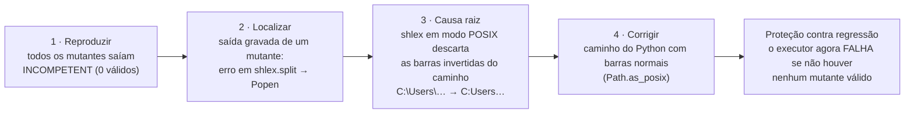
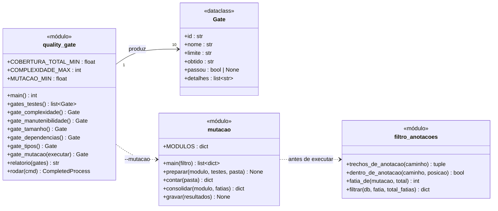

# Evidências complementares — manutenção e qualidade

Este documento não corresponde a um critério isolado do enunciado. Ele reúne as evidências de que a Parte 2 foi construída para ser **mantida**, com base em Valente, *Fundamentos de Manutenção de Software* (FMS), e *Engenharia de Software Moderna* (ESM).

## 1. Tipos de manutenção realizados nesta sprint

O FMS, cap. 1, §1.2 (p. 2–3), define cinco tipos de manutenção. Todos os exemplos abaixo aconteceram de fato durante a Sprint 2:

| Tipo (FMS §1.2) | O que foi feito | Evidência |
|---|---|---|
| **Corretiva** (bug reportado por usuários) | Nenhuma: o sistema ainda não tem usuários | — |
| **Preventiva** (bug latente, ainda não causou falha) | Tabela hash com capacidade em potência de 2: chaves inteiras com padrão caíam todas no mesmo *bucket*. Corrigida para capacidade prima | `test_chaves_multiplas_de_potencia_de_2_nao_se_concentram` |
| **Preventiva** | `remover` podia retirar a chave errada num *bucket* com colisão, revelado por teste de mutação | `test_remover_em_bucket_com_colisao_retira_a_chave_certa` |
| **Adaptativa** (nova regra ou tecnologia) | Execução dos testes de mutação adaptada ao Windows: caminhos com barra invertida quebravam o TOML e o `shlex` | `scripts/mutacao.py` |
| **Refatoração** | `carregar()` dividida por extração de método (complexidade 18 → 6); `gerar()` separada de `main()` para ser testável; "balde" → "bucket" | gates G5 e G7; `git diff` |
| **Evolutiva** (nova funcionalidade) | Integração grafo + hash; quality gates; relatório de validação automático | `tests/test_integracao_estruturas.py`; `scripts/quality_gate.py` |

## 2. Depuração: um caso real, nos quatro passos do FMS

O FMS, cap. 6, §6.2 (p. 2), divide a depuração em quatro passos: **reproduzir, localizar, identificar a causa raiz e corrigir**. O caso abaixo aconteceu na construção dos testes de mutação.

O erro só apareceu porque o resultado era implausível (100% incompetentes), e a correção incluiu uma **guarda**: se ele voltar, o gate falha, em vez de relatar um sucesso vazio.

## 3. Bugs e regressões

O FMS, cap. 5 (p. 14), define **regressão** como um bug introduzido por uma modificação no código. Cada defeito corrigido na sprint ganhou um teste que falharia se ele voltasse:

| Defeito | Teste de regressão |
|---|---|
| Hash com capacidade em potência de 2 | `test_chaves_multiplas_de_potencia_de_2_nao_se_concentram` (o teste foi escrito **antes** da correção e falhou, confirmando o defeito) |
| Regra de crescimento sem verificação | `test_crescimento_segue_a_regra_menor_primo_maior_ou_igual_a_2m_mais_1` (capacidades 1 a 40) |
| Detecção de ciclo parava no primeiro componente (encontrado por mutação) | `test_ciclo_em_componente_posterior_e_detectado` |
| Empate na fila saía fora da ordem de chegada (encontrado por mutação) | `test_empate_total_respeita_ordem_de_chegada` |

## 4. Testes: a pirâmide do projeto

O ESM, cap. 8 (p. 2–4), organiza os testes numa pirâmide: muitos testes de unidade na base, menos testes de integração e poucos de sistema no topo.

| Medida | Resultado | Referência |
|---|---|---|
| Cobertura de linhas e ramos | 97,4% | ESM §8.4 (p. 17) |
| Testes de mutação | 91,7% | *não abordado no ESM*; ferramenta cosmic-ray |

## 5. Código limpo e documentação

| Prática (FMS) | No código |
|---|---|
| **Linguagem ubíqua** (cap. 2, §2.6, p. 12) | Identificadores com os termos do domínio: `conta_receita`, `componente`, `conciliar`, `sujeito_passivo`, `credito_em_negociacao` |
| **Evitar números mágicos** (cap. 2, §2.5, p. 10) | Constantes nomeadas: `CENTAVO`, `CARGA_MAXIMA = 0.75`, `COMPLEXIDADE_MAX = 10`, `COBERTURA_TOTAL_MIN = 90.0` |
| **Docstrings como comentários públicos** (cap. 3, p. 7) | Cada módulo e função pública tem docstring com o **porquê** das decisões (ex.: por que o total da conta-pai não é somado) |
| **Comentários para o que não é óbvio** (cap. 3, epígrafe de Ousterhout, p. 1) | Ex.: em `mutacao.py`, por que o caminho do Python vai com barras normais |

## 6. Dívida técnica registrada

O FMS, cap. 7, distingue dívida **planejada** (deliberada, assumida para avançar) de **não planejada** (surge de fatores fora do controle; §7.3, p. 8). As duas estão registradas para não virarem surpresa:

| Dívida | Tipo | Onde está registrada | Plano |
|---|---|---|---|
| Conexão aplicação ↔ MySQL sem TLS | Planejada (banco local) | `PROTOCOLOS_SEGURANCA_AUDITORIA.md` P2 | Obrigatório quando o banco sair da máquina |
| Auditoria sem cadeia de MAC, sequência e selo | Planejada | Protocolos A2–A4 | Próximas sprints |
| Usuário `pi2_app` pode alterar e apagar a auditoria | Planejada | Protocolos A5 | Criar usuário só de inserção |
| Módulo operacional só com dados sintéticos | **Não planejada** (os dados públicos não existem) | `SPRINT2.md`; PA-12 | Pedido institucional à Sefin |
| Carga completa (176.993 linhas) não executada | Planejada (piloto) | Critério 3 | Sprint 3 |
| Workflow de integração contínua nunca executado no GitHub | Planejada | Guia do GitHub, seção 6 | Primeiro push |
| Commits ainda não feitos | Planejada | Critério 2 | Antes da entrega |

## 7. Fontes legadas

O FMS, cap. 8, trata de **sistemas legados** e de sua substituição gradual. O projeto tem uma fonte com essa característica: a API antiga da Prefeitura (`integracao.palmas.to.gov.br`), com histórico de 2001 a jun/2021. Ela usa outro plano de contas, e seus meses de 2016–2018 repetem o valor anual. A decisão foi **não misturar** as duas séries: cada fonte terá seu próprio adaptador, e uma união só acontece depois de reconciliar códigos e conceitos (relatório de auditoria dos CSVs; `REQUISITOS_UML.md` §20.2, regra 6).

## 8. Processo: revisão e integração contínua

- **Revisão de código** (FMS, cap. 9, p. 3–4) por pull request: o guia do GitHub organiza a entrega em um PR `sprint2 → main`, revisado pelos colegas.
- **Controle de versões e integração contínua** (ESM, cap. 10, §10.2, p. 5, e §10.3, p. 10): os quality gates rodam localmente e estão configurados para rodar a cada push no GitHub Actions.

*Diagrama de classes das ferramentas de qualidade (`scripts/`), na mesma notação do ESM §4.3.*

## 9. Uso de IA na manutenção

O desenvolvimento desta sprint foi **assistido por um agente de IA** (Claude Code). O FMS, cap. 10, descreve esse modo de trabalho e suas precauções, que foram seguidas:
- **Planejamento revisado antes da execução** (p. 11): o plano da sprint foi escrito e aprovado antes da implementação.
- **Critérios de verificação** (p. 11) e **testes continuando a passar** a cada mudança (p. 17): toda alteração passou pelos quality gates, e os documentos só citam testes que existem, verificados automaticamente.
- **Responsabilidade humana:** o código e os documentos precisam ser lidos, entendidos e defendidos pela equipe. Recomenda-se declarar esse uso conforme a política do curso.

**Referências:** FMS cap. 1 §1.2 (p. 2–3); cap. 2 §2.5 (p. 10) e §2.6 (p. 12); cap. 3 (p. 1 e 7); cap. 5 (p. 14); cap. 6 §6.2 (p. 2); cap. 7 §7.3 (p. 8); cap. 8; cap. 9 (p. 3–4); cap. 10 (p. 11 e 17). ESM cap. 8 (p. 2–4, 13, 17, 36); cap. 10 §10.2 (p. 5) e §10.3 (p. 10).
