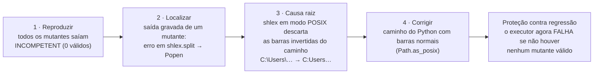
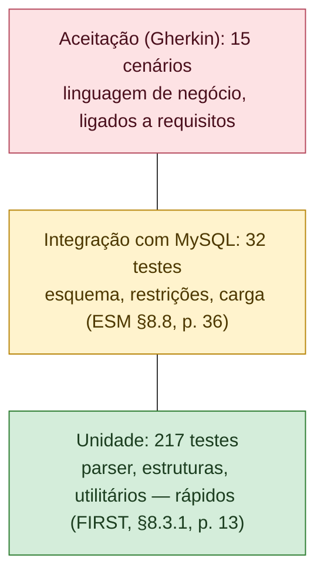
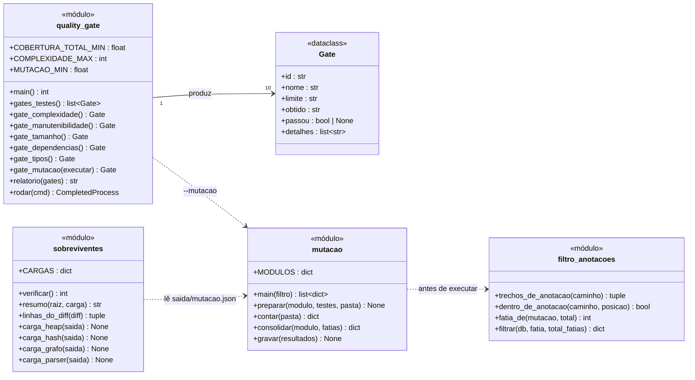

# Evidências complementares — manutenção e qualidade

Este documento não corresponde a um critério isolado do enunciado. Ele reúne as evidências de que a Parte 2 foi construída para ser **mantida**, com base em Valente, *Fundamentos de Manutenção de Software* (FMS), e *Engenharia de Software Moderna* (ESM).

## 1. Tipos de manutenção realizados nesta sprint

O FMS, cap. 1, §1.2 (p. 2–3), define cinco tipos de manutenção. Todos os exemplos abaixo aconteceram de fato durante a Sprint 2:

| Tipo (FMS §1.2) | O que foi feito | Evidência |
|---|---|---|
| **Corretiva** (bug reportado por usuários) | Nenhuma: o sistema ainda não tem usuários | — |
| **Preventiva** (bug latente, ainda não causou falha) | Tabela hash com capacidade em potência de 2: chaves inteiras com padrão caíam todas no mesmo *bucket*. Corrigida para capacidade prima | `test_chaves_multiplas_de_potencia_de_2_nao_se_concentram` |
| **Preventiva** | `remover` podia retirar a chave errada num *bucket* com colisão, revelado por teste de mutação | `test_remover_em_bucket_com_colisao_retira_a_chave_certa` |
| **Preventiva** (revisão de 01/10/2026) | Fila de prioridade: uma ação retirada e reinserida voltava com a prioridade antiga, porque a versão recomeçava em 1. Encontrado por teste diferencial contra um modelo de referência; corrigido com um número de sequência único | `test_remover_e_reinserir_nao_ressuscita_a_entrada_antiga`; `test_fila_equivale_ao_modelo_de_referencia` |
| **Preventiva** (revisão de 01/10/2026) | Carga: arquivo reprovado ficava bloqueado e a recarga respondia "0 erros"; coluna ausente, componente sem conta-pai e linha com campos a menos derrubavam a carga com erro cru, sem registro | `test_arquivo_reprovado_nao_e_mascarado_na_recarga`; `test_coluna_ausente_reprova_o_arquivo_sem_erro_cru`; `test_componentes_sem_a_conta_pai_reprovam_o_arquivo_sem_erro_cru`; `test_linha_com_campos_a_menos_reprova_o_arquivo_sem_erro_cru` |
| **Adaptativa** (nova regra ou tecnologia) | Execução dos testes de mutação adaptada ao Windows: caminhos com barra invertida quebravam o TOML e o `shlex` | `scripts/mutacao.py` |
| **Refatoração** | `carregar()` dividida por extração de método (complexidade 18 → 6); `interpretar()` dividida depois que o gate G5 reprovou a primeira versão da validação do arquivo (complexidade 13 → 4); `gerar()` separada de `main()` para ser testável; "balde" → "bucket" | gates G5 e G7 (a refatoração de `carregar()` é anterior ao primeiro commit; a de `interpretar()` está no histórico do Git) |
| **Evolutiva** (nova funcionalidade) | Integração grafo + hash; quality gates; relatório de validação automático; validação do contrato do arquivo inteiro; verificador de mutantes sobreviventes | `tests/test_integracao_estruturas.py`; `scripts/quality_gate.py`; `etl/parser.py` (`validar_arquivo`); `scripts/sobreviventes.py` |

## 2. Depuração: um caso real, nos quatro passos do FMS

O FMS, cap. 6, §6.2 (p. 2), divide a depuração em quatro passos: **reproduzir, localizar, identificar a causa raiz e corrigir**. O caso abaixo aconteceu na construção dos testes de mutação.

O erro só apareceu porque o resultado era implausível (100% incompetentes), e a correção incluiu uma **guarda**: se ele voltar, o gate falha, em vez de relatar um sucesso vazio.

Um segundo caso aconteceu em 01/10/2026, no verificador de mutantes sobreviventes:

| Passo (FMS §6.2) | O que aconteceu |
|---|---|
| 1 · Reproduzir | O mutante `range(2021, 2027)` aparecia como "comportamento diferente", mas, testado à parte, não mudava nada |
| 2 · Localizar | Só falhava quando rodava logo depois de outro mutante da mesma linha, com o mesmo tamanho |
| 3 · Causa raiz | O Python valida o bytecode em cache (`.pyc`) pela data, com resolução de segundos, e pelo tamanho do arquivo: o mutante anterior estava sendo executado no lugar do novo |
| 4 · Corrigir | `PYTHONDONTWRITEBYTECODE=1` no processo de cada mutante, a mesma proteção que o cosmic-ray usa em `testing.py`. O falso positivo desapareceu; as 3 diferenças restantes eram lacunas reais e ganharam testes |

## 3. Bugs e regressões

O FMS, cap. 5 (p. 14), define **regressão** como um bug introduzido por uma modificação no código. Cada defeito corrigido na sprint ganhou um teste que falharia se ele voltasse:

| Defeito | Teste de regressão |
|---|---|
| Hash com capacidade em potência de 2 | `test_chaves_multiplas_de_potencia_de_2_nao_se_concentram` (o teste foi escrito **antes** da correção e falhou, confirmando o defeito) |
| Regra de crescimento sem verificação | `test_crescimento_segue_a_regra_menor_primo_maior_ou_igual_a_2m_mais_1` (capacidades 1 a 40) |
| Detecção de ciclo parava no primeiro componente (encontrado por mutação) | `test_ciclo_em_componente_posterior_e_detectado` |
| Empate na fila saía fora da ordem de chegada (encontrado por mutação) | `test_empate_total_respeita_ordem_de_chegada` |
| Ação retirada e reinserida voltava com a prioridade antiga (revisão de 01/10/2026; os testes novos falham no código antigo) | `test_remover_e_reinserir_nao_ressuscita_a_entrada_antiga`, `test_extrair_e_reinserir_nao_ressuscita_a_entrada_antiga` |
| Três mutantes classificados como equivalentes mudavam o comportamento: construção da heap com 2 itens, inserção depois de extração, rótulo criado em tempo de execução | `test_construcao_em_lote_para_todas_as_permutacoes`, `test_insercao_depois_de_extracao_sobe_ate_o_pai`, `test_filtro_de_rotulo_compara_por_igualdade_e_nao_por_identidade` |
| Arquivo reprovado mascarado na recarga; erros crus na carga | testes de contrato em `tests/test_banco.py` e `tests/aceitacao/carga_receita.feature` |
| Lacunas nos testes do código novo, achadas pelo verificador de sobreviventes: primeiro ano da vigência 2022–2026 e linha física de registros consecutivos | `test_limites_das_vigencias`, `test_registros_consecutivos_em_linhas_pares_e_impares` |

## 4. Testes: a pirâmide do projeto

O ESM, cap. 8 (p. 2–4), organiza os testes numa pirâmide: muitos testes de unidade na base, menos testes de integração e poucos de sistema no topo.

| Medida | Resultado | Referência |
|---|---|---|
| Cobertura de linhas e ramos | 98,1% | ESM §8.4 (p. 17) |
| Testes de mutação | 93,0%; nenhum sobrevivente muda o comportamento numa carga diferencial (`scripts/sobreviventes.py`) | *não abordado no ESM*; ferramenta cosmic-ray; DeMillo, Lipton e Sayward (1978) |
| Testes de propriedade e diferenciais | heap e fila contra `heapq` e um modelo sem heap; grafo contra Kahn, conjuntos disjuntos e os algoritmos de Lintzmayer & Mota; hash contra `dict` | Claessen e Hughes (2000); McKeeman (1998) |

## 5. Código limpo e documentação

| Prática (FMS) | No código |
|---|---|
| **Linguagem ubíqua** (cap. 2, §2.6, p. 12) | Identificadores com os termos do domínio: `conta_receita`, `componente`, `conciliar`, `sujeito_passivo`, `credito_em_negociacao` |
| **Evitar números mágicos** (cap. 2, §2.5, p. 10) | Constantes nomeadas: `CENTAVO`, `CARGA_MAXIMA = 0.75`, `COMPLEXIDADE_MAX = 10`, `COBERTURA_TOTAL_MIN = 90.0`; a conciliação usa `len(COMPONENTE_POR_SUFIXO)` em vez do `4` literal |
| **Docstrings como comentários públicos** (cap. 3, p. 7) | Cada módulo e função pública tem docstring com o **porquê** das decisões (ex.: por que o total da conta-pai não é somado) |
| **Comentários para o que não é óbvio** (cap. 3, epígrafe de Ousterhout, p. 1) | Ex.: em `mutacao.py`, por que o caminho do Python vai com barras normais |

## 6. Dívida técnica registrada

O FMS, cap. 7, distingue dívida **planejada** (deliberada, assumida para avançar) de **não planejada** (surge de fatores fora do controle; §7.3, p. 8). As duas estão registradas para não virarem surpresa:

| Dívida | Tipo | Onde está registrada | Plano |
|---|---|---|---|
| Conexão aplicação ↔ MySQL sem TLS | Planejada (banco local) | `PROTOCOLOS_SEGURANCA_AUDITORIA.md` P2 | Obrigatório quando o banco sair da máquina |
| Auditoria sem cadeia de MAC, sequência e selo | Planejada | Protocolos A2–A4 | Próximas sprints |
| Usuário `pi2_app` pode alterar e apagar a auditoria | Planejada | Protocolos A5 | Criar usuário só de inserção |
| Módulo operacional só com dados sintéticos | **Não planejada** (os dados públicos não existem) | `SPRINT2.md`; PA-12 | Pedido institucional à Sefin |
| Carga completa (176.993 linhas) não executada | Planejada (piloto) | Critério 3 | Sprint 3 |
| Mutação (G10) ainda não executada no GitHub Actions; G1–G9 já foram aprovados lá | Planejada | `.github/workflows/qualidade.yml` | Primeira execução agendada (segunda-feira) ou manual |
| Mutação não cobre a carga (`carregar_receita`), porque exige o banco | Planejada | `REQUISITOS_UML.md` §23.4 | Sprint 3 |
| Classificação da conta repetida por órgão | Planejada (redundância controlada) | Critério 1, §5.4; consulta V17 | Tabela `plano_conta` se o plano de contas passar a ser editado |
| Pseudonimização especificada, sem código | Planejada (o piloto não tem dados pessoais) | `E3_integracao_segura.md` | Quando chegarem dados pessoais |

## 7. Fontes legadas

O FMS, cap. 8, trata de **sistemas legados** e de sua substituição gradual. O projeto tem uma fonte com essa característica: a API antiga da Prefeitura (`integracao.palmas.to.gov.br`), com histórico de 2001 a jun/2021. Ela usa outro plano de contas, e seus meses de 2016–2018 repetem o valor anual. A decisão foi **não misturar** as duas séries: cada fonte terá seu próprio adaptador, e uma união só acontece depois de reconciliar códigos e conceitos (relatório de auditoria dos CSVs; `REQUISITOS_UML.md` §20.2, regra 6).

## 8. Processo: revisão e integração contínua

- **Desenvolvimento baseado no tronco** (ESM, cap. 10, §10.3): o repositório usa só a `main`; "todo desenvolvimento ocorre no branch principal", e a integração contínua roda a cada push. A mutação, lenta, roda toda semana e sob demanda.
- **Revisão de código** (FMS, cap. 9, p. 3–4): sem pull requests, a revisão é feita sobre os commits da `main` e registrada no diário de bordo. A revisão independente de 01/10/2026 (`REVISAO_CONSONANCIA_01-10-2026.md`) é um exemplo: encontrou defeitos que a suíte não pegava, e cada correção veio com teste que falha no código antigo.
- **Controle de versões e integração contínua** (ESM, cap. 10, §10.2, p. 5, e §10.3, p. 10): os quality gates rodam localmente e estão configurados para rodar no GitHub Actions.

*Diagrama de classes das ferramentas de qualidade (`scripts/`), na mesma notação do ESM §4.3.*

## 9. Uso de IA na manutenção

O desenvolvimento desta sprint foi **assistido por um agente de IA** (Claude Code). O FMS, cap. 10, descreve esse modo de trabalho e suas precauções, que foram seguidas:
- **Planejamento revisado antes da execução** (p. 11): o plano da sprint foi escrito e aprovado antes da implementação.
- **Critérios de verificação** (p. 11) e **testes continuando a passar** a cada mudança (p. 17): toda alteração passou pelos quality gates, e os documentos só citam testes que existem, verificados automaticamente.
- **Responsabilidade humana:** o código e os documentos precisam ser lidos, entendidos e defendidos pela equipe. Recomenda-se declarar esse uso conforme a política do curso.
- **Verificar o que a IA produziu:** a revisão de 01/10/2026 encontrou um defeito na fila de prioridade e três mutantes mal classificados no próprio código assistido por IA. Isso mostra por que o FMS insiste nesse ponto: os testes precisam ser julgados, e não só executados.

**Referências:** FMS cap. 1 §1.2 (p. 2–3); cap. 2 §2.5 (p. 10) e §2.6 (p. 12); cap. 3 (p. 1 e 7); cap. 5 (p. 14); cap. 6 §6.2 (p. 2); cap. 7 §7.3 (p. 8); cap. 8; cap. 9 (p. 3–4); cap. 10 (p. 11 e 17). ESM cap. 8 (p. 2–4, 13, 17, 36); cap. 10 §10.2 (p. 5) e §10.3 (p. 10 e 15). Externas, não conferidas nos livros do curso: DeMillo, Lipton e Sayward, *Hints on test data selection*, IEEE Computer, 1978 (mutação); Claessen e Hughes, *QuickCheck*, ICFP 2000 (testes de propriedade); McKeeman, *Differential testing for software*, Digital Technical Journal, 1998 (testes diferenciais).
