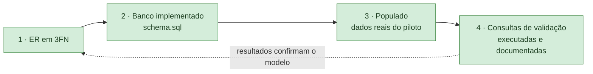

# Parte 2 — Diagrama ER + banco implementado e populado

> **Enunciado (Sprint 2, entrega até 02/10/2026):** *"Diagrama Entidade-Relacionamento normalizado (3FN), banco implementado (PostgreSQL, MySQL, SQLite ou MongoDB) com esquema versionado no repositório, populado com dados reais coletados em piloto, e consultas SQL de validação executadas e documentadas."*
>
> **Rubrica:** *"ER em 3FN; banco populado com dados reais; consultas validadas"* — 35% da nota da Sprint 2.

Evidências geradas novamente em **01/10/2026 12:12**, no MySQL 8.4.11, depois das correções da revisão de consonância.

## Critérios e evidências

| # | Critério do enunciado | Situação | Documento | Evidência principal |
|---|---|---|---|---|
| 1 | Diagrama ER normalizado (3FN) | ✅ Cumprido | [1_diagrama_er_3fn.md](1_diagrama_er_3fn.md) | Diagramas ER dos dois módulos, dependências funcionais, diagrama de classes do domínio |
| 2 | Banco implementado com **esquema versionado no repositório** | ✅ Cumprido | [2_banco_implementado.md](2_banco_implementado.md) | MySQL 8.4.11, 43 tabelas e 3 views criadas por `schema.sql`, versionado no Git (`main`); a publicação no GitHub é passo da Parte 4 |
| 3 | Populado com **dados reais** coletados em piloto | ✅ Cumprido no piloto | [3_populado_dados_reais.md](3_populado_dados_reais.md) | Amostra real de 10 linhas carregada com linhagem e SHA-256; contrato do arquivo validado antes da publicação; carga idempotente comprovada |
| 4 | Consultas SQL de validação **executadas e documentadas** | ✅ Cumprido | [4_consultas_validacao.md](4_consultas_validacao.md) | 18 consultas executadas; resultados gerados automaticamente |
| — | Evidências complementares | — | [5_manutencao_e_qualidade.md](5_manutencao_e_qualidade.md) | Tipos de manutenção, depuração, dívida técnica, testes e uso de IA |



## Como reproduzir tudo

Com o MySQL no ar e o `.env` preenchido (ver README do repositório):

```bash
python -m etl.sql_runner                                             # cria o banco (critério 2)
python -m etl.carregar_receita data/amostra/receita_amostra_10.csv   # popula com dados reais (critério 3)
python -m etl.relatorio_validacao                                    # executa e documenta as consultas (critério 4)
python scripts/quality_gate.py                                       # testes e métricas
```

## Qualidade do que foi entregue

| Gate | Resultado |
|---|---|
| G1 Testes unitários | 217/217 ✅ |
| G2 Testes de integração (MySQL) | 32/32 ✅ |
| G3 Testes de aceitação (Gherkin) | 15/15 ✅ |
| G4 Cobertura de linhas e ramos | 98,1% ✅ |
| G5 Complexidade ciclomática | máx. 8 (componentes_sem_pai), média 2,8 ✅ |
| G6 Índice de manutenibilidade | mín. 43,1 (parser.py) ✅ |
| G7 Tamanho de módulos e funções | maior módulo 202 SLOC; maior função 31 linhas ✅ |
| G8 Controle de dependências (import-linter) | 4/4 contratos ✅ |
| G9 Verificação de tipos (Pyright) | 0 erro(s) ✅ |
| G10 Testes de mutação | 93,0% (816/877 mortos, nesta rodada) ✅ |

## Organização desta pasta

Os documentos estão em `docs/parte2/`. Os artefatos que eles citam ficam nos seus lugares no repositório: `sql/`, `etl/`, `data/amostra/`, `docs/validacao.md` e `docs/modelagem_er.md`.

## Diagramas de classes nesta Parte

Seguem a notação de Valente, *Engenharia de Software Moderna*, cap. 4, §4.3 (UML como esboço):

| Diagrama | Onde |
|---|---|
| Domínio do Módulo A (receita observada), com as views como «view» | Critério 1, §4.1 |
| Domínio do Módulo B (operacional) | Critério 1, §4.2 |
| Código da camada de dados (`etl/`), montado a partir do código real | Critério 2, §4 |
| Ferramentas de qualidade (`scripts/`) | Evidências complementares, §8 |
