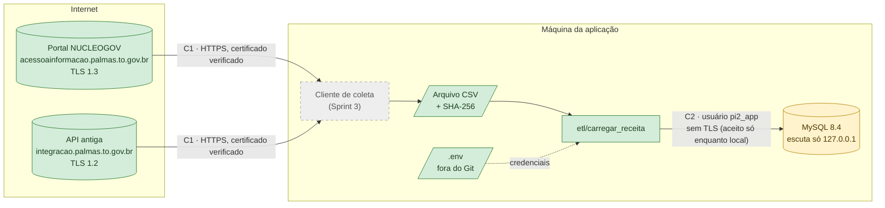
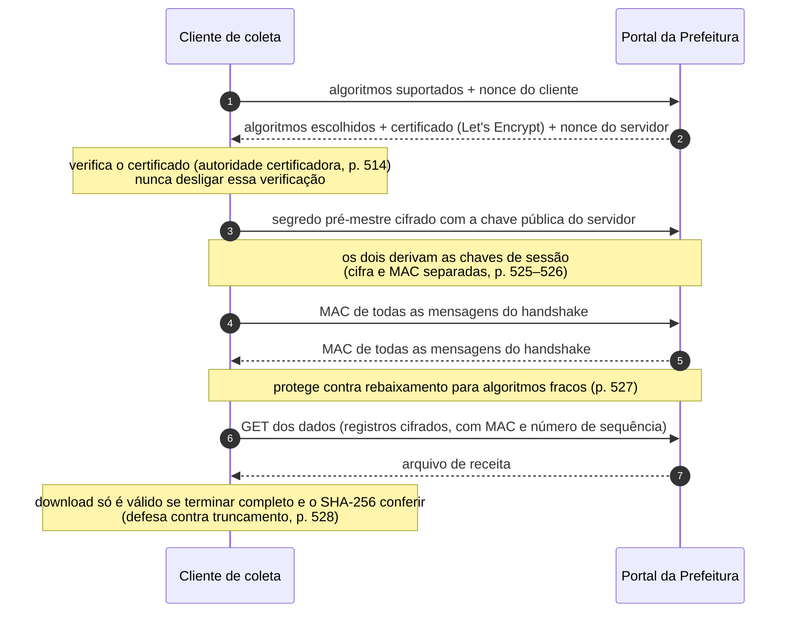
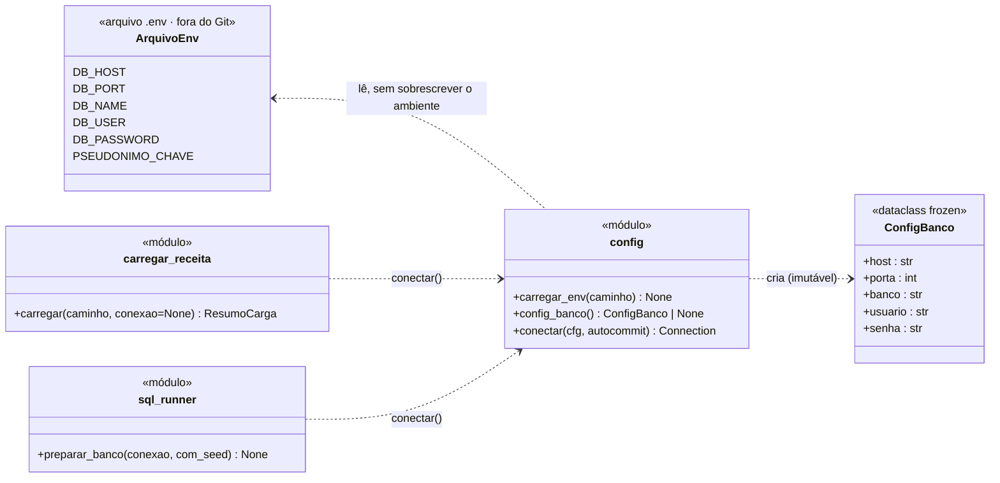

# Parte 3 — E3: Integração segura com a fonte

> **Enunciado (Sprint 2):** *"Documentação do acesso à API da Prefeitura ou ao Portal de Dados Abertos: endpoint, autenticação, uso de HTTPS e cuidados de segurança discutidos no Módulo 4 de Redes."*
>
> **Rubrica:** *"Acesso à fonte documentado, com HTTPS e tratamento de credenciais"* — 15% da nota da Sprint 2.

## Critérios e evidências

| Item do enunciado | Situação | Evidência |
|---|---|---|
| **Endpoint** | ⚠️ Hosts, portas e TLS verificados · **caminhos da API pendentes** | [E3_integracao_segura.md](../E3_integracao_segura.md) §1–2. O portal NUCLEOGOV responde 403 a partir da rede de teste; quem fez a extração de 07/07/2026 precisa registrar os caminhos exatos |
| **Autenticação** | ✅ Documentada | Dados públicos (Lei 12.527/2011), sem credencial. Plano para dados restritos da Sefin: token institucional ou VPN (Protocolos, P4) |
| **Uso de HTTPS** | ✅ Verificado em 30/09/2026 | TLS 1.3 (NUCLEOGOV) e TLS 1.2 (API antiga), certificados Let's Encrypt válidos, HTTP redirecionado para HTTPS. Saída em [evidencias](verificacao_https_30-09-2026.txt) |
| **Cuidados de segurança do Módulo 4 de Redes** | ✅ Documentados com base em Kurose & Ross | [PROTOCOLOS_SEGURANCA_AUDITORIA.md](../PROTOCOLOS_SEGURANCA_AUDITORIA.md): conexão (P1–P5) e auditoria (A1–A6), com página de cada fundamento |
| **Tratamento de credenciais** (rubrica) | ✅ Implementado · ⚠️ 2 pendências registradas | `.env` fora do Git, usuário de banco com privilégio restrito, servidor só em `127.0.0.1`. Pendências: TLS entre aplicação e banco; permissões da auditoria |

## 1. As conexões do sistema e a proteção de cada uma

Verde: implementado e verificado. Cinza: planejado. Amarelo: funcionando, com pendência registrada.

## 2. Como o HTTPS protege a coleta

Sequência do handshake TLS nos seis passos descritos por Kurose & Ross (§8.6.2, p. 527), aplicada à coleta no portal. Cada passo defende contra um ataque que o livro descreve:

| Ataque (Kurose) | Defesa | Regra do projeto |
|---|---|---|
| Servidor impostor (p. 524) | Certificado assinado por autoridade certificadora | Verificação de certificado sempre ativa |
| Repetição de conexão (p. 528) | Nonces no handshake | Biblioteca TLS padrão, sem desabilitar recursos |
| Rebaixamento de algoritmo (p. 527) | MAC do handshake | Aceitar só TLS 1.2 ou superior *[RFC 8996]* |
| Truncamento (p. 528) | Registro de encerramento autenticado | Arquivo aceito só com tamanho e SHA-256 conferidos |

## 3. Tratamento de credenciais no código

Diagrama de classes (notação do ESM, cap. 4, §4.3) do módulo `etl/config.py` e de quem o usa. As credenciais vêm do ambiente ou do `.env`, nunca do código.

| Regra | Como é garantida | Verificação |
|---|---|---|
| Nenhum segredo no Git | `.env` no `.gitignore`; repositório só tem `.env.example` sem valores | `git check-ignore -v .env`; simulação dos commits (guia do GitHub) |
| Configuração imutável | `ConfigBanco` é `dataclass(frozen=True)` | — |
| Variável de ambiente tem prioridade sobre o `.env` | `carregar_env` usa `setdefault` | `test_carregar_env_nao_sobrescreve_variavel_existente` |
| Sem senha, sem conexão | `config_banco()` devolve `None`; `conectar()` falha com mensagem clara | `test_sem_senha_nao_ha_configuracao` |
| Menor privilégio no banco | `pi2_app` só nos bancos do projeto, sem privilégio global | Criação do usuário (README) |
| Banco não exposto | `bind-address=127.0.0.1` | `my.ini` do MySQL portátil |
| Auditoria sem senha nem token | `CHECK ck_aud_ator` e regra do RF-03 | `auditoria.feature` |

## 4. Pendências registradas

| Pendência | Risco | Plano |
|---|---|---|
| Caminhos exatos dos endpoints | Documentação incompleta do acesso | Registrar na Sprint 3, junto com o cliente de coleta |
| Conexão aplicação ↔ banco sem TLS | Credencial legível na rede, **se** o banco sair da máquina | `require_secure_transport=ON` e `REQUIRE SSL` antes de qualquer banco remoto (Protocolos, P2) |
| `pi2_app` pode alterar a auditoria | Registro de auditoria adulterável | Usuário só de inserção (Protocolos, A5) |
| Cadeia de MAC da auditoria | Adulteração não detectada | Implementar A2–A4 (Protocolos) |

**Referências:** KUROSE, J. F.; ROSS, K. W. *Redes de computadores e a Internet*. 6. ed. Pearson, 2013: §8.3.3 (p. 514), §8.6 (p. 524–528), §8.7 (p. 528–531), §8.9 (p. 538–545). RFC 8446 (TLS 1.3), RFC 8996, RFC 9325. Lei nº 12.527/2011 (acesso à informação) e Lei nº 13.709/2018 (LGPD).
