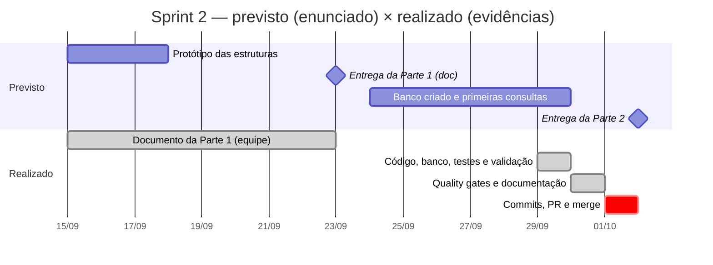
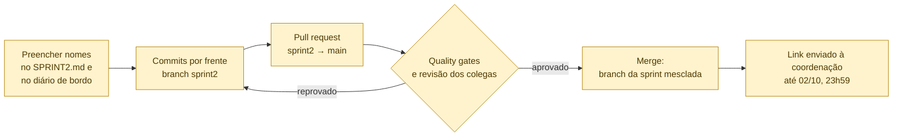

# Parte 4 — E4: Relatório da sprint

> **Enunciado (Sprint 2):** *"Até uma página em SPRINT2.md: o que foi feito, decisões de modelagem tomadas, divisão de trabalho entre os 5 integrantes e impedimentos levados para a Sprint 3."*
>
> **Rubrica:** *"Organização e relatório (E4): branch da sprint, diário de bordo em dia, divisão de trabalho explícita"* — 15% da nota da Sprint 2.

## Critérios e evidências

| Item | Situação | Evidência |
|---|---|---|
| `SPRINT2.md` com até uma página | ✅ 516 palavras | [SPRINT2.md](../../SPRINT2.md) |
| O que foi feito | ✅ | SPRINT2.md, seção "O que foi feito" |
| Decisões de modelagem | ✅ 7 decisões | SPRINT2.md, seção "Decisões de modelagem" |
| **Divisão de trabalho entre os 5 integrantes** | ⚠️ **Frentes definidas, nomes em branco** | SPRINT2.md, tabela "Divisão de trabalho". A equipe precisa preencher |
| Impedimentos para a Sprint 3 | ✅ 5 impedimentos | SPRINT2.md, seção "Impedimentos" |
| **Branch da sprint** (rubrica) | ❌ **Pendente** | O repositório local não tem commits. Passo a passo no guia do GitHub (`planejamento/Guia_GitHub_Sprint2.pdf`) |
| **Diário de bordo em dia** (rubrica) | ⚠️ Atividades registradas, **integrantes em branco** | [DIARIO_DE_BORDO.md](../DIARIO_DE_BORDO.md) |

## 1. Cronograma previsto × realizado

Marcos do enunciado (seção 4) comparados com as datas das evidências no repositório:

O **protótipo em Python da Parte 1** foi construído em 29/09, depois do prazo de 23/09. O documento da Parte 1 foi entregue no prazo, mas **sem código**.

## 2. Da sprint à entrega

Todos os passos acima estão **pendentes** e dependem da equipe. O guia em PDF traz os comandos prontos e já foi testado numa cópia do repositório: 8 commits, nenhum arquivo esquecido e nenhum arquivo sensível.

## 3. Divisão de trabalho proposta

| Frente | Responsabilidade | Principais arquivos |
|---|---|---|
| 1 — Modelagem ER e 3FN | Diagramas ER, dependências funcionais | `docs/modelagem_er.md`, `docs/parte2/1_diagrama_er_3fn.md` |
| 2 — Esquema MySQL | Tabelas, restrições, índices | `sql/schema.sql`, `sql/dados_referencia.sql` |
| 3 — ETL e LGPD | Amostra, carga idempotente, pseudonimização | `etl/`, `data/amostra/` |
| 4 — Estruturas de dados | Grafo, hash, heap e testes | `src/estruturas/`, `docs/parte1/` |
| 5 — Validação, E3 e relatório | Consultas, integração segura, relatório | `sql/validacao.sql`, `docs/parte3/`, `SPRINT2.md`, diário de bordo |

A participação individual é conferida pelo histórico de commits, pelos pull requests e pelo diário de bordo (enunciado, seção 6). Por isso é importante que cada integrante faça os commits e as revisões **com a própria conta**.

**Referências:** enunciado da Sprint 2 (seções 3 a 6); Valente, *Fundamentos de Manutenção de Software*, cap. 9 (revisão de código por pull request, p. 3–4); *Engenharia de Software Moderna*, cap. 10 (controle de versões, §10.2, p. 5).
